# สัปดาห์ที่ 1: Introduction to HTML

## 📚 หัวข้อทฤษฎี (45 นาที: 09:50 น. - 10:35 น.)
เตรียมความพร้อมและสร้างความเข้าใจพื้นฐานก่อนเริ่มลงมือปฏิบัติจริง โดยเน้นการเปรียบเทียบเชิงอุปมาอุปไมย (Analogy) เพื่อให้นักเรียน ม.5 เข้าใจง่ายและเห็นภาพชัดเจนที่สุด

### ⏱️ แผนย่อยสำหรับการบรรยายทฤษฎี 45 นาที

```mermaid
gantt
    title สัดส่วนเวลาการสอนทฤษฎี (45 นาที)
    dateFormat  X
    axisFormat %s
    section หัวข้อ
    1. เบราว์เซอร์และอินเทอร์เน็ตทำงานอย่างไร : active, 0, 10
    2. ทำความรู้จัก HTML & โครงสร้าง Boilerplate : 10, 25
    3. เจาะลึกแท็กเด่น (Heading, Paragraph, Link, Image) : 25, 40
    4. กิจกรรมทดสอบความเข้าใจด่วน (Quick Quiz) : 40, 45
```

---

### 1. 🌐 ส่วนที่ 1: เว็บเบราว์เซอร์และอินเทอร์เน็ตทำงานอย่างไร? (10 นาที)
*   **คำถามชวนคิด (Ice Breaking)**: "เวลาเราพิมพ์ `google.com` แล้วกด Enter... เกิดอะไรขึ้นเบื้องหลังหน้าจอคอมพิวเตอร์ของเราบ้าง?"
*   **แนวทางการอธิบาย (Client-Server Concept)**:
    *   **Client (เครื่องเรา)**: เปรียบเสมือน **"ลูกค้า"** ที่เดินเข้าร้านอาหารแล้วสั่งเมนู (ส่ง Request ไปหา Server)
    *   **Server (เครื่องแม่ข่าย)**: เปรียบเสมือน **"เชฟในห้องครัว"** ที่เตรียมวัตถุดิบและปรุงอาหารตามสั่ง จากนั้นส่งจานอาหารกลับมา (ส่ง Response เป็นไฟล์ HTML/CSS/JS)
    *   **Browser (Chrome, Safari, Edge)**: เปรียบเสมือน **"พนักงานเสิร์ฟและผู้อธิบายอาหาร"** มีหน้าที่นำไฟล์รหัสโค้ดดิบๆ มาแปลผล (Render) ให้กลายเป็นภาพ ปุ่ม และข้อความสวยงามที่พวกเราอ่านรู้เรื่อง
*   **จุดเน้นย้ำ**: HTML ไม่ใช่ภาษาโปรแกรมมิ่ง (Programming Language) ที่คำนวณสูตรคณิตศาสตร์หรือประมวลผลตรรกะได้ แต่เป็น **Markup Language** หรือภาษาที่ใช้กำหนดโครงสร้างและระบุประเภทข้อมูลบนหน้าเว็บ

---

### 2. 🏗️ ส่วนที่ 2: โครงสร้างหลัก HTML Boilerplate (15 นาที)
*   **เป้าหมาย**: ทำความเข้าใจว่าโครงสร้างมาตรฐานที่ทุกหน้าเว็บไซต์ในโลกจำเป็นต้องมีคืออะไร
*   **เปรียบเทียบโครงสร้างหน้าเว็บกับ "มนุษย์"**:
    *   **`<!DOCTYPE html>`**: เปรียบเสมือนการป่าวประกาศภาษาที่คุย "สวัสดีครับเบราว์เซอร์ นี่คือเอกสารมาตรฐาน HTML5 นะ!"
    *   **`<html>`**: เปรียบเหมือน **"ผิวหนังชั้นนอกสุดที่ห่อหุ้มร่างกาย"** (จุดเริ่มต้นและสิ้นสุดของเอกสาร)
    *   **`<head>`**: เปรียบเหมือน **"สมองและจิตวิญญาณ"**
        *   เก็บข้อมูลที่คนดูมองไม่เห็นโดยตรงบนหน้าเว็บ แต่จำเป็นมาก เช่น `<meta charset="UTF-8">` (หน้ากากแปลภาษาไทย ไม่ให้เว็บเป็นภาษาต่างดาว)
        *   `<title>`: ชื่อเพจที่จะไปปรากฏบน Tab ของเว็บเบราว์เซอร์ (เปรียบเหมือนป้ายชื่อห้อยคอ)
    *   **`<body>`**: เปรียบเหมือน **"ร่างกายที่แสดงต่อสาธารณะ"**
        *   ทุกอย่างที่เราต้องการให้คนดูมองเห็น (ปุ่ม, รูปภาพ, วิดีโอ, ข้อความ) จะต้องเขียนอยู่ภายใต้แท็กนี้เท่านั้น!
*   **กิจกรรมร่วมสนุก**: ครูโชว์โค้ด Boilerplate เปล่าๆ แล้วให้นักเรียนทายว่า "ถ้าครูเขียนข้อความนอกแท็ก `<body>` จะเกิดอะไรขึ้น?" (เปิดโอกาสให้แสดงความคิดเห็น)

---

### 3. 📝 ส่วนที่ 3: เจาะลึกแท็กพื้นฐานสำหรับชิ้นงานแรก (15 นาที)
*   **โครงสร้างของแท็ก (Tag Anatomy)**:
    *   อธิบายหลักการ แท็กเปิด `🚩 <tag>` + เนื้อหา + แท็กปิด `🔚 </tag>` (สังเกตเครื่องหมาย Slash `/`)
*   **เจาะลึก 4 แท็กหลักที่จะใช้ใน Workshop**:
    1.  **Heading (`<h1>` ถึง `<h6>`)**:
        *   ใช้สำหรับหัวข้อใหญ่ (Heading)
        *   `<h1>` มีขนาดใหญ่ที่สุดและสำคัญที่สุด (มีได้เพียง 1 แท็กต่อหน้าเพื่อผลดีต่อ SEO)
        *   เรียงลำดับขนาดและความสำคัญลงไปเรื่อยๆ จนถึง `<h6>` ที่เล็กที่สุด
    2.  **Paragraph (`
`)**:
        *   ย่อหน้าทั่วไปสำหรับใส่เนื้อหา บรรยายรายละเอียด
        *   เบราว์เซอร์จะเว้นช่องว่าง (Margin) ด้านบนและล่างให้โดยอัตโนมัติเมื่อขึ้นย่อหน้าใหม่
    3.  **Image (``)**:
        *   แท็กพิเศษที่ **"ไม่มีแท็กปิด"** (Self-closing tag)
        *   ต้องมี Attribute สำคัญคือ `src` (แหล่งที่อยู่ของรูปภาพ) และ `alt` (คำอธิบายรูปกรณีโหลดรูปไม่ขึ้น)
    4.  **Anchor (`<a>`)**:
        *   แท็กสร้างลิงก์เชื่อมโยงไปยังหน้าเว็บอื่น
        *   ต้องมี Attribute `href` (จุดหมายปลายทางที่ต้องการให้ลิงก์ไป) และ `target="_blank"` เพื่อสั่งให้เปิดแท็บใหม่โดยไม่ปิดหน้าเว็บเดิมของเรา

---

### 4. 🧠 ส่วนที่ 4: กิจกรรมทดสอบความเข้าใจด่วน (Quick Quiz) (5 นาที)
ก่อนจะปล่อยนักเรียนไปจับคอมพิวเตอร์ ครูถามคำถามด่วน 3 ข้อเพื่อเช็กความพร้อม (ยกมือตอบเพื่อสะสมคะแนนพิเศษ):
1.  **คำถาม 1**: ถ้าต้องการพิมพ์หัวข้อชื่อภาพยนตร์ที่เป็นหัวข้อใหญ่ที่สุดในหน้าเว็บ ควรใช้แท็กใด? *(แนวตอบ: `<h1>`)*
2.  **คำถาม 2**: แท็ก `` ต่างจากแท็ก `
` และ `<h1>` อย่างไรบ้างในแง่ของโครงสร้าง? *(แนวตอบ: ไม่มีแท็กปิด `</img>` และต้องใช้ Attribute `src` เพื่อแสดงผล)*
3.  **คำถาม 3**: ทำไมเราต้องใส่ `<meta charset="UTF-8">` ไว้ในแท็ก `<head>`? *(แนวตอบ: เพื่อให้หน้าเว็บรองรับและแสดงผลอักษรภาษาไทยได้ถูกต้อง ไม่เป็นตัวอักษรเพี้ยน)*

---

## ⏱️ แผนจัดสรรเวลาสำหรับคาบปฏิบัติ Workshop (100 นาที: 10:40 น. - 12:20 น.)

สำหรับการสอนนักเรียนมัธยม 5 ที่เพิ่งเริ่มต้นเขียนโค้ดเป็นครั้งแรกในชีวิต เวลา 100 นาทีนี้จะผ่านไปเร็วมาก แผนการสอนจะแบ่งออกเป็น 5 ช่วงหลักๆ เพื่อให้การเรียนรู้อยู่ในระดับที่สนุก ท้าทาย และไม่น่าเบื่อ ดังนี้ครับ:

### 1. ช่วงปูสภาพแวดล้อมระบบและสร้างไฟล์ (20 นาที | 10:40 - 11:00 น.)
*   **เป้าหมาย**: เปิดโปรแกรมทำงาน คุ้นชินกับเครื่องมือ และสร้างไฟล์ทำงานไฟล์แรก
*   **สิ่งที่ครูนำทำ**: 
    1. สอนเปิดโปรแกรม **VS Code** 
    2. แนะนำการเปิดโฟลเดอร์ทำงานเฉพาะของตัวเอง (เช่น บน Desktop หรือโฟลเดอร์วิชา)
    3. สร้างไฟล์ใหม่ตั้งชื่อว่า `index.html` (เน้นย้ำจุดผิดยอดนิยมเรื่องห้ามพิมพ์นามสกุลผิดหรือเซฟเป็นไฟล์ `.txt`)
    4. พิมพ์ `!` แล้วกด Tab หรือพิมพ์โครงสร้าง HTML ตั้งต้นพร้อมใส่ `<meta charset="UTF-8">` เพื่อให้แสดงผลภาษาไทยได้ถูกต้อง

### 2. ลงมือทำโปรเจกต์ส่วนที่ 1: โครงสร้างหลัก (25 นาที | 11:00 - 11:25 น.)
*   **เป้าหมาย**: เรียนรู้การจัดวางเนื้อหาพื้นฐานผ่านแท็ก Heading และ Paragraph
*   **โจทย์ [Core]**:
    - สร้างหน้าเว็บจัดอันดับหนังหรือการ์ตูนสุดโปรด 3 เรื่องแรกของตัวเอง
    - ใช้แท็ก `<h1>` ในการประกาศหัวข้อหลักของหน้าเว็บ
    - ใช้แท็ก `<h2>` หรือ `<h3>` สำหรับแบ่งอันดับหนังแต่ละเรื่อง
    - เขียนข้อความบรรยายความชอบใต้หนังแต่ละเรื่องโดยใช้แท็ก `
`
    - ใส่เส้นคั่นระหว่างเนื้อหาด้วยแท็ก `
`

### 3. ลงมือทำโปรเจกต์ส่วนที่ 2: ความท้าทายระดับสูง (30 นาที | 11:25 - 11:55 น.)
*   **เป้าหมาย**: เรียนรู้การดึงข้อมูลจากอินเทอร์เน็ตมาฝังลงหน้าเว็บ (รูปภาพและลิงก์)
*   **โจทย์ [Extra Challenge]**:
    - ค้นหาภาพโปสเตอร์หนังโปรดจากอินเทอร์เน็ต แล้วคัดลอกที่อยู่รูปภาพ (Image Address) มาฝังโดยใช้แท็ก ``
    - ฝึกจัดสัดส่วนของรูปภาพ (ระบุ `width` หรือ `height` เพื่อไม่ให้ภาพล้นจอ)
    - **[เพิ่มพิเศษ]** นำแท็กสร้างลิงก์เชื่อมโยง `<a href="..." target="_blank">` มาประยุกต์สอนในการทำลิงก์เปิดหน้า Youtube ดูตัวอย่างหนังแต่ละเรื่อง

### 4. ตกแต่งลูกเล่นพิเศษ "โรงภาพยนตร์จอมืด" (10 นาที | 11:55 - 12:05 น.)
*   **เป้าหมาย**: จุดประกายความว้าวตั้งแต่ชิ้นงานแรกด้วยการเปลี่ยนหน้าตาเว็บ
*   **สิ่งที่ครูนำทำ**: สอนแอบใส่คำสั่ง CSS แบบด่วน (Inline Styles) ลงในแท็ก `<body>` เพื่อเปลี่ยนหน้าจอพื้นหลังเป็นสีดำสไตล์ Netflix หรือโรงหนังสุดหรูหรา:
    - `<body style="background-color: #1a1a1a; color: #e5e5e5; max-width: 800px; margin: 0 auto; padding: 40px;">`
    - วิธีนี้จะทำให้นักเรียนรู้สึกตื่นเต้นว่า "เขียนโค้ดวันแรก หน้าเว็บก็ออกมาสวยมีระดับได้!"

### 5. กิจกรรมโชว์ผลงาน Mini Cinema Showcase (15 นาที | 12:05 - 12:20 น.)
*   **เป้าหมาย**: แลกเปลี่ยนทัศนะและชื่นชมความสำเร็จของกันและกัน
*   **สิ่งที่ครูนำทำ**: 
    1. ให้นักเรียนจับคู่หรือจับกลุ่ม 3 คน เปิดเว็บภาพยนตร์ของตัวเองให้เพื่อนดู
    2. พูดคุยแลกเปลี่ยนเหตุผลที่ชอบหนังเรื่องนี้
    3. ครูสรุปประเด็นสิ่งที่ได้เรียนรู้ในวันแรก และเกริ่นเข้าสู่สัปดาห์ถัดไป
