# สัปดาห์ที่ 2: HTML Forms (แบบฟอร์มและการรับข้อมูล)

## 📚 หัวข้อทฤษฎี (45 นาที: 09:50 น. - 10:35 น.)
เรียนรู้การทำงานของแบบฟอร์มออนไลน์ (HTML Forms) และส่วนประกอบในการรับข้อมูลพื้นฐาน (Inputs, Selectors, Textarea) เพื่อให้นักเรียนเข้าใจกระบวนการโต้ตอบของผู้ใช้งานกับหน้าเว็บและวางรากฐานการเชื่อมโยงระบบ Logic ในระดับสูง

### ⏱️ แผนย่อยสำหรับการบรรยายทฤษฎี 45 นาที

```mermaid
gantt
    title สัดส่วนเวลาการสอนทฤษฎี Week 02 (45 นาที)
    dateFormat  X
    axisFormat %s
    section หัวข้อ
    1. แนะนำแนวคิด HTML Forms (กระดาษ & ซอง) : active, 0, 10
    2. แท็กรับข้อความพื้นฐาน & การผูกคู่ฉลาก (Label & Inputs) : 10, 20
    3. ปุ่มเลือก ตัวเลือกหลายค่า และกฎกล่องซ้อน (Radios, Checkboxes, Select Dropdown) : 20, 35
    4. การส่งแบบฟอร์มและกิจกรรม Quick Quiz : 35, 45
```



---

### 1. 📂 ส่วนที่ 1: แนะนำแนวคิดแบบฟอร์ม (HTML Forms Concept) (10 นาที)
*   **แนวทางการเปรียบเทียบเชิงลึก**:
    *   **แบบฟอร์ม (Form)**: เปรียบเสมือน **"ซองจดหมายขนาดใหญ่ที่มีแผ่นรองเขียนหนีบไว้ (Clipboard & Envelope)"** ซึ่งทำหน้าที่รวบรวมข้อมูลหรือแบบสอบถามจากจุดต่างๆ เอาไว้ในที่เดียวกัน เพื่อเตรียมจัดส่งไปยังจุดหมายปลายทาง (เซิร์ฟเวอร์ฐานข้อมูล)
    *   **แท็ก `<form>`**: คือซองจดหมายหลัก หากผู้ใช้งานเขียนช่องกรอกข้อมูล (Inputs) ไว้นอกแท็กปิดและแท็กเปิดของ `<form>` ข้อมูลส่วนนั้นจะไม่ถูกรวบรวมเข้าไปในซอง ทำให้กระจัดกระจายและไม่สามารถนำส่งข้อมูลได้
*   **เจาะลึก 2 แอตทริบิวต์สำคัญที่ต้องอธิบายบนสไลด์**:
    1.  **`action`**: เปรียบเหมือน **"จ่าหน้าซองจดหมาย"** ชี้พิกัดปลายทางที่ต้องการให้ข้อมูลวิ่งไปประมวลผล (เช่น URL ของ API หรือฐานข้อมูลบนเซิร์ฟเวอร์) ในการเรียนระดับ ม.5 เราจะใส่เครื่องหมาย `#` (สัญลักษณ์ปักหมุดหน้าเดิม) หรือเว้นว่างไว้เพื่อทดสอบแบบ Local
    2.  **`method`**: เปรียบเหมือน **"รูปแบบความปลอดภัยในการนำส่งจดหมาย"** มี 2 วิธีหลักที่มีพฤติกรรมต่างกันอย่างสิ้นเชิง:
        *   **`GET` (ส่งแบบเปิดเผย/โปสต์การ์ด)**: ข้อมูลทั้งหมดจะถูกเขียนห้อยท้าย URL บนเบราว์เซอร์ให้เห็นอย่างเด่นชัด (เช่น `?username=somsak&password=123`) ทำให้ไม่มีความปลอดภัยเลย ห้ามใช้กับรหัสผ่านเด็ดขาด! แต่นิยมใช้กับการค้นหาข้อมูลทั่วไป (Search box) ที่ผู้ใช้สามารถแชร์ลิงก์ต่อได้
        *   **`POST` (ส่งแบบปิดผนึกปลอดภัย)**: ข้อมูลจะถูกบรรจุลงในกล่องข้อมูลนำส่งภายในระบบ (Request Body) ไม่เปิดเผยบนแถบ URL ทำให้มีความปลอดภัยสูง เหมาะอย่างยิ่งสำหรับหน้าลงทะเบียน รหัสผ่าน หรือข้อมูลส่วนตัว
*   **โครงสร้างตัวอย่างสำหรับการสอน**:
    ```html
    <!-- แบบฟอร์มกรอกประวัติเบื้องต้น ส่งข้อมูลแบบปิดผนึกปลอดภัย (POST) -->
    <form action="#" method="POST">
        <!-- ช่องรับข้อมูลทุกอย่างต้องซ้อนอยู่ตรงนี้ -->
    </form>
    ```

---

### 2. ✏️ ส่วนที่ 2: แท็กรับข้อความพื้นฐานและการผูกคู่ฉลาก (Text Inputs & Label Binding) (10 นาที)
*   **แนวทางการอธิบายเชิงลึก**:
    *   **แท็ก `<input>`**: ช่องเปิดรับอินพุตจากผู้กรอก เป็นแท็กเดี่ยวไม่มีป้ายปิด (Self-closing tag) โดยจะเปลี่ยนบทบาทและกล่องการกรอกตามแอตทริบิวต์ `type`
    *   **ทำความรู้จัก 4 ประเภทแกนหลักที่ต้องยกตัวอย่าง**:
        1.  `type="text"`: ช่องกรอกข้อความทั่วไปบรรทัดเดียว (เช่น ชื่อ-นามสกุล, ที่อยู่อย่างง่าย)
        2.  `type="email"`: ช่องป้อนอีเมล เบราว์เซอร์จะช่วยตรวจสอบไวยากรณ์ก่อนส่งว่าสะกดในรูปแบบ `@` และมีชื่อโดเมนถูกต้องหรือไม่
        3.  `type="password"`: ช่องป้อนรหัสผ่าน เบราว์เซอร์จะซ่อนตัวอักษรเป็นจุดดำกลมหรือดอกจันอัตโนมัติ เพื่อป้องกันการแอบมองหน้าจอ
        4.  `type="number"`: ช่องใส่ตัวเลข (เช่น อายุ, น้ำหนัก) *จุดเด่น*: เมื่อเปิดบนอุปกรณ์พกพา (สมาร์ตโฟน) หน้าเว็บจะบังคับให้แป้นพิมพ์เปลี่ยนเป็นแบบปุ่มตัวเลข (Numeric Keypad) ทันที ช่วยเพิ่มความสะดวกในการใช้งานอย่างยอดเยี่ยม (Good UX)
*   **กฎเหล็ก: การทำ Label Binding (ผูกคู่ฉลากกับช่องกรอก)**:
    *   เพื่อสร้างฟอร์มที่เป็นมืออาชีพและเข้าใจง่าย เราต้องมีป้ายชื่ออธิบายช่องกรอกเสมอด้วยแท็ก `<label>`
    *   **วิธีผูกความสัมพันธ์**: ใช้แอตทริบิวต์ `for` ในแท็ก `<label>` ให้ **ตรงกันทุกตัวอักษร (Case-sensitive)** กับแอตทริบิวต์ `id` ในแท็ก `<input>`
    *   *โค้ดตัวอย่างที่ถูกต้อง*:
        ```html
        <label for="fullname">ชื่อผู้สมัคร:</label>
        <input type="text" id="fullname" name="fullname">
        ```
    *   **ทำไมต้องผูกคู่? (อธิบายประโยชน์ 2 ด้าน)**:
        1.  **ด้านประสบการณ์การใช้งาน (UX)**: ผู้ใช้ไม่จำเป็นต้องจิ้มเมาส์ให้ตรงช่องสี่เหลี่ยมเล็กๆ แค่คลิกที่ตัวอักษรป้ายคำว่า "ชื่อผู้สมัคร" ตัวเบราว์เซอร์จะเลื่อนเคอร์เซอร์ไปเปิดช่องอินพุตให้อัตโนมัติ (อำนวยความสะดวกมากบนสมาร์ตโฟน)
        2.  **ด้านความเท่าเทียม (Accessibility)**: โปรแกรมอ่านหน้าจอ (Screen Reader) จะทำงานได้อย่างไร้รอยต่อ ช่วยอ่านออกเสียงบอกคนพิการทางสายตาได้ถูกต้องว่าช่องกรอกข้อมูลนี้ต้องการข้อมูลใด
*   **แอตทริบิวต์เสริมพลังควบคุมข้อมูล (Validation attributes)**:
    *   `placeholder`: ตัวหนังสือบอกใบ้สีเทาจางๆ (เช่น `placeholder="เช่น เด็กหญิงสมรัก"`) ช่วยแนะแนวรูปแบบการกรอกและจะจางหายไปเมื่อผู้ใช้เริ่มพิมพ์ตัวแรก
    *   `required`: แอตทริบิวต์สั้นแต่ทรงพลัง บังคับให้ผู้กรอกกรอกข้อมูลนี้ หากไม่ได้กรอกและกดส่ง เบราว์เซอร์จะสั่งยกเลิกการส่งทันทีและเด้งป้ายคำเตือน
    *   `minlength` / `maxlength`: จำกัดจำนวนอักษรขั้นต่ำและสูงสุด (เช่น ตั้งรหัสผ่านไม่ต่ำกว่า 6 ตัวอักษร)

---

### 3. 🔘 ส่วนที่ 3: ปุ่มเลือก ตัวเลือกหลายค่า และกฎกล่องซ้อน (Radios, Checkboxes, Dropdown Select) (15 นาที)
*   **แนวทางการเปรียบเทียบและการอธิบายเชิงลึก**:
    *   เพื่อจำกัดคำตอบของนักเรียนให้ตรงตามเงื่อนไขทางคอมพิวเตอร์ที่ต้องการประมวลผล:
    *   **1) ปุ่มตัวเลือกหนึ่งเดียว (Radio Buttons - `type="radio"`)**:
        *   **แนวเปรียบเปรย**: เปรียบเหมือน **"ปุ่มเปิดช่องวิทยุในรถยนต์โบราณ"** (กดปุ่มเลือกฟังคลื่นหนึ่งลงไป ปุ่มเดิมที่ค้างอยู่จะเด้งหลุดกลับมาทันที) ผู้ใช้สามารถเลือกทางเลือกได้เพียง **1 ข้อเท่านั้น** จากกลุ่มตัวเลือกทั้งหมด!
        *   **กฎสำคัญที่ห้ามสะกดผิด**: ปุ่มวิทยุในคำถามชุดเดียวกัน **จะต้องระบุแอตทริบิวต์ `name="..."` ด้วยคำสะกดเหมือนกันเป๊ะทุกตัวอักษร!** เพื่อเป็นการจัดกลุ่ม (Grouping) ให้เบราว์เซอร์ หากสะกดแอตทริบิวต์ `name` ไม่เหมือนกัน เบราว์เซอร์จะมองเป็นปุ่มอิสระคนละกลุ่ม ทำให้นักเรียนสามารถเลือกได้หลายข้อพร้อมกันซึ่งผิดความตั้งใจของ Radio
        *   *ตัวอย่างการจัดกลุ่ม*:
            ```html
            <input type="radio" id="gender-m" name="gender" value="male">
            <label for="gender-m">ชาย</label>
            
            <input type="radio" id="gender-f" name="gender" value="female">
            <label for="gender-f">หญิง</label>
            ```
    *   **2) ช่องติ๊กเลือกอิสระ (Checkboxes - `type="checkbox"`)**:
        *   **แนวเปรียบเปรย**: เปรียบเหมือน **"รายการติ๊กเลือกอาหารที่อยากกินบนเมนู"** ผู้ใช้สามารถเลือกทางเลือกกี่ข้อก็ได้ เลือกทั้งหมด หรือไม่เลือกเลยก็ย่อมได้ตามความต้องการ ไม่ขัดแย้งกันเอง
        *   *ตัวอย่างการเขียน*:
            ```html
            <input type="checkbox" id="sports" name="interest" value="Sports">
            <label for="sports">สนใจกีฬา</label>
            ```
    *   **3) เมนูดึงลงมาแบบกลุ่มซ้อน (Dropdown List - `<select>` และ `<option>`)**:
        *   เหมาะสำหรับการเก็บชุดข้อมูลตัวเลือกจำนวนมากโดยไม่ให้เกะกะพื้นที่ดีไซน์บนหน้าจอ เช่น เลือกจังหวัด หรือ เลือกห้องเรียน
        *   **กฎกล่องซ้อน (Russian Nesting Dolls - ตุ๊กตาแม่ลูกดกสัญชาติรัสเซีย)**:
            *   กล่องชิ้นใหญ่ด้านนอกสุดคือแท็ก `<select>` (ทำหน้าที่เป็นกระเป๋าหรือขอบนอกของปุ่มกด)
            *   ตุ๊กตาตัวเล็กๆ ซ้อนอยู่ข้างในคือแท็ก `<option>` แต่ละแถว (ทำหน้าที่เป็นรายการย่อยที่ซ่อนอยู่ข้างใน รอให้กดออกมาเลือก)
        *   *ตัวอย่างการเขียนโค้ด*:
            ```html
            <select id="grade" name="grade">
                <option value="" disabled selected>-- เลือกห้องเรียน --</option>
                <option value="m5-1">ม.5/1</option>
                <option value="m5-2">ม.5/2</option>
            </select>
            ```
            *(คำแนะนำทาง Pedagogy: แนะนำการใส่ `value="" disabled selected` ในตัวเลือกแรกเพื่อให้ทำหน้าที่เป็นตัวหนังสือคำใบ้สีจางของช่องดรอปดาวน์)*
    *   **4) กล่องความเห็นขนาดยาว (Textarea - `<textarea>`)**:
        *   **จุดแตกต่าง**: ต่างจาก `<input>` ทั่วไปตรงที่เป็น **แท็กคู่** ต้องเขียนเปิดและปิดคู่กัน `<textarea>...</textarea>` (ไม่สะกดแบบ Self-closing) ใช้เมื่อผู้ใช้ต้องการพิมพ์ข้อความปริมาณมาก หลายย่อหน้า เช่น ความคิดเห็น แนะนำตัว หรือที่อยู่ติดต่อ

---

### 4. 🚀 ส่วนที่ 4: การส่งข้อมูลและกิจกรรมทดสอบความเข้าใจด่วน (Quick Quiz) (10 นาที)
*   **เบื้องหลังการส่งแบบฟอร์ม (Form Submission Mechanics)**:
    *   **ตัวสั่งการหลัก**: แท็ก `<button type="submit">ส่งข้อมูล</button>` เมื่อกดปุ่มนี้ เบราว์เซอร์จะรวบรวมข้อมูลทุกช่องภายในแท็ก `<form>`
    *   **ตัวส่งต่อข้อมูล**: เบราว์เซอร์จะส่งเฉพาะข้อมูลจากกล่องกรอก **ที่มีแอตทริบิวต์ `name` เท่านั้น!** โดยจะจับคู่ออกมาเป็นชุดข้อมูลแบบ `key=value` (เช่น `fullname=Somsak&grade=m5-1&platform=PC`) วิ่งไปสู่ปลายทางที่กำหนดใน `action`
    *   ⚠️ **เตือนภัยบั๊กสุดฮิตประจำคาบ**: หากเด็กเขียนช่องกรอกสวยงามมาก มี `id` ถูกต้อง แต่ลืมใส่แอตทริบิวต์ `name="..."` ข้อมูลส่วนนั้นจะ **หายสาบสูญและไม่ถูกจัดส่งไปยังเซิร์ฟเวอร์โดยเด็ดขาดตอนกดส่งแบบฟอร์ม!**

*   **คำถามทบทวนเชิงลึก 5 ข้อด่วน (Quick Quiz)**:
    1.  **คำถาม 1**: แอตทริบิวต์ `id` ของแท็ก `<input>` และแอตทริบิวต์ `for` ของแท็ก `<label>` สัมพันธ์กันอย่างไรในแง่การทำงาน?
        *   *(แนวตอบ: ต้องสะกดให้ตรงกันเป๊ะทุกตัวอักษร เพื่อทำการเชื่อมโยงข้อมูลป้ายชื่อเข้ากับช่องกรอก ซึ่งจะช่วยยกระดับดีไซน์การคลิก (UX) และการเข้าถึงระบบคนพิการ (Accessibility))*
    2.  **คำถาม 2**: ถ้านักเรียนคลิกปุ่มวิทยุ (Radio Buttons) เลือกแพลตฟอร์มเกม 3 ช่อง แล้วพบว่าสามารถคลิกเลือกปุ่มได้พร้อมกันหมดทั้ง 3 ปุ่ม จุดผิดพลาดในโค้ดน่าจะเกิดจากที่ใด?
        *   *(แนวตอบ: เกิดจากปุ่มอินพุตวิทยุเหล่านั้นลืมระบุแอตทริบิวต์ `name` หรือเขียนคำสะกดใน `name="..."` แตกต่างกัน ทำให้เบราว์เซอร์มองไม่เห็นว่าเป็นคำถามกลุ่มเดียวกัน)*
    3.  **คำถาม 3**: หากนักเรียนทำเว็บส่งฟอร์มใบสมัคร E-Sports แล้วคลิกส่งผลงานพบว่าข้อมูลในช่องอีเมลไม่ยอมไปส่งให้เซิร์ฟเวอร์โดยเด็ดขาด ทั้งที่ตรวจสอบแล้วว่าใส่ `id` ของอินพุตถูกต้องแล้ว ควรตรวจสอบสิ่งใดเป็นลำดับถัดไป?
        *   *(แนวตอบ: ตรวจสอบว่าในแท็ก `<input type="email">` ได้พิมพ์แอตทริบิวต์ `name="..."` ไว้แล้วหรือไม่ และช่องกรอกนั้นถูกครอบอยู่ในแท็ก `<form>` หรือเปล่า)*
    4.  **คำถาม 4**: การเขียน Dropdown เลือกสี โดยใช้แนวทาง Nesting (ตุ๊กตาแม่ลูกดก) ข้อใดเขียนได้ถูกต้องตามหลักไวยากรณ์ HTML?
        *   A) `<select><option>สีแดง</option><option>สีน้ำเงิน</option></select>`
        *   B) `<option><select>สีแดง</select><select>สีน้ำเงิน</select></option>`
        *   *(แนวตอบ: A เพราะ `<select>` คือกล่องใหญ่ทำหน้าที่ครอบรายการย่อย `<option>` ทั้งหมดไว้ด้านใน)*
    5.  **คำถาม 5**: ในแง่โครงสร้างการปิดแท็ก (Tag Closing) แท็ก `<input type="password">` และแท็ก `<textarea>` มีความแตกต่างกันอย่างไร?
        *   *(แนวตอบ: `<input>` เป็นแท็กเดี่ยวปิดตัวเองในตัว (Self-closing tag) ไม่มีแท็กคู่ปิดภายนอก ส่วน `<textarea>` เป็นแท็กคู่ที่ต้องระบุทั้งแท็กเปิดและแท็กปิดอย่างชัดเจน `<textarea>...</textarea>`)*

---

## โปรเจกต์ประจำสัปดาห์
**[Project] Club SignUp Form (ฟอร์มสมัครเข้าชมรม E-Sports เพลินพัฒนา)**
*   **คำอธิบายย่อย**: พัฒนาแบบฟอร์มการรับสมัครนักเรียน ม.5 เข้าร่วมชมรม E-Sports ของโรงเรียน เพื่อเก็บข้อมูลความสามารถและแพลตฟอร์มการเล่นของนักเรียนจริง
*   **ที่ตั้งไฟล์**: `Week 02/Teacher/`

### 💻 กิจกรรมปฏิบัติ Workshop (100 นาที: 10:40 น. - 12:20 น.)
*   **0-20 นาทีแรก**: แนะนำ VS Code สำหรับโฟลเดอร์ปฏิบัติการ ตรวจสอบโครงร่าง Boilerplate ในโฟลเดอร์ `Student/index.html` และทดลองเปิดในเว็บเบราว์เซอร์
*   **20-55 นาที [Core Mission]**:
    1.  สร้างหัวข้อหน้าเว็บชมรมด้วย `<h1>` และ `<p>`
    2.  เขียนแท็ก `<form>` ครอบคลุมช่องรับข้อมูล
    3.  สร้างช่องกรอกข้อมูลพื้นฐาน: ชื่อ-นามสกุล (`type="text"`), อีเมล (`type="email"`), และรหัสผ่าน (`type="password"`)
    4.  ผูกช่องกรอกข้อมูลเข้ากับแท็ก `<label>` อย่างถูกหลักการด้วย `id` และ `for`
    5.  สร้างปุ่มเลือกห้องเรียนด้วย Dropdown `<select>` และ `<option>`
    6.  สร้างปุ่มส่งแบบฟอร์ม `<button type="submit">` เพื่อทำการทดสอบการแจ้งเตือน Validation เบื้องต้นเมื่อลืมกรอกข้อมูลที่กำหนดเป็น `required`
*   **55-80 นาที [Extra Challenge]**:
    1.  เพิ่มกลุ่มปุ่มตัวเลือกแบบกลุ่มละเลือกได้ 1 ค่า (Radio Buttons) เพื่อระบุเครื่องเล่นเกมหลัก (PC, Console, Mobile) พร้อมใช้แอตทริบิวต์ `name` ร่วมกันอย่างสมบูรณ์
    2.  เพิ่มกลุ่มช่องติ๊กเลือกประเภทเกมที่สนใจ (Checkboxes) เช่น MOBA, FPS, Sports
    3.  เพิ่มกล่องแนะนำตัวและเป้าหมายเข้าชมรมด้วย `<textarea>`
    4.  ตกแต่งหน้าเว็บแบบฟอร์มเบื้องต้นด้วย CSS ในระดับ Pro (สามารถคัดลอกไอเดียการจัดเรียง การทำปุ่มสีสวยๆ และกรอบการกรอกข้อมูลจากตัวอย่างโค้ดของครู)
*   **80-90 นาที [Showcase & Validation Verification]**: จับคู่แลกเปลี่ยนเครื่องทดสอบกรอกข้อมูลของเพื่อน ตรวจสอบข้อความเตือนของระบบเบราว์เซอร์เมื่อกรอกอีเมลผิดฟอร์แมต หรือทดลองคลิกที่ตัวอักษร Label เพื่อเช็คว่าโฟลเดอร์เด้งเปิดช่องกรอกจริงหรือไม่
*   **90-100 นาที [Reflection]**: สรุปจุดระวัง บั๊กยอดฮิต (สะกด for/id ผิดตัวใหญ่ตัวเล็ก, ลืมกรอก name ในวิทยุทำให้เลือกได้หลายข้อ) และอธิบายเพิ่มเติมว่าสัปดาห์ถัดไปเราจะเอา Lists มาประยุกต์ทำระบบเมนูข้ามหน้าใน Multi-Page Websites อย่างไร
