# สัปดาห์ที่ 2: Intermediate HTML

## 📚 หัวข้อทฤษฎี (45 นาที: 09:50 น. - 10:35 น.)
ทำความเข้าใจเกี่ยวกับการจัดระเบียบเนื้อหาด้วย List, กฎสำคัญของการเขียนแท็กซ้อนแท็ก (Nesting), และวิธีเชื่อมโยงข้อมูลสู่โลกภายนอกผ่าน Links และ Images โดยเน้นการใช้การเปรียบเทียบเพื่อให้เห็นภาพ

### ⏱️ แผนย่อยสำหรับการบรรยายทฤษฎี 45 นาที

```mermaid
gantt
    title สัดส่วนเวลาการสอนทฤษฎี Week 02 (45 นาที)
    dateFormat  X
    axisFormat %s
    section หัวข้อ
    1. การจัดกลุ่มข้อมูลด้วย Lists (ul/ol) : active, 0, 10
    2. กฎทองคำของการทำ Nesting : 10, 20
    3. เปิดประตูมิติด้วย Anchor & Images : 20, 40
    4. กิจกรรม Quick Quiz ทบทวน : 40, 45
```

---

### 1. 📋 ส่วนที่ 1: การจัดกลุ่มข้อมูลด้วย Lists (ul/ol) (10 นาที)
*   **แนวทางการเปรียบเทียบ**:
    *   **Unordered List (`<ul>`)**: เปรียบเสมือน **"รายการซื้อของที่ซูเปอร์มาร์เก็ต"** (Shopping List) ซื้ออะไรก่อนหลังก็ได้ ไม่มีความสำคัญของลำดับ มีสัญลักษณ์นำหน้าเป็นจุดวงกลม (Bullet point)
    *   **Ordered List (`<ol>`)**: เปรียบเสมือน **"ขั้นตอนการประกอบอาหาร"** (Cooking Recipe) หรือ **"การต่อหุ่นยนต์ Lego"** ต้องทำทีละข้อเรียงตามลำดับ 1, 2, 3... ข้ามขั้นตอนไม่ได้!
    *   **List Item (`<li>`)**: คือ **"แต่ละรายการย่อย"** ที่อยู่ในห่อของ `<ul>` หรือ `<ol>` อีกทีหนึ่ง (เปรียบเหมือนสินค้าในตะกร้า)

---

### 2. 🪆 ส่วนที่ 2: กฎทองคำของการทำ Nesting (10 นาที)
*   **แนวทางการอธิบาย**: 
    *   การทำ **Nesting** หรือการแทรกแท็กซ้อนแท็ก เปรียบเสมือน **"ตุ๊กตาแม่ลูกดกสัญชาติรัสเซีย" (Russian Nesting Dolls)** หรือกล่องใบเล็กที่บรรจุอยู่ในกล่องใบใหญ่
    *   **กฎสำคัญ**: "แท็กไหนเปิดทีหลังสุด ต้องปิดก่อนเพื่อน" (Last In, First Out)
    *   **ตัวอย่างเปรียบเทียบที่ถูกต้อง**: 
        *   ✅ ถูกต้อง: `
ฉันชอบเรียน <strong>วิทยาศาสตร์</strong> มาก
` (เปิด strong ทีหลังสุด ต้องปิด strong ก่อนป้าย paragraph)
        *   ❌ ผิดพลาด: `
ฉันชอบเรียน <strong>วิทยาศาสตร์มาก
</strong>` (เกิดการคร่อมกันของวงเล็บ ทำให้เบราว์เซอร์สับสน)

---

### 3. 🚪 ส่วนที่ 3: เปิดประตูมิติด้วย Anchor & Images (20 นาที)
*   **แนวทางการอธิบาย**:
    *   **Anchor Tag (`<a>`)**: เปรียบเสมือน **"ประตูมิติโดราเอมอน"** (Portal) เชื่อมต่อโลกภายนอก
        *   ต้องมี Attribute `href` ชี้เป้าหมาย URL ที่จะพาไป
        *   แนะนำคุณสมบัติ `target="_blank"` เพื่อรักษาหน้าเว็บหลักของเราเอาไว้ไม่ให้ปิดตัวลง
    *   **Image Tag (``)**: เปรียบเสมือน **"กรอบรูปติดผนัง"** (Picture Frame)
        *   เป็น Self-closing tag (ไม่มีป้ายเปิดป้ายปิดคู่กัน)
        *   ต้องใช้ `src` ชี้ตำแหน่งภาพ และใส่ `alt` เสมอเผื่อว่าอินเทอร์เน็ตหลุด จะได้มีข้อความบอกใบ้ขึ้นแทน
        *   สอนการปรับความกว้าง `width="..."` เพื่อคุมสัดส่วน

---

### 4. 🧠 ส่วนที่ 4: กิจกรรมทดสอบความเข้าใจด่วน (Quick Quiz) (5 นาที)
เช็กความพร้อมด้วย 3 คำถามด่วน:
1.  **คำถาม 1**: ข้อใดเขียนการซ้อนแท็ก (Nesting) ได้ถูกต้อง?
    *   A) `<ul><li>ข้อ 1</ul></li>`
    *   B) `<ul><li>ข้อ 1</li></ul>` *(แนวตอบ: B)*
2.  **คำถาม 2**: ถ้าต้องการเขียนวิธีทำต้มยำกุ้งทีละขั้นตอน ควรใช้แท็กคู่ใดระหว่าง `<ul>` กับ `<ol>`? *(แนวตอบ: `<ol>` เพราะต้องทำตามขั้นตอนที่ชัดเจน)*
3.  **คำถาม 3**: ข้อใดเป็น Attribute ที่จำเป็นในการระบุแหล่งที่อยู่ของรูปภาพในแท็ก ``? *(แนวตอบ: `src` ย่อมาจาก Source)*

## โปรเจกต์
[Project] Birthday Invite
- • Core: ทำการ์ดวันเกิด มีรูปภาพและลิสต์กำหนดการ
- • Extra: สร้างหน้า "สูตรอาหาร" ฝังลิงก์ Google Map
