# สัปดาห์ที่ 3: Multi-Page Websites

## 📚 หัวข้อทฤษฎี (45 นาที: 09:50 น. - 10:35 น.)
ทำความเข้าใจโครงสร้างหลักของ HTML (Boilerplate) อย่างลึกซึ้ง และไขกุญแจความลับของระบบการระบุที่อยู่ไฟล์ (Computer File Paths) เพื่อเชื่อมโยงแต่ละหน้าเพจเข้าหากันได้อย่างแม่นยำ

### ⏱️ แผนย่อยสำหรับการบรรยายทฤษฎี 45 นาที

```mermaid
gantt
    title สัดส่วนเวลาการสอนทฤษฎี Week 03 (45 นาที)
    dateFormat  X
    axisFormat %s
    section หัวข้อ
    1. ทบทวนและเจาะลึกโครงสร้าง Boilerplate : active, 0, 15
    2. ทำความเข้าใจระบบ Relative vs Absolute Path : 15, 30
    3. หลักการสร้างระบบเมนูนำทาง (Navigation Link) : 30, 40
    4. กิจกรรม Quick Quiz ทบทวน : 40, 45
```

---

### 1. 🏗️ ส่วนที่ 1: เจาะลึกโครงสร้าง Boilerplate และความจำกัด (15 นาที)
*   **แนวทางการอธิบาย**:
    *   ทำไมนักเรียนจึงไม่ควรเขียนโค้ดโดยไม่มีโครงสร้างพื้นฐานเหล่านี้?
    *   **ทบทวนแบบลงลึก**:
        *   `<html lang="th">`: บอกเบราว์เซอร์และระบบค้นหา (เช่น Google Search) ว่าหน้านี้เขียนด้วยภาษาอะไร เพื่อการแปลภาษาและการค้นหาที่ง่ายขึ้น
        *   `<meta name="viewport" content="width=device-width, initial-scale=1.0">`: เปรียบเสมือน **"แว่นสายตาปรับโฟกัส"** สั่งให้หน้าจอปรับขนาดให้เหมาะสมกับสมาร์ตโฟน แท็บเล็ต หรือคอมพิวเตอร์อย่างอัตโนมัติ (หากไม่มี บรรทัดนี้จะทำให้ตัวอักษรบนมือถือมีขนาดเล็กมากจนต้องใช้นิ้วซูมเข้าออก)

---

### 2. 🗺️ ส่วนที่ 2: ระบบที่อยู่ไฟล์ Relative vs Absolute Path (15 นาที)
*   **แนวทางการเปรียบเทียบ**:
    *   **Absolute Path**: เปรียบเสมือน **"ที่อยู่ตามทะเบียนบ้านแบบเป็นทางการ"** (เช่น `https://www.google.com/images/logo.png` หรือ `C:\Users\Student\Desktop\image.png`) ชี้ไปที่จุดใดจุดหนึ่งในโลกอินเทอร์เน็ตหรือฮาร์ดดิสก์แบบตายตัว 
        *   *ข้อจำกัด*: หากย้ายเครื่องคอมพิวเตอร์หรืออัปโหลดขึ้นเซิร์ฟเวอร์จริง ลิงก์ที่ชี้หาเครื่องส่วนตัว (`C:\...`) จะพังทันที!
    *   **Relative Path**: เปรียบเสมือน **"การบอกทางของคนในบ้านเดียวกัน"** อิงตามพิกัดปัจจุบันที่เรากำลังยืนอยู่
        *   `./filename.html` (หรือแค่ `filename.html`): แปลว่า **"คุยกับคนที่อยู่ในห้องเดียวกัน"** (ไฟล์อยู่ระดับชั้นเดียวกัน)
        *   `folder/filename.html`: แปลว่า **"เดินเปิดประตูเข้าห้องย่อยชื่อ folder ไปหาคนข้างใน"** (ไฟล์อยู่ในโฟลเดอร์ลูก)
        *   `../filename.html`: แปลว่า **"เดินเปิดประตูย้อนกลับออกไปนอกตัวบ้าน 1 ชั้น"** (ไฟล์อยู่ในโฟลเดอร์แม่ชั้นนอกสุด)

---

### 📂 ส่วนที่ 3: ระบบเมนูนำทางและโครงสร้างหลายหน้า (10 นาที)
*   **แนวทางการอธิบาย**:
    *   เว็บไซต์ระดับมืออาชีพแทบทั้งหมดไม่ได้มีหน้าเดียว เราต้องเตรียมจัดวางโครงสร้างระบบไฟล์ให้เป็นระเบียบ
    *   **หน้าแรกต้องตั้งชื่อว่า `index.html` เสมอ!** เพราะเบราว์เซอร์และเว็บเซิร์ฟเวอร์จะมองหาไฟล์นี้เป็นเป้าหมายแรกสุดโดยอัตโนมัติ
    *   การสร้างเมนูนำทางข้ามหน้า ใช้แท็ก `<a href="ที่อยู่หน้าอื่น">` ในการเชื่อมต่อหากันเป็นวงจรเมนูเชื่อมโยงกลับไปกลับมา
    *   **แนะนำการใช้สื่อมัลติมีเดียเบื้องต้น**:
        *   `<audio src="...">`: สำหรับฝังไฟล์เสียง
        *   `<video src="..." controls>`: สำหรับฝังคลิปวิดีโอ (เน้นย้ำความสำคัญของ Attribute `controls` ถ้าลืมใส่ นักเรียนจะไม่มีปุ่มกดเล่น/หยุด!)

---

### 4. 🧠 ส่วนที่ 4: กิจกรรมทดสอบความเข้าใจด่วน (Quick Quiz) (5 นาที)
เช็กความพร้อมด้วย 3 คำถามด่วน:
1.  **คำถาม 1**: หากไฟล์ `about.html` อยู่ในโฟลเดอร์เดียวกับ `index.html` ข้อใดคือการระบุ Path ในแท็ก `<a>` ที่ถูกต้องและเหมาะสมที่สุดสำหรับการย้ายระบบ?
    *   A) `<a href="C:\Users\about.html">`
    *   B) `<a href="about.html">` *(แนวตอบ: B - Relative Path ย้ายเครื่องแล้วลิงก์ไม่พัง)*
2.  **คำถาม 2**: สัญลักษณ์ `../` ในเรื่องการหาเส้นทางไฟล์ Relative Path หมายความว่าอย่างไร? *(แนวตอบ: ถอยย้อนกลับออกไปนอกโฟลเดอร์ปัจจุบัน 1 ระดับชั้น)*
3.  **คำถาม 3**: หากต้องการฝังวิดีโอลงในหน้าเว็บ แต่ลืมใส่ Attribute `controls` จะเกิดผลลัพธ์อย่างไรบ้าง? *(แนวตอบ: วิดีโอจะขึ้นแต่กรอบรูปภาพนิ่งนิ่ง และนักเรียนจะไม่สามารถกดปุ่มเริ่มเล่น (Play) หรือปรับเสียงได้)*

## โปรเจกต์
[Project] Personal Wiki
- • Core: สร้างหน้าเว็บ 3 หน้า และทำเมนูลิงก์ไปมา
- • Extra: ทดลองใช้แท็ก <audio> หรือ <video>
