# สัปดาห์ที่ 3: Multi-Page Websites (ระบบเว็บไซต์หลายหน้า)

## 📚 หัวข้อทฤษฎี (45 นาที: 09:50 น. - 10:35 น.)
ทำความเข้าใจโครงสร้างหลักของ HTML (Boilerplate) อย่างลึกซึ้ง และไขกุญแจความลับของระบบการระบุที่อยู่ไฟล์ (Computer File Paths) เพื่อเชื่อมโยงแต่ละหน้าเพจเข้าหากันได้อย่างแม่นยำ

### ⏱️ แผนย่อยสำหรับการบรรยายทฤษฎี 45 นาที

```mermaid
gantt
    title สัดส่วนเวลาการสอนทฤษฎี Week 03 (45 นาที)
    dateFormat  X
    axisFormat %s
    section หัวข้อ
    1. ทบทวนและเจาะลึกโครงสร้าง Boilerplate : active, 0, 15
    2. ทำความเข้าใจระบบ Relative vs Absolute Path : 15, 30
    3. หลักการสร้างระบบเมนูนำทาง (Navigation Link) : 30, 40
    4. กิจกรรม Quick Quiz ทบทวน : 40, 45
```



---

### 1. 🏗️ ส่วนที่ 1: เจาะลึกโครงสร้าง Boilerplate และความสำคัญ (15 นาที)
*   **แนวทางการอธิบาย**:
    *   ทำไมนักเรียนจึงไม่ควรเขียนโค้ดโดยไม่มีโครงสร้างพื้นฐานเหล่านี้?
    *   **ทบทวนแบบลงลึก**:
        *   `<html lang="th">`: บอกเบราว์เซอร์และระบบค้นหา (เช่น Google Search) ว่าหน้านี้เขียนด้วยภาษาอะไร เพื่อการแปลภาษาและการค้นหาที่ง่ายขึ้น
        *   `<meta name="viewport" content="width=device-width, initial-scale=1.0">`: เปรียบเสมือน **"แว่นสายตาปรับโฟกัส"** สั่งให้หน้าจอปรับขนาดให้เหมาะสมกับสมาร์ตโฟน แท็บเล็ต หรือคอมพิวเตอร์อย่างอัตโนมัติ (หากไม่มี บรรทัดนี้จะทำให้ตัวอักษรบนมือถือมีขนาดเล็กมากจนต้องใช้นิ้วซูมเข้าออก)

---

### 2. 🗺️ ส่วนที่ 2: ระบบที่อยู่ไฟล์ Relative vs Absolute Path (15 นาที)
*   **แนวทางการเปรียบเทียบ**:
    *   **Absolute Path**: เปรียบเสมือน **"ที่อยู่ตามทะเบียนบ้านแบบเป็นทางการ"** (เช่น `https://www.google.com/images/logo.png` หรือ `C:\Users\Student\Desktop\image.png`) ชี้ไปที่จุดใดจุดหนึ่งในโลกอินเทอร์เน็ตหรือฮาร์ดดิสก์แบบตายตัว 
        *   *ข้อจำกัด*: หากย้ายเครื่องคอมพิวเตอร์หรืออัปโหลดขึ้นเซิร์ฟเวอร์จริง ลิงก์ที่ชี้หาเครื่องส่วนตัว (`C:\...`) จะพังทันที!
    *   **Relative Path**: เปรียบเสมือน **"การบอกทางของคนในบ้านเดียวกัน"** อิงตามพิกัดปัจจุบันที่เรากำลังยืนอยู่
        *   `./filename.html` (หรือแค่ `filename.html`): แปลว่า **"คุยกับคนที่อยู่ในห้องเดียวกัน"** (ไฟล์อยู่ระดับชั้นเดียวกัน)
        *   `folder/filename.html`: แปลว่า **"เดินเปิดประตูเข้าห้องย่อยชื่อ folder ไปหาคนข้างใน"** (ไฟล์อยู่ในโฟลเดอร์ลูก)
        *   `../filename.html`: แปลว่า **"เดินเปิดประตูย้อนกลับออกไปนอกตัวบ้าน 1 ชั้น"** (ไฟล์อยู่ในโฟลเดอร์แม่ชั้นนอกสุด)

---

### 📂 ส่วนที่ 3: ระบบเมนูนำทางและโครงสร้างหลายหน้า (10 นาที)
*   **แนวทางการอธิบาย**:
    *   เว็บไซต์ระดับมืออาชีพแทบทั้งหมดไม่ได้มีหน้าเดียว เราต้องเตรียมจัดวางโครงสร้างระบบไฟล์ให้เป็นระเบียบ
    *   **หน้าแรกต้องตั้งชื่อว่า `index.html` เสมอ!** เพราะเบราว์เซอร์และเว็บเซิร์ฟเวอร์จะมองหาไฟล์นี้เป็นเป้าหมายแรกสุดโดยอัตโนมัติ
    *   **แท็กกลุ่มนำทาง `<nav>` (Navigation)**:
        *   เป็นแท็กโครงสร้างเชิงความหมาย (Semantic HTML) ที่ทำหน้าที่เป็นกล่องครอบชุดลิงก์เชื่อมโยงนำทางทั้งหมดของเว็บไซต์ ช่วยจัดระเบียบโครงสร้างหน้าเว็บให้ดีขึ้น และส่งผลดีมากต่อระบบค้นหา (SEO) ในการเข้ามาวิเคราะห์หาหน้าหลักๆ ของเว็บเรา
        *   ตัวอย่างเช่น:
            ```html
            <nav>
                <a href="index.html">หน้าแรก</a> | 
                <a href="about.html">เกี่ยวกับฉัน</a>
            </nav>
            ```
    *   การสร้างเมนูนำทางข้ามหน้า ใช้แท็ก `<a href="ที่อยู่หน้าอื่น">` ในการเชื่อมต่อหากันเป็นวงจรเมนูเชื่อมโยงกลับไปกลับมา
    *   **แนะนำการใช้สื่อมัลติมีเดียเบื้องต้น**:
        *   `<audio src="...">`: สำหรับฝังไฟล์เสียง
        *   `<video src="..." controls>`: สำหรับฝังคลิปวิดีโอ (เน้นย้ำความสำคัญของ Attribute `controls` ถ้าลืมใส่ นักเรียนจะไม่มีปุ่มกดเล่น/หยุด!)

---

### 4. 🧠 ส่วนที่ 4: กิจกรรมทดสอบความเข้าใจด่วน (Quick Quiz) (5 นาที)
เช็กความพร้อมด้วย 3 คำถามด่วน:
1.  **คำถาม 1**: หากไฟล์ `about.html` อยู่ในโฟลเดอร์เดียวกับ `index.html` ข้อใดคือการระบุ Path ในแท็ก `<a>` ที่ถูกต้องและเหมาะสมที่สุดสำหรับการย้ายระบบ?
    *   A) `<a href="C:\Users\about.html">`
    *   B) `<a href="about.html">` *(แนวตอบ: B - Relative Path ย้ายเครื่องแล้วลิงก์ไม่พัง)*
2.  **คำถาม 2**: สัญลักษณ์ `../` ในเรื่องการหาเส้นทางไฟล์ Relative Path หมายความว่าอย่างไร? *(แนวตอบ: ถอยย้อนกลับออกไปนอกโฟลเดอร์ปัจจุบัน 1 ระดับชั้น)*
3.  **คำถาม 3**: หากต้องการฝังวิดีโอลงในหน้าเว็บ แต่ลืมใส่ Attribute `controls` จะเกิดผลลัพธ์อย่างไรบ้าง? *(แนวตอบ: วิดีโอจะขึ้นแต่กรอบรูปภาพนิ่งนิ่ง และนักเรียนจะไม่สามารถกดปุ่มเริ่มเล่น (Play) หรือปรับเสียงได้)*

---

## ⏱️ แผนจัดสรรเวลาสำหรับคาบปฏิบัติ Workshop (90 นาที: 10:40 น. - 12:10 น.)

สำหรับการปฏิบัติแล็บที่ท้าทายขึ้น 90 นาทีนี้จะให้นักเรียนสร้างเว็บไซต์ **Personal Wiki (5 หน้า)** โดยครอบคลุมทั้งการเชื่อมโยงหน้าเว็บในโฟลเดอร์เดียวกัน (Flat) และการเชื่อมโยงข้ามโฟลเดอร์ (Nested Folders) เพื่อฝึกการคิดและเขียน Relative Paths:

### โครงสร้างระบบไฟล์เป้าหมาย:
```
Student/
├── index.html (หน้าแรก)
├── about.html (เกี่ยวกับฉัน)
├── contact.html (ติดต่อฉัน - เพิ่มใหม่)
└── hobbies/
    ├── hobbies.html (งานอดิเรกหลัก)
    └── gallery.html (คลังภาพงานอดิเรก - เพิ่มใหม่)
```

---

### 📅 รายละเอียดช่วงเวลาปฏิบัติการ:

#### 1. ช่วงตั้งค่าโฟลเดอร์และเตรียมระบบไฟล์ (15 นาที | 10:40 - 10:55 น.)
*   **กิจกรรมของครู**:
    1. นำนักเรียนเข้าสู่โฟลเดอร์ปฏิบัติการ `Student/` ใน VS Code
    2. สอนวิธีสร้างโฟลเดอร์ย่อยชื่อ `hobbies/` ขึ้นมาเคียงข้างกับไฟล์หลัก
    3. สร้างไฟล์และโครงสร้างพื้นฐาน 5 หน้า:
       - อยู่ที่ Root: `index.html`, `about.html`, `contact.html`
       - อยู่ในโฟลเดอร์ `hobbies/`: `hobbies.html`, `gallery.html`
    4. ตรวจสอบให้มั่นใจว่าทุกหน้ามี Boilerplate และแท็ก `<meta charset="UTF-8">` เพื่อให้แสดงภาษาไทยถูกต้อง
*   **จุดเน้นย้ำ**: อธิบายความแตกต่างของโครงสร้างแบบแฟลต (ระนาบเดียวกัน) และแบบเนสเต็ด (ซ้อนโฟลเดอร์)

#### 2. ลุยภารกิจหลัก (Core Mission): ระบบเชื่อมโยง 2 รูปแบบ (40 นาที | 10:55 - 11:35 น.)
*   **กิจกรรมของครู**:
    - **รูปแบบที่ 1 (โฟลเดอร์เดียวกัน)**: สอนนักเรียนเชื่อมโยงหน้าแรก หน้าแนะนำตัว และหน้าติดต่อฉันเข้าหากันในส่วน `<nav>` ของ 3 ไฟล์หลัก:
      ```html
      <a href="index.html">หน้าแรก</a> | <a href="about.html">เกี่ยวกับฉัน</a> | <a href="contact.html">ติดต่อฉัน</a>
      ```
    - **รูปแบบที่ 2 (ซ้อนโฟลเดอร์ย่อย)**: สอนวิธีเดินหน้าเข้าโฟลเดอร์ย่อยจากรูทไปหาหน้างานอดิเรก:
      ```html
      <a href="hobbies/hobbies.html">งานอดิเรก</a>
      ```
    - **รูปแบบที่ 3 (การย้อนกลับด้วย `../`)**: สอนเขียนเมนูนำทางในไฟล์ `hobbies.html` และ `gallery.html` เพื่อลิงก์กลับไปหารูทและลิงก์หากันเอง:
      ```html
      <!-- ย้อนกลับขึ้นไปหารูท -->
      <a href="../index.html">หน้าแรก</a> | <a href="../about.html">เกี่ยวกับฉัน</a> | <a href="../contact.html">ติดต่อฉัน</a> |
      <!-- ลิงก์ภายในโฟลเดอร์ย่อยเดียวกัน -->
      <a href="hobbies.html">งานอดิเรก</a> | <a href="gallery.html">คลังภาพ</a>
      ```

#### 3. ปฏิบัติการส่วนขยาย (Extra Challenge): ระบบมัลติมีเดีย (15 นาที | 11:35 - 11:50 น.)
*   **กิจกรรมของครู**:
    1. สอนฝังเครื่องเล่นเพลงประกอบในหน้า `hobbies/hobbies.html` ด้วยแท็ก `<audio src="https://www.w3schools.com/html/horse.mp3" controls>`
    2. สอนฝังเครื่องเล่นวิดีโอแนะนำตัวในหน้า `about.html` ด้วยแท็ก `<video src="https://www.w3schools.com/html/mov_bbb.mp4" controls width="400">`
    3. ฝึกแทรกรูปภาพจากแหล่งเก็บภายนอกลงในหน้า `hobbies/gallery.html` ผ่านแท็ก ``
*   **กฎสำคัญ**:
    - ต้องเน้นย้ำเรื่องแอตทริบิวต์ `controls` ของทั้ง `<audio>` และ `<video>` เสมอ

#### 4. สรุปวิเคราะห์จุดระวังการเขียนพาธเชิงลึก (10 นาที | 11:50 - 12:00 น.)
*   **สิ่งที่ครูเน้นย้ำ**:
    1.  **บั๊กตัวพิมพ์เล็ก-ใหญ่ (Case Sensitivity)**: ชื่อไฟล์ตั้งเป็นอักษรพิมพ์เล็กหมด ลิงก์ต้องเป็นตัวเล็กทั้งหมด
    2.  **บั๊ก Absolute Path เครื่องส่วนตัว**: ลิงก์ต้องไม่ขึ้นต้นด้วย `C:\Users\...`
    3.  **การลืมใส่ `../` ในโฟลเดอร์ย่อย**: ทำให้เบราว์เซอร์พยายามหาไฟล์ที่อยู่โฟลเดอร์ย่อยแทนที่จะไปข้างนอก

#### 5. กิจกรรม "เพื่อนล่าลิงก์และมีเดียพัง" (Broken Link Hunting) (10 นาที | 12:00 - 12:10 น.)
*   **กติกาและวิธีการจัดกิจกรรม**:
    1. ให้นักเรียนสลับเครื่องกับเพื่อนข้างๆ เพื่อช่วยทดสอบคลิกลิงก์ครบทั้ง 5 หน้า
    2. ทดลองเปิดเพลงและวิดีโอว่าเล่นได้จริงหรือไม่
    3. หากพบลิงก์พัง (Error 404) ให้ช่วยกันแนะวิธีแก้ไขพาธ
    4. ครูสรุปประเมินความสำเร็จของห้องเรียน
