# สัปดาห์ที่ 4: Introduction to JavaScript

## 📚 หัวข้อทฤษฎี (45 นาที: 09:50 น. - 10:35 น.)
แนะนำ JavaScript ในฐานะ "สมอง" ของหน้าเว็บ โดยเชื่อมโยงความรู้เดิมจากวิชาหุ่นยนต์ Arduino เพื่อให้นักเรียน ม.5 ที่คุ้นเคยกับฮาร์ดแวร์สามารถจับต้องแนวคิดซอฟต์แวร์เว็บได้อย่างรวดเร็ว

### ⏱️ แผนย่อยสำหรับการบรรยายทฤษฎี 45 นาที

```mermaid
gantt
    title สัดส่วนเวลาการสอนทฤษฎี Week 04 (45 นาที)
    dateFormat  X
    axisFormat %s
    section หัวข้อ
    1. เปรียบเทียบ JS กับ Arduino & โครงสร้าง DOM : active, 0, 15
    2. คอนเซปต์กล่องเก็บข้อมูล (let vs const) : 15, 25
    3. การเชื่อมโยงคำสั่งผ่าน Event Listener : 25, 40
    4. กิจกรรม Quick Quiz เช็กความเข้าใจ : 40, 45
```

---

### 1. 🤖 ส่วนที่ 1: เปรียบเทียบ JavaScript กับ Arduino (15 นาที)
*   **แนวทางการสอนเชิงเปรียบเทียบ**:
    *   **HTML** คือ โครงกระดูกเว็บ, **CSS** คือ ผิวหนังและเสื้อผ้า, ส่วน **JavaScript** คือ **"สมองและระบบประสาท"** ที่คอยรับคำสั่ง สั่งงาน และประมวลผลตรรกะ
    *   **เปรียบเทียบเชิงลึกกับ Arduino**:
        *   **Input**: Arduino อ่านค่าจากเซนเซอร์ (เช่น `analogRead(A0)`) 🔁 JS ดึงค่าจากช่องพิมพ์บนหน้าเว็บ (เช่น `document.getElementById('weight').value`)
        *   **Logic (สมอง)**: Arduino ประมวลผลและคำนวณในฟังก์ชัน 🔁 JS คำนวณค่าสูตรคณิตศาสตร์ในฟังก์ชัน (เช่น `bmi = weight / (height * height)`)
        *   **Output**: Arduino สั่งขยับมอเตอร์หรือเปิดไฟ LED (เช่น `digitalWrite(13, HIGH)`) 🔁 JS อัปเดตเนื้อหาหรือเปลี่ยนโหมดสีบนหน้าจอใหม่อย่างทันทีทันใด (เช่น `resultDiv.innerText = "ค่า BMI..."`)

---

### 2. 📦 ส่วนที่ 2: คอนเซปต์กล่องเก็บข้อมูล (let vs const) (10 นาที)
*   **แนวทางการเปรียบเทียบ**:
    *   **Variables (ตัวแปร)**: เปรียบเหมือน **"กล่องเก็บของที่ติดป้ายชื่อไว้"** เมื่อใดต้องการเรียกใช้ก็เพียงเรียกชื่อป้ายหน้าระบบ
    *   **`let` (กล่องเปิดฝาปิดฝาได้)**: สำหรับเก็บข้อมูลที่ **"เปลี่ยนแปลงค่าได้ตลอดเวลา"** เช่น คะแนนเกม ยอดเงินในบัญชี หรือค่าตัวเลขส่วนสูงน้ำหนักในเครื่องคิดเลข
    *   **`const` (กล่องปิดตายด้วยกาวตราช้าง)**: ย่อมาจาก Constant สำหรับเก็บข้อมูลที่ **"ห้ามเปลี่ยนค่าเด็ดขาดชั่วชีวิต"** เช่น ค่าคงที่ทางฟิสิกส์ หรือตำแหน่งจุดเชื่อมต่อขององค์ประกอบ HTML (`document.getElementById(...)`) เพื่อความปลอดภัยไม่ให้ข้อมูลในระบบเพี้ยน

---

### 3. 🔌 ส่วนที่ 3: การดึงองค์ประกอบและการดักฟังคำสั่ง (Event Listener) (15 นาที)
*   **แนวทางการอธิบาย**:
    *   **`document.getElementById()`**: เปรียบเหมือน **"การยื่นมือไปหยิบของชิ้นนั้นตามป้ายชื่อไอดี"** บนหน้าเว็บ
    *   **Event Listener (`addEventListener`)**: เปรียบเหมือน **"การติดตั้งสวิตช์หรือเซนเซอร์ดักฟังพฤติกรรม"**
        *   เหมือนครูสั่งนักเรียนว่า "ยืนเฝ้าประตูไว้ (Listener) เมื่อใดที่มีคนเดินมา **คลิก** สวิตช์ปุ่มกด (Event) ให้ตะโกนเรียกฟังก์ชันประมวลผลทำงานทันทีนะ!"
    *   **การแปลงประเภทข้อมูล (`parseFloat` / `parseInt`)**:
        *   เบราว์เซอร์จะมองสิ่งที่พิมพ์ในกล่องข้อความเป็นตัวหนังสือ (String) เสมอ (เช่น `"50"` + `"50"` = `"5050"` ไม่ใช่ `100`)
        *   ครูต้องสอนด่านคัดกรองแปลงร่างข้อมูลให้กลายเป็นตัวเลขจุดทศนิยมผ่านเครื่องมือ `parseFloat` ก่อนนำไปคำนวณสมการจริง

---

### 4. 🧠 ส่วนที่ 4: กิจกรรมทดสอบความเข้าใจด่วน (Quick Quiz) (5 นาที)
เช็กความพร้อมด้วย 3 คำถามด่วน:
1.  **คำถาม 1**: หากต้องการเก็บป้ายชื่อเชื่อมต่อปุ่มกด `const calcBtn = document.getElementById('calc-btn')` ทำไมจึงควรใช้ `const` แทนการใช้ `let`? *(แนวตอบ: เพราะตัวเชื่อมปุ่มกดนี้มีหน้าที่ชี้พิกัดเดิมตลอดเวลา ไม่จำเป็นต้องเปลี่ยนค่าไปชี้ตัวอื่น เพื่อความปลอดภัยและเสถียรภาพของโค้ด)*
2.  **คำถาม 2**: ถ้าไม่ใส่ `parseFloat()` ครอบตัวแปรตัวเลขที่ดึงมาจาก Input ผลลัพธ์ของการคำนวณทางคณิตศาสตร์จะเป็นอย่างไร? *(แนวตอบ: คอมพิวเตอร์จะมองเป็นข้อความธรรมดา (String) ทำให้การคำนวณบวกกลายเป็นการนำข้อความมาต่อกัน หรือขึ้นค่าเป็น NaN (Not a Number) เมื่อพยายามคูณหาร)*
3.  **คำถาม 3**: คำสั่ง `calcBtn.addEventListener('click', calculateBMI)` เปรียบเทียบได้กับอุปกรณ์หรือส่วนใดในบอร์ดหุ่นยนต์ Arduino? *(แนวตอบ: เปรียบเสมือนสวิตช์ปุ่มกด (Push Button) หรืออินเตอร์รัพต์ที่คอยจับสัญญาณเมื่อมีการกดปุ่มลงไปบนบอร์ด)*

## โปรเจกต์ตัวอย่าง
[Project] Simple BMI Calculator (โปรแกรมคำนวณ BMI อย่างง่าย)
- • Core: รับค่าน้ำหนัก ส่วนสูง แล้วคำนวณหาค่า BMI
- • Extra: นำผลลัพธ์ไปเทียบเกณฑ์ (ผอม, ปกติ, อ้วน) -> *สามารถต่อยอดในสัปดาห์ถัดไป*

### สิ่งที่ได้เรียนรู้:
1. การดึงค่าจาก Input (`document.getElementById`)
2. การใช้ตัวแปรและการแปลงประเภทข้อมูล (`parseFloat`)
3. การคำนวณทางคณิตศาสตร์ใน JS
4. การเปลี่ยนข้อความบนหน้าเว็บ (`innerText`)
