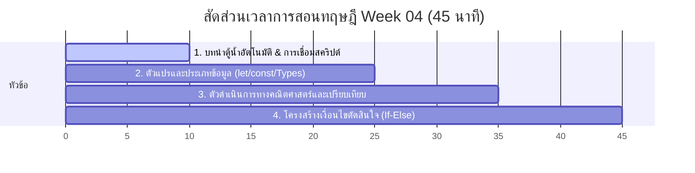

# สัปดาห์ที่ 4: Introduction to JavaScript

## 📚 หัวข้อทฤษฎี (45 นาที: 09:50 น. - 10:35 น.)
แนะนำ JavaScript ในฐานะ "สมอง" ของหน้าเว็บ โดยปูพื้นฐานการเขียนโปรแกรมเชิงตรรกะและโครงสร้างภาษาอ้างอิงตามลำดับเนื้อหาในวิดีโอ BorntoDev (นาทีที่ 24:00 - 1:05:00) เชื่อมโยงกับสิ่งใกล้ตัวอย่างระบบตู้กดน้ำอัตโนมัติ

### ⏱️ แผนย่อยสำหรับการบรรยายทฤษฎี 45 นาที


```mermaid
gantt
    title สัดส่วนเวลาการสอนทฤษฎี Week 04 (45 นาที)
    dateFormat  X
    axisFormat %s
    section หัวข้อ
    1. บทนำตู้น้ำอัตโนมัติ & การเชื่อมสคริปต์ : active, 0, 10
    2. ตัวแปรและประเภทข้อมูล (let/const/Types) : 10, 25
    3. ตัวดำเนินการทางคณิตศาสตร์และเปรียบเทียบ : 25, 35
    4. โครงสร้างเงื่อนไขตัดสินใจ (If-Else) : 35, 45
```

---

### 1. 🥤 ส่วนที่ 1: แนะนำ JavaScript และวิธีการเชื่อมโยงสคริปต์ (10 นาที)
*   **แนวทางการเปรียบเทียบ**:
    *   **HTML** คือ โครงตู้กดน้ำ, **CSS** คือ สีสันป้ายตกแต่งตู้น้ำ ส่วน **JavaScript** คือ **"ระบบประมวลผลและการตัดสินใจเบื้องหลังของตู้"**
*   **รูปแบบการเขียนและเชื่อมโยง JavaScript (สองวิธีหลัก)**:
    *   **1. แบบเขียนภายในหน้า HTML (Internal Script)**:
        *   ใช้แท็ก `<script>` ครอบโค้ด JS โดยตรงในไฟล์ HTML
        *   *ตัวอย่างการเขียน:*
            ```html
            <!-- index.html -->
            <button id="hello-btn">คลิก</button>
            <script>
                const helloBtn = document.getElementById('hello-btn');
                helloBtn.addEventListener('click', () => {
                    alert('สวัสดีจาก Internal Script!');
                });
            </script>
            ```
        *   *ข้อดี/ข้อเสีย:* สะดวก รวดเร็วสำหรับงานเล็กๆ แต่ทำให้ไฟล์ HTML รกและแชร์ข้ามหน้าเว็บอื่นไม่ได้
    *   **2. แบบแยกไฟล์ภายนอก (External Script - แนะนำ)**:
        *   เขียนโค้ด JS แยกเฉพาะในไฟล์นามสกุล `.js` (เช่น `script.js`) แล้วลิงก์เข้ามา
        *   *ตัวอย่างการเขียน:*
            ```html
            <!-- index.html -->
            <button id="hello-btn">คลิก</button>
            <script src="script.js"></script>
            ```
            ```javascript
            // script.js (ไม่ต้องมีแท็ก <script> ครอบ)
            const helloBtn = document.getElementById('hello-btn');
            helloBtn.addEventListener('click', () => {
                alert('สวัสดีจาก External Script!');
            });
            ```
        *   *ข้อดี:* โค้ดเป็นระเบียบ แยกโครงสร้างออกจากการควบคุมพฤติกรรมอย่างเป็นระบบ และแชร์ข้ามไฟล์ได้ง่าย

---

### 2. 📦 ส่วนที่ 2: ตัวแปรและประเภทข้อมูล (15 นาที) — *เทียบเท่าคลิป BorntoDev นาทีที่ 24:00 - 40:00*
*   **ตัวแปร (Variables)**: เปรียบเสมือน **"กล่องเก็บข้อมูลที่มีป้ายชื่อติดไว้"** เพื่อนำมาเรียกใช้หรือประมวลผลซ้ำ
    *   `let` (กล่องเปิดฝา เปลี่ยนของได้): เช่น ตัวแปรสำหรับคำนวณค่าน้ำหนัก ยอดเงินสะสม หรือคะแนนสะสม
    *   `const` (กล่องปิดตายด้วยกาวตราช้าง ห้ามเปลี่ยนค่า): เช่น พิกัดการดึงองค์ประกอบปุ่ม หรือค่าคงที่ทางคณิตศาสตร์
*   **ประเภทข้อมูลพื้นฐาน (Basic Data Types)**:
    *   `String` (ข้อความ): ครอบด้วยเครื่องหมายคำพูด เช่น `"Hello"`, `"50"`
    *   `Number` (ตัวเลขคณิตศาสตร์): ไม่มีเครื่องหมายคำพูด เช่น `50`, `1.85` (ใช้บวกลบคูณหารคำนวณได้จริง)
    *   `Boolean` (ค่าความจริง): มีสองสถานะคือ `true` (จริง) หรือ `false` (เท็จ)
*   **การตรวจสอบข้อมูลเบื้องหลัง (Debugging)**:
    *   ใช้ `console.log()` พ่นค่าออกทางหน้าหลังบ้าน (Inspect Console) เพื่อเช็กพฤติกรรมการประมวลผล
    *   ใช้ `alert()` แสดงหน้าต่าง Pop-up แจ้งเตือนด่วนบนจอภาพ
    *   *จุดเน้นย้ำเรื่องประเภทข้อมูล:* ฟังก์ชัน `parseFloat()` มีความสำคัญมากในการคัดกรองแปลงข้อมูลประเภทข้อความ (`String` เช่น `"50"`) ที่รับมาจากกล่อง Input บนหน้าเว็บ ให้กลายเป็นตัวเลขจุดทศนิยม (`Number` เช่น `50`) ก่อนทำการประมวลผลคำนวณ

---

### 3. 🔌 ส่วนที่ 3: ตัวดำเนินการและการประมวลผล (10 นาที) — *เทียบเท่าคลิป BorntoDev นาทีที่ 40:00 - 50:00*
*   **ตัวดำเนินการทางคณิตศาสตร์ (Arithmetic Operators)**:
    *   สัญลักษณ์คำนวณ: `+` (บวก), `-` (ลบ), `*` (คูณ), `/` (หาร)
    *   *ตัวอย่างการนำไปใช้:* `bmi = weight / (heightM * heightM)` (สูตรดัชนีมวลกาย)
*   **ตัวดำเนินการเปรียบเทียบ (Comparison Operators)**:
    *   เปรียบเทียบค่าสองฝั่งเพื่อส่งผลเป็นค่าความจริง (`true`/`false`):
    *   `>` (มากกว่า), `<` (น้อยกว่า), `>=` (มากกว่าหรือเท่ากับ), `<=` (น้อยกว่าหรือเท่ากับ), `==` (เท่ากับ)
*   **ตัวดำเนินการทางตรรกศาสตร์ (Logical Operators)**:
    *   `&&` (AND - และ): ต้องเป็นจริงทั้งสองฝั่งจึงจะได้ผลลัพธ์เป็นจริง (เช่น `bmi >= 18.5 && bmi <= 22.9`)
    *   `||` (OR - หรือ): ขอเพียงมีฝั่งใดฝั่งหนึ่งเป็นจริงก็ทำงานทันที
    *   `!` (NOT - ปฏิเสธ): กลับค่าความจริงจากจริงเป็นเท็จ หรือเท็จเป็นจริง

---

### 4. 🧠 ส่วนที่ 4: โครงสร้างควบคุมและตัดสินใจ (If-Else) (10 นาที) — *เทียบเท่าคลิป BorntoDev นาทีที่ 50:00 - 1:05:00*
*   **แนวคิดการตัดสินใจของเงื่อนไข (Conditionals)**:
    *   เปรียบเหมือนการคิดของตู้น้ำหยอดเหรียญ:
        *   **If (ถ้า)**: หยอดเหรียญครบ 20 บาท -> จ่ายน้ำกระป๋องโค้ก
        *   **Else If (หรือถ้า)**: หยอดเหรียญครบ 15 บาท -> จ่ายขวดน้ำเปล่า
        *   **Else (นอกเหนือจากนั้น)**: แจ้งเตือนสัญญาณไฟกระพริบว่าเงินสะสมไม่เพียงพอ
*   **ไวยากรณ์โครงสร้างควบคุมเงื่อนไข**:
    ```javascript
    if (เงื่อนไขที่ 1) {
        // สั่งทำงานเมื่อเงื่อนไขที่ 1 เป็นจริง
    } else if (เงื่อนไขย่อย) {
        // สั่งทำงานเมื่อเงื่อนไขย่อยเป็นจริง
    } else {
        // สั่งทำงานเมื่อไม่ตรงกับเงื่อนไขใดๆ ด้านบนเลย
    }
    ```
*   **กิจกรรมทบทวนด่วน (Quick Quiz) (5 นาที)**:
    1.  **คำถาม 1**: ทำไมเราต้องแปลงค่าน้ำหนักหรือส่วนสูงด้วยฟังก์ชัน `parseFloat()` ก่อนคำนวณทางคณิตศาสตร์? *(แนวตอบ: เพราะข้อความจากช่องอินพุตบนเบราเซอร์เป็นข้อมูลประเภท String หากไม่ทำการแปลงเป็นตัวเลขก่อน โค้ดจะไม่ประมวลผลคำนวณคณิตศาสตร์ และเกิดค่าผิดพลาดเป็น NaN หรือเอาข้อความมาต่อกัน)*
    2.  **คำถาม 2**: สัญลักษณ์ `&&` (และ) ทำหน้าที่อะไรในการเช็กเกณฑ์ BMI สุขภาพ? *(แนวตอบ: บังคับให้เงื่อนไขขนาบซ้ายและขวาต้องผ่านเกณฑ์ทั้งหมด เช่น ค่า BMI ต้องอยู่ตั้งแต่ 18.5 ขึ้นไป และไม่เกิน 22.9 จึงจะสรุปว่าเป็นเกณฑ์น้ำหนักปกติ)*
    3.  **คำถาม 3**: หากต้องการเขียนโค้ดตรวจสอบเงื่อนไข "ถ้าหยอดเงินสะสมน้อยกว่าราคาสินค้า ให้แสดง Alert บอกเงินไม่พอ" จะเขียนโครงสร้างได้อย่างไร? *(แนวตอบ: `if (money < price) { alert("ยอดเงินไม่พอ!"); }`)*

---

## ⏱️ แผนจัดสรรเวลาสำหรับคาบปฏิบัติ Workshop (90 นาที: 10:40 น. - 12:10 น.)

สำหรับการปฏิบัติแล็บสัปดาห์นี้จะให้นักเรียนสร้างระบบตรวจและเสี่ยงสลากกินแบ่ง **[Project] 2-Digit Lottery Simulator** โดยเน้นเชื่อมโยงขั้นตอนการนำเข้าข้อมูลประมวลผล การสุ่มค่า และการเขียนตรวจสอบเงื่อนไขทางเลือกของ JavaScript ร่วมกับ HTML/CSS เพื่อให้นักเรียนเข้าใจกระบวนการรันโปรแกรมตามลำดับ:

### 📅 รายละเอียดช่วงเวลาปฏิบัติการ:

#### 1. ช่วงตั้งค่าไฟล์และเชื่อมต่อระบบหลัก (15 นาที | 10:40 - 10:55 น.)
*   **กิจกรรมของครู**:
    1. นำนักเรียนเข้าสู่โฟลเดอร์ปฏิบัติการ `Student/` ใน VS Code เพื่อสำรวจโครงสร้างและไฟล์ตั้งต้น `index.html` และ `script.js`
    2. สอนวิธีเชื่อมโยงไฟล์ JavaScript ภายนอกโดยใส่แท็กด้านล่างของ `<body>` ใน `index.html`:
       ```html
       <script src="script.js"></script>
       ```
    3. สาธิตการเขียนคำสั่ง `console.log("Hello, World!");` หรือ `alert()` เพื่อทดสอบว่าไฟล์สคริปต์เชื่อมต่อและทำงานสำเร็จจริงผ่านเว็บเบราว์เซอร์
*   **จุดเน้นย้ำ**: ย้ำความสำคัญของ Relative Path และความจริงที่ว่าต้องเชื่อมไฟล์ก่อนจึงจะรันโค้ดควบคุมได้

#### 2. ลุยภารกิจหลัก (Core Mission): สุ่มตรวจรางวัลเลขท้าย 2 ตัว (40 นาที | 10:55 - 11:35 น.)
*   **กิจกรรมของครู**:
    - **ขั้นตอนที่ 1 (ดึง Element)**: สอนดึงข้อมูลกล่องอินพุตตัวเลข ปุ่ม และพื้นที่แสดงผลจาก HTML มาเตรียมประมวลผลเป็นตัวแปรค่าคงที่ (`const`):
      ```javascript
      const lottoInput = document.getElementById('lotto-input');
      const playBtn = document.getElementById('play-btn');
      const winningNumDiv = document.getElementById('winning-number');
      const resultDiv = document.getElementById('result');
      ```
    - **ขั้นตอนที่ 2 (สร้างฟังก์ชันเสี่ยงโชค)**: สอนสร้างฟังก์ชัน `playLottery()` เพื่อคำนวณและสุ่มเลขรางวัล:
      - ดึงค่าตัวเลขจากอินพุตและแปลงประเภทข้อมูลด้วย `parseInt()`
      - สุ่มตัวเลขจำนวนเต็ม 0 ถึง 99 ด้วยสูตร: `const winningNumber = Math.floor(Math.random() * 100);`
      - จัดรูปแบบแสดงผลเลข 2 หลักกรณีที่ได้ค่าต่ำกว่า 10 (เช่น 7 -> "07") ด้วยคำสั่ง:
        ```javascript
        const formattedWinningNumber = winningNumber.toString().padStart(2, '0');
        winningNumDiv.innerText = formattedWinningNumber;
        ```
    - **ขั้นตอนที่ 3 (ตรวจสอบผลและเชื่อมโยงปุ่ม)**:
      - เปรียบเทียบเงื่อนไขการถูกรางวัล: `if (userGuess === winningNumber)` แล้วนำผลลัพธ์ไปเขียนแสดงผลผ่าน `resultDiv.innerText`
      - เชื่อมโยงฟังก์ชันเข้ากับเหตุการณ์คลิกปุ่มผ่านคำสั่ง:
        ```javascript
        playBtn.addEventListener('click', playLottery);
        ```

#### 3. ปฏิบัติการส่วนขยาย (Extra Challenge): การตรวจรางวัลเฉียดและการดักจับข้อผิดพลาด (15 นาที | 11:35 - 11:50 น.)
*   **กิจกรรมของครู**:
    1. **ระบบรางวัลเฉียด (Near Miss)**: สอนเขียนตรวจสอบเงื่อนไข `else if` เพื่อเช็คว่าตัวเลขที่ซื้อคลาดเคลื่อนไปจากผลรางวัลสุ่มบวกหรือลบ 1 ค่าหรือไม่ (เช่น ออก 55 ซื้อ 54 หรือ 56) ให้แสดงข้อความปลอบใจและใช้โทนสีส้ม (`orange`)
    2. **การคัดกรองข้อมูลผิดพลาด (Validation)**: สอนเขียนเงื่อนไข `if` เพื่อป้องกันความผิดพลาดก่อนเริ่มสุ่มรางวัล โดยคัดกรองว่าค่าว่างเปล่า หรือตัวเลขอยู่นอกเหนือช่วง `0 - 99` หรือไม่ หากเป็นจริงให้แจ้งเตือนและหยุดฟังก์ชันด้วยคำสั่ง `return` ทันที

#### 4. สรุปวิเคราะห์จุดระวังการสะกดโค้ด (10 นาที | 11:50 - 12:00 น.)
*   **สิ่งที่ครูเน้นย้ำ**:
    1.  **การสะกดคำสั่งและวงเล็บขาดหาย**: ตัวแปรและคำสะกดเคส เช่น `getElementById` หรือ `addEventListener` ห้ามสะกดผิดแม้แต่ตัวพิมพ์เล็ก-พิมพ์ใหญ่
    2.  **ความต่างของประเภทข้อมูล (String vs Number)**: หากนำ String สองตัวมาเช็คด้วย `===` เช่น `"07"` (String) เทียบกับ `7` (Number) จะได้ผลลัพธ์เป็นเท็จเสมอ จึงจำเป็นต้องแปลงข้อความเป็นตัวเลข (`parseInt`) ก่อนคำนวณเสมอ
    3.  **ช่วงขอบเขตของ Math.random()**: สุ่มเลข 2 หลักต้องคูณด้วย `100` และใช้ `Math.floor()` ในการปัดทศนิยมลง เพื่อครอบคลุมเลข `0 ถึง 99`

#### 5. กิจกรรม "สลับกันถล่มระบบเสี่ยงโชค" (10 นาที | 12:00 - 12:10 น.)
*   **กติกาและวิธีการจัดกิจกรรม**:
    1. ให้นักเรียนสลับหน้าจอโปรเจกต์ตรวจรางวัลของเพื่อนข้างๆ
    2. ทดลองกรอกข้อมูลเคสแปลกๆ เช่น ไม่กรอกตัวเลข, กรอกตัวเลข 500, หรือกรอกตัวเลขติดลบ เพื่อทดสอบว่าโปรแกรมของเพื่อนสามารถคัดกรองบั๊กได้ครบถ้วนหรือไม่
    3. ตรวจสอบเงื่อนไขว่าเมื่อถูกรางวัล หรือเฉียดรางวัล แสดงผลลัพธ์สีสันได้ถูกต้องตามโจทย์หรือไม่
    4. ครูสรุปประเมินความเข้าใจและจังหวะการทำโปรแกรมของนักเรียนทั้งคาบ

## โปรเจกต์ตัวอย่าง
[Project] Simple 2-Digit Lottery Simulator (โปรแกรมจำลองสลากกินแบ่งเลขท้าย 2 ตัว)
- • Core: รับค่าตัวเลขที่ทาย สุ่มเลข 2 หลัก แล้วตรวจสอบเงื่อนไขการถูกรางวัลเมื่อคลิกปุ่ม
- • Extra: เพิ่มรางวัลข้างเคียง (+/- 1 จากเลขรางวัล) และทำแบบตรวจสอบคัดกรองความถูกต้องข้อมูลอินพุต (Validation) พร้อมเปลี่ยนสีข้อความ

### สิ่งที่ได้เรียนรู้:
1. การเชื่อมต่อลิงก์ภายนอกแบบ External JS และการดีบั๊กผ่าน `console.log()` / `alert()`
2. การสร้างตัวแปรเก็บข้อมูล และการแปลงประเภทข้อมูลตัวเลขจำนวนเต็มด้วย `parseInt()`
3. การสุ่มคำนวณทางคณิตศาสตร์ด้วย `Math.random()` และ `Math.floor()`
4. การสร้างเงื่อนไขควบคุมและเปรียบเทียบตรรกะแบบทางเลือกหลายเงื่อนไข (`if-else if-else`)
5. การดึง Element และอัปเดตอักษรสีสันบน DOM หน้าเว็บ (`innerText` / `style.color`)
