# สัปดาห์ที่ 5: Introduction to CSS

## 📚 หัวข้อทฤษฎี (45 นาที: 09:50 น. - 10:35 น.)
เข้าสู่อาณาจักรแห่งการตกแต่งเว็บไซต์ ทำความเข้าใจการแยกส่วนของข้อมูล (HTML) ออกจากความสวยงาม (CSS) เรียนรู้วิธีใส่ CSS ทั้ง 3 รูปแบบ และกลไกการเลือกเป้าหมายเพื่อลงสี (Selectors) อย่างมือโปร

### ⏱️ แผนย่อยสำหรับการบรรยายทฤษฎี 45 นาที

```mermaid
gantt
    title สัดส่วนเวลาการสอนทฤษฎี Week 05 (45 นาที)
    dateFormat  X
    axisFormat %s
    section หัวข้อ
    1. CSS คืออะไร & วิธีเขียน 3 รูปแบบ : active, 0, 20
    2. เจาะลึก CSS Selectors (Tag, Class, ID) : 20, 35
    3. กฎความสำคัญ (Specificity) เบื้องต้น : 35, 40
    4. กิจกรรม Quick Quiz ทบทวน : 40, 45
```

---

### 1. 🎨 ส่วนที่ 1: CSS คืออะไร และการติดตั้ง 3 รูปแบบ (20 นาที)
*   **แนวทางการเปรียบเทียบ**:
    *   ถ้า HTML คือการก่อสร้างโครงเสาคอนกรีตของบ้าน **CSS (Cascading Style Sheets)** ก็คือการทาสี ปูพื้นไม้กระดาน และการเลือกติดโคมไฟหรูหรา
    *   **เปรียบเทียบความแตกต่างในการเขียน 3 รูปแบบ**:
        1.  **Inline Style (สติกเกอร์ราคาติดบนตัวสินค้า)**: เขียนในแท็ก HTML ตรงๆ เช่น `
` สะดวกด่วนจี๋ แต่รกรุงรังและแก้ไขยากมากเมื่อเว็บมีขนาดใหญ่ขึ้น
        2.  **Internal CSS (คู่มือกระดาษโน้ตแปะหัวข้อสอบ)**: เขียนในแท็ก `<style>` ด้านบนหน้าเพจ เป็นสัดส่วนขึ้นมาบ้าง แต่ยังส่งผลดีเฉพาะในหน้าเดียวนั้นๆ
        3.  **External CSS (สมุดคู่มือการออกแบบระดับห้างสรรพสินค้า)**: แยกไฟล์โค้ดความสวยงามออกไปเป็นไฟล์ `.css` ต่างหาก (เช่น `style.css`) แล้วเชื่อมกลับเข้ามาในหัวเว็บด้วยแท็ก `<link>`
            *   *ข้อดีที่สุด*: แก้ไขที่เดียว เปลี่ยนแปลงความสวยงามได้ทั้ง 100 หน้าเว็บในเสี้ยววินาที! (เหมือนโจทย์สลับธีม Dark/Light ที่เปลี่ยนแค่ชื่อลิงก์ไฟล์ CSS)

---

### 2. 🎯 ส่วนที่ 2: เจาะลึก CSS Selectors (15 นาที)
*   **แนวทางการอธิบายเชิงอุปมาอุปไมย (ในการชี้ระบุเป้าหมายในห้องเรียน ม.5)**:
    *   **Tag Selector (ชี้ตามสายพันธุ์)**: เช่น `p { color: blue; }` เปรียบเสมือนสั่งว่า **"นักเรียนที่เป็นมนุษย์ทุกคนในห้องนี้จงยืนขึ้น!"** (ทุกแท็ก `
` เปลี่ยนสีทั้งหมด)
    *   **Class Selector (ชี้ตามกลุ่มชมรม)**: มีสัญลักษณ์จุดนำหน้าเสมอ (เช่น `.science-club { color: green; }`) เปรียบเสมือนสั่งว่า **"นักเรียนที่อยู่ชมรมวิทยาศาสตร์เท่านั้นจงยืนขึ้น!"** (แท็กใดๆ ที่ใส่ `class="science-club"` จะเปลี่ยนเป็นสีเขียว มีหลายคนได้)
    *   **ID Selector (ชี้เป้าเจาะจงรายตัว)**: มีสัญลักษณ์แฮชแท็กนำหน้า (เช่น `#president { color: gold; }`) เปรียบเสมือนสั่งว่า **"หัวหน้าห้องเรียนคนเดียวเท่านั้นจงยืนขึ้น!"** (แท็กที่ใส่ `id="president"` จะเปลี่ยนสีทอง และในหนึ่งหน้าต้องมี ID นี้เพียงจุดเดียวห้ามซ้ำซ้อน)

---

### 3. ⚖️ ส่วนที่ 3: กฎสิทธิ์ความสำคัญเบื้องต้น (Specificity) (5 นาที)
*   **แนวทางการสอน**:
    *   จะเกิดอะไรขึ้นถ้ามีคนมาสั่งว่า "หัวหน้าห้องจงใส่เสื้อสีทอง" (สั่งเจาะจง ID) แต่ป้ายชมรมสั่งว่า "เด็กวิทยาศาสตร์จงใส่เสื้อสีเขียว" (สั่งตาม Class)?
    *   **กฎการชนกัน**: ID มีพลังอำนาจสูงที่สุด รองลงมาคือ Class และท้ายสุดคือ Tag ปกติทั่วไป

---

### 4. 🧠 ส่วนที่ 4: กิจกรรมทดสอบความเข้าใจด่วน (Quick Quiz) (5 นาที)
เช็กความพร้อมด้วย 3 คำถามด่วน:
1.  **คำถาม 1**: ข้อใดคือรูปแบบการเชื่อมโยง CSS ที่ดีที่สุดในการจัดทำเว็บไซต์หลายหน้า เพื่อความง่ายในการดูแลรักษาระยะยาว?
    *   A) Inline Style
    *   B) External CSS *(แนวตอบ: B)*
2.  **คำถาม 2**: สัญลักษณ์จุด (Dot `.`) ในหน้าไฟล์ CSS สื่อถึง Selector ประเภทใด? *(แนวตอบ: Class Selector)*
3.  **คำถาม 3**: หากในโค้ด HTML มีการตั้งค่า `class="box"` และมีโค้ด CSS สั่งงาน `.box { color: red; }` ควบคู่กับ `div { color: blue; }` ตัวอักษรในการ์ดกล่องนั้นจะแสดงผลออกมาเป็นสีอะไร? *(แนวตอบ: สีแดง เพราะ Class Selector (.box) มีสิทธิ์ลำดับความสำคัญ (Specificity) เหนือกว่า Tag Selector (div))*

## โปรเจกต์
[Project] Colour Vocab
- • Core: ทำหน้าเว็บคำศัพท์ ใส่สีพื้นหลังตามคำศัพท์
- • Extra: สร้าง CSS 2 ไฟล์เพื่อลองทำระบบสลับธีม
