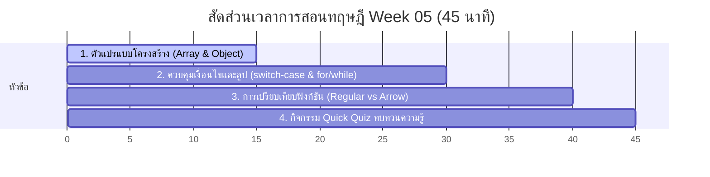

# สัปดาห์ที่ 5: JavaScript Core Fundamentals (Rock-Paper-Scissors)

## 📚 หัวข้อทฤษฎี (45 นาที: 09:50 น. - 10:35 น.)
ทำความเข้าใจและเรียนรู้โครงสร้างและไวยากรณ์หลักที่จำเป็นต้องรู้ของ JavaScript (Core JS) ได้แก่ **Array, Object, switch-case, การวนลูป (for/while), และการใช้งานฟังก์ชัน (Regular vs Arrow)** ผ่านการพัฒนาเกมเป่ายิ้งฉุบสะสมคะแนนแบบมีระบบลูปผูกปุ่มอัจฉริยะ

### ⏱️ แผนย่อยสำหรับการบรรยายทฤษฎี 45 นาที


```mermaid
gantt
    title สัดส่วนเวลาการสอนทฤษฎี Week 05 (45 นาที)
    dateFormat  X
    axisFormat %s
    section หัวข้อ
    1. ตัวแปรแบบโครงสร้าง (Array & Object) : active, 0, 15
    2. ควบคุมเงื่อนไขและลูป (switch-case & for/while) : 15, 30
    3. การเปรียบเทียบฟังก์ชัน (Regular vs Arrow) : 30, 40
    4. กิจกรรม Quick Quiz ทบทวนความรู้ : 40, 45
```

---

### 1. 📦 ส่วนที่ 1: ตัวแปรแบบโครงสร้างข้อมูล (Array & Object) (15 นาที)
*   **Array (ตัวแปรแบบชุดข้อมูลลำดับ)**:
    *   เปรียบเหมือน **"กล่องใส่ของที่มีช่องแบ่งเป็นช่องๆ และมีหมายเลขกำกับ (Index)"** เริ่มต้นจากช่องที่ 0
    *   นำมาใช้เก็บทางเลือกของเกมเป่ายิ้งฉุบเพื่อสุ่มตัวเลือกคอมพิวเตอร์: `const choices = ['rock', 'paper', 'scissors'];`
    *   เข้าถึงข้อมูลด้วย index เช่น `choices[0]` (ได้ `'rock'`)
*   **Object (ตัวแปรแบบโครงสร้างคู่ Key-Value)**:
    *   เปรียบเหมือน **"แฟ้มประวัตินักเรียนที่มีป้ายระบุชื่อหัวข้อและมีข้อมูลอยู่ข้างใน"** ช่วยจัดเก็บตัวแปรเดี่ยวๆ ที่กระจัดกระจายให้มาอยู่เป็นกลุ่มก้อนอย่างเป็นระบบ
    *   นำมาใช้เก็บสถานะสะสมของเกม (State Object):
        ```javascript
        const gameState = {
            playerScore: 0,
            computerScore: 0,
            winningScore: 5
        };
        ```
    *   เข้าถึงข้อมูลผ่านเครื่องหมายจุด (Dot Notation) เช่น `gameState.playerScore`

---

### 2. ✊✌️✋ ส่วนที่ 2: ตรรกะเงื่อนไขและลูป (switch-case & for/while) (15 นาที)
*   **switch-case (ตรรกะแบบมีทางเลือกชัดเจน)**:
    *   เปรียบเหมือน **"ตู้ทางแยกที่มีป้ายบอกทางตรงๆ"** ถ้าตรงกับเงื่อนไขใดให้ทำทันที เหมาะกับกรณีที่เปรียบเทียบความเท่ากันแบบระบุค่าแน่นอน (ไม่ต้องเขียน `if-else` ซ้อนกันพร่ำเพรื่อ)
    *   ตัวอย่างการนำมาแปลงตัวย่อภาษาอังกฤษเป็น Emoji ภาษาไทย:
        ```javascript
        switch (choice) {
            case 'rock': return '✊ ค้อน';
            case 'paper': return '✋ กระดาษ';
            case 'scissors': return '✌️ กรรไกร';
        }
        ```
*   **การวนลูป (for และ while loops)**:
    *   **for loop (รู้รอบแน่นอน)**: เปรียบเหมือน **"การวิ่งรอบสนามโรงเรียนตามจำนวนรอบที่ครูกำหนด"** นำมาใช้จัดการผูก Event Listener ให้กับปุ่มเป่ายิ้งฉุบทั้ง 3 ปุ่ม หรือใช้เซ็ตเปิด/ปิดการทำงานของปุ่มทุกปุ่มพร้อมกันโดยใช้โค้ดเพียงไม่กี่บรรทัด
    *   **while loop (ไม่รู้รอบแน่นอน)**: เปรียบเหมือน **"การวิ่งเก็บขยะไปเรื่อยๆ ตราบใดที่ยังเห็นขยะอยู่บนพื้น"** นิยมใช้เมื่อไม่ทราบจำนวนรอบที่ชัดเจน แต่จะทำงานซ้ำไปเรื่อยๆ จนกว่าเงื่อนไขจะเป็นเท็จ (เช่น สุ่มเลขใหม่เรื่อยๆ จนกว่าจะไม่ซ้ำกับของเดิม)

---

### 3. ⚡ ส่วนที่ 3: ฟังก์ชันการทำงาน (Regular vs Arrow Functions) (10 นาที)
*   **Regular Function (ฟังก์ชันแบบดั้งเดิม)**:
    *   ใช้คำสำคัญ `function` ประกาศ มักใช้กับฟังก์ชันประมวลผลขนาดใหญ่ที่มีการเรียกใช้ซ้ำ เช่น `function play(playerChoice) { ... }`
*   **Arrow Function (ฟังก์ชันแบบลูกศรย่อ)**:
    *   ใช้รูปแบบเครื่องหมายลูกศร `() => { ... }` มีขนาดกะทัดรัด นิยมใช้กับฟังก์ชันย่อยที่ไม่ได้มีความซับซ้อนมาก หรือใช้ส่งเป็น callback ในเหตุการณ์คลิกปุ่ม:
        ```javascript
        resetBtn.addEventListener('click', resetGame);
        btn.addEventListener('click', () => play(choices[i]));
        ```

---

### 4. 🧠 ส่วนที่ 4: กิจกรรมทดสอบความเข้าใจด่วน (Quick Quiz) (5 นาที)
1.  **คำถาม 1**: หากต้องการเข้าถึงค่า `'scissors'` จากอาเรย์ `const choices = ['rock', 'paper', 'scissors'];` จะต้องระบุดัชนี index อย่างไร? *(แนวตอบ: `choices[2]` เพราะดัชนีอ้างอิงเริ่มนับจากเลข 0)*
2.  **คำถาม 2**: ประโยชน์ที่สำคัญที่สุดของการนำ `for loop` มาใช้ในการจัดการปุ่มกดในเกมนี้คืออะไร? *(แนวตอบ: ช่วยลดความซ้ำซ้อนของโค้ด ไม่ต้องเขียนดึง ID และผูก Event Listener แยกรายปุ่มทีละ 3 รอบ)*
3.  **คำถาม 3**: การทำงานของ `while loop` แตกต่างจาก `for loop` ในแง่ใดชัดเจนที่สุด? *(แนวตอบ: for loop ใช้เมื่อรู้จำนวนรอบที่ชัดเจน เช่น ขนาดของ Array ส่วน while loop ใช้เมื่อต้องการให้รันซ้ำไปเรื่อยๆ จนกว่าเงื่อนไขจะเป็นเท็จ โดยไม่จำเป็นต้องระบุจำนวนรอบล่วงหน้า)*

---

## ⏱️ แผนจัดสรรเวลาสำหรับคาบปฏิบัติ Workshop (90 นาที)

นักเรียนจะได้สร้างโปรเจกต์ **[Project] Rock-Paper-Scissors Game (เกมเป่ายิ้งฉุบสะสมแต้ม)** ที่อัปเกรดการเขียนโค้ดด้วยรูปแบบโครงสร้างมาตรฐาน:

### 📅 รายละเอียดช่วงเวลาปฏิบัติการ:

#### 1. สำรวจโครงสร้างและแปลงตัวแปรเป็น Object (15 นาที | 10:40 - 10:55 น.)
*   ให้นักเรียนเปิดโฟลเดอร์ปฏิบัติการ `Student/` เชื่อมไฟล์ `script.js` และสำรวจหน้ากาก HTML
*   ปรับเปลี่ยนการประกาศตัวแปรเก็บคะแนนแบบแยกเดี่ยวให้มาอยู่ในรูปแบบ **State Object (`gameState`)**

#### 2. แปลงตรรกะ Emoji ด้วย switch-case และทำระบบสุ่ม (25 นาที | 10:55 - 11:20 น.)
*   สร้างฟังก์ชันย่อยด้วย Arrow Function และใช้ตรรกะ `switch-case` เพื่อทำการแมปค่าทางเลือกภาษาอังกฤษไปแสดงเป็น Emoji ในหน้าเว็บ
*   สร้างระบบสุ่มคำตอบคอมพิวเตอร์ผ่านการเลือกค่าจาก Index ของ Array `choices`

#### 3. ปรับปรุงตรรกะตรวจสอบการเล่นและประกาศผู้ชนะ (20 นาที | 11:20 - 11:40 น.)
*   พัฒนาฟังก์ชันหลัก `play()` โดยรับพารามิเตอร์ตรวจสอบตรรกะแพ้ชนะ `if-else if-else` และสะสมค่าคะแนนขึ้นไปที่ `gameState`
*   เขียนระบบตรวจสอบเป้าหมายคะแนนสูงสุดเพื่อทำการบล็อกปุ่มทั้งหมด

#### 4. ใช้ for loop ควบคุมปุ่มและสิทธิ์การใช้งาน (20 นาที | 11:40 - 12:00 น.)
*   **จุดเน้นย้ำความโปร:** เขียนลูป `for` เพื่อผูก Event Listener ให้กับปุ่มเป่ายิ้งฉุบทั้ง 3 ปุ่มโดยอัตโนมัติ
*   เขียนลูป `for` เพื่อทำการวนรอบเปลี่ยนสถานะ `disabled` ของปุ่มต่างๆ ในฟังก์ชันปิดเกม และฟังก์ชันรีเซ็ตระบบ
*   สร้างฟังก์ชันรีเซ็ตค่าสถานะใน Object และคืนค่าหน้าจอกลับจุดเริ่มต้น

#### 5. แลกเปลี่ยนเรียนรู้ QA (10 นาที | 12:00 - 12:10 น.)
*   สลับเครื่องกับเพื่อนเพื่อเล่นทดสอบหาข้อบกพร่อง:
    - ตรวจว่าปุ่มล็อกเมื่อครบ 5 แต้มจริงหรือไม่
    - ตรวจสอบว่าโค้ดลูป `for` ผูกปุ่มได้ครบทุกปุ่มและไม่พบ Error สีแดงขึ้นใน Console ของเบราว์เซอร์
