# สัปดาห์ที่ 7: CSS Properties (2)

## 📚 หัวข้อทฤษฎี (45 นาที: 09:50 น. - 10:35 น.)
ไขความลึกลับของเลย์เอาต์เว็บผ่าน **"ทฤษฎีกล่อง" (The CSS Box Model)** ซึ่งเป็นรากฐานที่สำคัญที่สุดในการจัดระเบียบพื้นที่และระยะห่างบนหน้าจอคอมพิวเตอร์ โดยเปรียบเทียบกับพัสดุไปรษณีย์ส่งของจริง

### ⏱️ แผนย่อยสำหรับการบรรยายทฤษฎี 45 นาที

```mermaid
gantt
    title สัดส่วนเวลาการสอนทฤษฎี Week 07 (45 นาที)
    dateFormat  X
    axisFormat %s
    section หัวข้อ
    1. ไขความลับ Box Model ด้วยกล่องพัสดุ : active, 0, 20
    2. เจาะลึกการจัดแต่งขอบโค้ง (border-radius) : 20, 30
    3. ฝึกคำนวณพื้นที่จริงของกล่อง (Box Sizing) : 30, 40
    4. กิจกรรม Quick Quiz ทบทวน : 40, 45
```

---

### 1. 📦 ส่วนที่ 1: ไขความลับ Box Model ด้วยกล่องพัสดุไปรษณีย์ (20 นาที)
*   **แนวทางการสอนเชิงเปรียบเทียบ**:
    *   เบราว์เซอร์จะมององค์ประกอบทุกชิ้นบนหน้าจอ (ไม่ว่าจะเป็นรูปภาพ ปุ่ม หรือตัวหนังสือ) เป็น **"กล่องสี่เหลี่ยม"** เสมอ!
    *   **เปรียบเทียบส่วนประกอบทั้ง 4 ของ Box Model**:
        1.  **Content (ตัวชิ้นงาน)**: เปรียบเหมือน **"ตัวสินค้าหรือแก้วมณีล้ำค่า"** ที่อยู่ข้างในสุดของกล่องพัสดุ
        2.  **Padding (กันกระแทก)**: เปรียบเหมือน **"พลาสติกบับเบิ้ลกันกระแทก"** ที่ห่อรอบสินค้า เป็นระยะห่างระหว่างตัวสินค้ากับลังกระดาษ (ช่องว่างภายในกล่อง)
        3.  **Border (ลังกระดาษ)**: เปรียบเหมือน **"ลังกระดาษลูกฟูกหนาๆ"** ที่ปิดกั้นขอบเขตของพัสดุ (สามารถกำหนดสี ความหนา และชนิดเส้นได้ เช่น `border: 2px solid black;`)
        4.  **Margin (ระยะจอดรถขนส่ง)**: เปรียบเหมือน **"ระยะห่างระหว่างกล่องส่งพัสดุกล่องนี้ กับกล่องพัสดุข้างๆ"** เพื่อไม่ให้เบียดกันจนแหลกเหลว (ระยะห่างภายนอกขอบเขตของลังกระดาษ)

---

### 2. 🎡 ส่วนที่ 2: ศิลปะการจัดแต่งของโค้ง (border-radius) (10 นาที)
*   **แนวทางการอธิบาย**:
    *   ความมหัศจรรย์ของ `border-radius` (การทำมุมโค้งมน)
    *   ถ้ากล่องมีขนาดกว้างยาวเท่ากันเป็นสี่เหลี่ยมจัตุรัส (เช่น กว้าง 200px สูง 200px) แล้วเราสั่งค่า `border-radius: 50%;` กล่องสี่เหลี่ยมกระด้างจะเปลี่ยนร่างกลายเป็น **"วงกลมที่สมบูรณ์แบบ"** ทันที!
    *   นี่คือเคล็ดลับในการสร้างกรอบรูปโปรไฟล์ทรงกลมสไตล์โซเชียลมีเดียยอดฮิตในปัจจุบัน

---

### 3. 📐 ส่วนที่ 3: ฝึกคำนวณพื้นที่และระยะชนกัน (10 นาที)
*   **แนวทางการสอนเชิงคำนวณ**:
    *   สอนให้นักเรียนเข้าใจว่าขนาดจริงของกล่องบนหน้าเว็บไม่ใช่แค่ `width` แต่เกิดจาก: `width` + `left padding` + `right padding` + `left border` + `right border`
    *   เกริ่นสั้นๆ เรื่องคำสั่งวิเศษ `box-sizing: border-box;` ที่สั่งให้เบราว์เซอร์รวมบับเบิ้ลและลังกระดาษเข้าไปในขนาดความกว้างที่เราสั่ง เพื่อให้จัดหน้าจอได้ง่ายขึ้นโดยไม่ต้องเหนื่อยคำนวณคณิตศาสตร์บวกเลขซ้ำซ้อน

---

### 4. 🧠 ส่วนที่ 4: กิจกรรมทดสอบความเข้าใจด่วน (Quick Quiz) (5 นาที)
เช็กความพร้อมด้วย 3 คำถามด่วน:
1.  **คำถาม 1**: หากต้องการขยับให้ปุ่มสองปุ่มที่อยู่ติดกันถอยเว้นระยะออกจากกันมากขึ้น ควรปรับค่าใดระหว่าง Padding กับ Margin? *(แนวตอบ: Margin เพราะเป็นระยะห่างภายนอกขอบของกล่อง)*
2.  **คำถาม 2**: หากกำหนดความกว้างและความสูงเป็น 150px เท่ากัน แล้วใส่ `border-radius: 50%;` จะได้ผลลัพธ์เป็นรูปทรงใด? *(แนวตอบ: รูปวงกลมสมบูรณ์แบบ)*
3.  **คำถาม 3**: ปลอกบับเบิ้ลกันกระแทกที่อยู่ภายในกล่องส่งของเปรียบเทียบได้กับองค์ประกอบใดในทฤษฎี CSS Box Model? *(แนวตอบ: Padding)*

## โปรเจกต์
[Project] Motivational Poster
- • Core: สร้างโปสเตอร์คำคม จัดกรอบให้สวยงาม
- • Extra: ใช้ border-radius วาดรูปทรงด้วย CSS
