# สัปดาห์ที่ 8: Midterm Checkpoint

## 📚 หัวข้อทฤษฎี (45 นาที: 09:50 น. - 10:35 น.)
สรุปองค์ความรู้ทั้งหมดตลอดครึ่งภาคเรียนที่ผ่านมา (HTML และ CSS) เพื่อเตรียมความพร้อมสำหรับการทำโปรเจกต์มิดเทอม (Capstone 1: Online Resume) และวิเคราะห์ข้อผิดพลาดในการเขียนโค้ดยอดฮิตเพื่อหลีกเลี่ยงในการสร้างสรรค์งานจริง

### ⏱️ แผนย่อยสำหรับการบรรยายทฤษฎี 45 นาที

```mermaid
gantt
    title สัดส่วนเวลาการสอนทฤษฎี Week 08 (45 นาที)
    dateFormat  X
    axisFormat %s
    section หัวข้อ
    1. สรุปสุดยอดองค์ความรู้ HTML & CSS : active, 0, 15
    2. คลินิกวิเคราะห์แก้บั๊กยอดฮิต (Bug Clinic) : 15, 30
    3. แนะนำชิ้นงาน Capstone 1 & เกณฑ์คะแนน : 30, 40
    4. กิจกรรม Quick Quiz ทบทวนความพร้อม : 40, 45
```

---

### 1. 🏆 ส่วนที่ 1: สรุปสุดยอดองค์ความรู้ HTML & CSS (15 นาที)
*   **แนวทางการบรรยายเชิงโครงสร้าง**:
    *   **HTML (กระดูกสันหลัง)**: การจัดกลุ่มข้อมูล คอนเซปต์ Block vs Inline Elements, ความสำคัญของความสะอาดโครงสร้างแท็กเปิดปิด และการเชื่อมโยงรูปภาพรูปภาพ/หน้าเพจ
    *   **CSS (หน้าตากายภาพ)**: การใช้ Selectors ควบคุมเป้าหมาย, การคัดเลือกเฉดสีและ Typography ที่ดึงอารมณ์ความรู้สึก และการใช้ Box Model (Margin/Padding/Border) เพื่อกำหนดสัดส่วนเลย์เอาต์หน้าจอ

---

### 2. 🏥 ส่วนที่ 2: คลินิกวิเคราะห์แก้บั๊กยอดฮิต (Bug Clinic) (15 นาที)
*   **แนวทางการสอนเพื่อป้องกันข้อผิดพลาด**:
    1.  **บั๊กภาพหาย (Broken Image)**: มักเกิดจากการพิมพ์ `src` ชี้ที่อยู่รูปภาพสะกดคำผิด หรือใช้ Absolute Path ของเครื่องคอมฯ ส่วนตัว (`C:\...`) แทน Relative Path
    2.  **บั๊กภาษาต่างดาว (Unicode Bug)**: มักเกิดจากการลืมพิมพ์ `<meta charset="UTF-8">` ไว้ในแท็ก `<head>` ทำให้เว็บแสดงภาษาไทยเพี้ยน
    3.  **บั๊กกล่องซ้อนกันแล้วขยับไม่ได้**: การลืมเคลียร์พื้นที่ Margin/Padding หรือเขียนลำดับ Nesting ผิดทำให้เลย์เอาต์ขยับเบี้ยว

---

### 3. 🎯 ส่วนที่ 3: แนะนำโจทย์ Capstone 1: Online Resume (10 นาที)
*   **แนวทางการชี้แนะ**:
    *   โจทย์: "สร้างหน้าประวัติส่วนตัวออนไลน์สำหรับยื่นสมัครงานหรือมหาวิทยาลัยจริง"
    *   **การวิเคราะห์เลย์เอาต์พื้นฐาน**:
        *   ส่วนหัว (Header): รูปภาพโปรไฟล์ หน้าปก และช่องทางติดต่อ
        *   ส่วนเนื้อหา (Body): ประวัติการศึกษา ผลงานเด่น และระดับทักษะความสามารถ (Skills)
    *   ชี้แนะแนวทางเกณฑ์การประเมิน: โครงสร้างโค้ดมีความถูกต้องตามหลักการพัฒนาเว็บ ความคิดสร้างสรรค์ และความสวยงามทันสมัย

---

### 4. 🧠 ส่วนที่ 4: กิจกรรมทดสอบความเข้าใจด่วน (Quick Quiz) (5 นาที)
เช็กความพร้อมด้วย 3 คำถามด่วน:
1.  **คำถาม 1**: หากนำโค้ดและรูปภาพไปรันบนคอมพิวเตอร์ของเพื่อนแล้วรูปภาพไม่ขึ้น แต่รันในเครื่องตนเองขึ้นปกติ ปัญหาหลักน่าจะเกิดจากอะไร? *(แนวตอบ: การระบุพาธรูปแบบ Absolute Path ที่ชี้พิกัดหาเฉพาะไฟล์ในเครื่องตนเอง หรือการลืมแนบโฟลเดอร์รูปภาพไปด้วย)*
2.  **คำถาม 2**: แท็ก `<meta charset="UTF-8">` ทำหน้าที่และควรเขียนไว้ในส่วนใดของเอกสาร HTML? *(แนวตอบ: ทำหน้าที่กำหนดรหัสตัวอักษรเพื่อรองรับภาษาไทย และต้องเขียนไว้ภายในแท็ก `<head>`)*
3.  **คำถาม 3**: ปัญหาความสวยงามที่พบบ่อยในการจัดระยะห่างระหว่างหัวข้อกับย่อหน้าคืออะไร และแก้ไขได้ด้วยคุณสมบัติใด? *(แนวตอบ: การเบียดกันเกินไปของตัวหนังสือ แก้ไขด้วยการปรับค่า `margin-bottom` หรือ `margin-top` ของแท็กนั้นๆ)*

## โปรเจกต์
🎯 [Capstone 1] Online Resume
- • Core: สร้างเรซูเม่ของตัวเองแบบจัดเต็มด้วย HTML/CSS
- • Review: เดินดูจอเพื่อนและโหวตผลงานที่เตะตา
