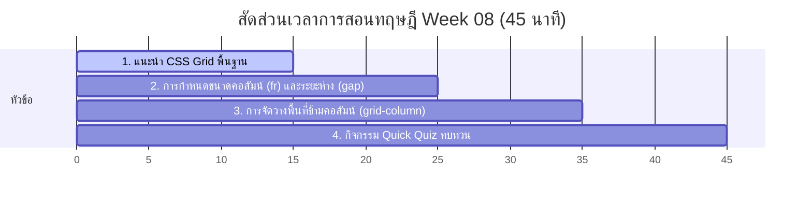

# สัปดาห์ที่ 8: CSS Grid Layout (การจัดโครงสร้างหน้าเว็บ)

## 📚 หัวข้อทฤษฎี (45 นาที: 09:50 น. - 10:35 น.)
เรียนรู้วิธีการจัดวางโครงสร้างหน้าเว็บสมัยใหม่ด้วย **CSS Grid Layout** ซึ่งเป็นเครื่องมือที่ทรงพลังที่สุดในการสร้าง Layout แบบตาราง (แถวและคอลัมน์) สองมิติ ช่วยให้เราจัดวางส่วนต่างๆ ของเว็บไซต์ได้อย่างสวยงามและเป็นระเบียบ

### ⏱️ แผนย่อยสำหรับการบรรยายทฤษฎี 45 นาที

```mermaid
gantt
    title สัดส่วนเวลาการสอนทฤษฎี Week 08 (45 นาที)
    dateFormat  X
    axisFormat %s
    section หัวข้อ
    1. แนะนำ CSS Grid พื้นฐาน : active, 0, 15
    2. การกำหนดขนาดคอลัมน์ (fr) และระยะห่าง (gap) : 15, 25
    3. การจัดวางพื้นที่ข้ามคอลัมน์ (grid-column) : 25, 35
    4. กิจกรรม Quick Quiz ทบทวน : 35, 45
```

---

### 1. 🏗️ ส่วนที่ 1: แนะนำ CSS Grid พื้นฐาน (15 นาที)
*   **แนวทางการสอนเชิงเปรียบเทียบ**:
    *   เปรียบเทียบการทำเว็บเหมือนการสร้างบ้าน เราต้องมี "โครงสร้าง" (Layout) ก่อนที่จะใส่เฟอร์นิเจอร์ (Content)
    *   **CSS Grid** คือระบบกริดแบบ 2 มิติ (มีทั้งแถวและคอลัมน์) ที่ทำให้การจัด Layout ง่ายขึ้นมาก
    *   เริ่มต้นด้วยการสร้าง **Grid Container**: ต้องใส่คำสั่ง `display: grid;` ที่กล่องแม่ (Container) เพื่อเปลี่ยนให้ลูกๆ ข้างในกลายเป็นไอเท็มในระบบ Grid

---

### 2. 📏 ส่วนที่ 2: การกำหนดขนาดคอลัมน์และระยะห่าง (10 นาที)
*   **แนวทางการอธิบาย**:
    *   **การแบ่งคอลัมน์ `grid-template-columns`**:
        *   แนะนำหน่วย `fr` (fraction) ที่ยืดหยุ่น เช่น `grid-template-columns: 1fr 2fr;` หมายถึงแบ่งเป็น 3 ส่วน ให้คอลัมน์แรกเอาไป 1 ส่วน คอลัมน์สองเอาไป 2 ส่วน (เหมือนในตัวอย่าง `Grid.html`)
    *   **การเว้นระยะห่าง `gap`**:
        *   แทนที่จะต้องมานั่งใส่ margin ให้แต่ละกล่อง เราสามารถสั่ง `gap: 15px;` ที่ Container แม่ได้เลย เพื่อเว้นระยะระหว่างแต่ละช่องอย่างสม่ำเสมอ

---

### 3. 🧩 ส่วนที่ 3: การจัดวางพื้นที่ข้ามคอลัมน์ (10 นาที)
*   **แนวทางการอธิบาย**:
    *   บางส่วนของเว็บเช่น Header หรือ Footer มักจะต้องยาวเต็มความกว้าง (กินพื้นที่หลายคอลัมน์)
    *   ใช้คำสั่ง **`grid-column`** กับกล่องลูก เช่น `grid-column: 1 / 3;` หมายถึงให้ขยายความกว้างตั้งแต่เส้นกริดที่ 1 ไปจนถึงเส้นกริดที่ 3 (ครอบคลุม 2 คอลัมน์)
    *   แสดงตัวอย่างการทำ Layout คลาสสิก: Header, Sidebar, Main Content, และ Footer

---

### 4. 🧠 ส่วนที่ 4: กิจกรรมทดสอบความเข้าใจด่วน (Quick Quiz) (10 นาที)
เช็กความพร้อมด้วย 3 คำถามด่วน:
1.  **คำถาม 1**: หากต้องการเริ่มต้นใช้งาน Grid ต้องใส่คำสั่งใดที่กล่อง Container แม่? *(แนวตอบ: `display: grid;`)*
2.  **คำถาม 2**: คำสั่ง `grid-template-columns: 1fr 1fr 1fr;` จะทำให้เกิดคอลัมน์กี่คอลัมน์ และขนาดเป็นอย่างไร? *(แนวตอบ: 3 คอลัมน์ ขนาดเท่าๆ กัน)*
3.  **คำถาม 3**: คำสั่งใดที่ใช้สำหรับเว้นระยะห่างระหว่างกล่อง (ทั้งแถวและคอลัมน์) ในระบบ Grid ได้อย่างรวดเร็ว? *(แนวตอบ: `gap`)*

## โปรเจกต์
[Project] Classic Web Layout
- • Core: สร้างหน้าเว็บที่มีโครงสร้างประกอบด้วย Header, Sidebar, Main Content, และ Footer โดยใช้ CSS Grid
- • Extra: ปรับสีสัน จัดขนาดตัวอักษร และลองเปลี่ยนสัดส่วนคอลัมน์เป็น 1fr 3fr
