# สัปดาห์ที่ 9: Advanced Layouts

## 📚 หัวข้อทฤษฎี (45 นาที: 09:50 น. - 10:35 น.)
ก้าวข้ามขีดจำกัดของการจัดวางเลย์เอาต์ปกติ สู่ทักษะขั้นสูงด้วยคุณสมบัติ **CSS Position (การจัดตำแหน่ง)** เรียนรู้วิธีการย้ายวัตถุตามใจสั่ง ดักจับจุด พิกัด และการตรึงแผงข้อมูลให้อยู่กับที่โดยไม่ไหลลื่นไปตามหน้าจอ

### ⏱️ แผนย่อยสำหรับการบรรยายทฤษฎี 45 นาที

```mermaid
gantt
    title สัดส่วนเวลาการสอนทฤษฎี Week 09 (45 นาที)
    dateFormat  X
    axisFormat %s
    section หัวข้อ
    1. ทำความรู้จัก Static และ Relative : active, 0, 15
    2. คอนเซปต์ Absolute บินอิสระตามคอร์ดิเนต : 15, 30
    3. ตรึงวัตถุด้วย Fixed (ปักหมุดลอยฟ้า) : 30, 40
    4. กิจกรรม Quick Quiz ทบทวน : 40, 45
```

---

### 1. 🚶‍♂️ ส่วนที่ 1: การจัดตำแหน่งปกติ Static และ Relative (15 นาที)
*   **แนวทางการเปรียบเทียบเชิงอุปมาอุปไมย (นักเรียนยืนต่อแถว)**:
    *   **Static (ตำแหน่งเริ่มต้นของทุกสิ่ง)**: เปรียบเหมือน **"นักเรียนยืนเข้าแถวหน้าเสาธงตามปกติ"** ใครมาก่อนต่อหน้า ใครมาหลังต่อท้าย ขยับตัวไปไหนนอกแถวเองไม่ได้เด็ดขาด
    *   **Relative (ยืนยงโย่ยงหยก)**: เปรียบเหมือน **"สั่งให้นักเรียนก้าวเบี่ยงเท้าออกจากแถวไปทางขวา 1 ก้าว"** (เช่น `left: 20px; top: 10px;`) ตัวนักเรียนจะขยับขยายไปตามสั่ง แต่สิ่งที่มหัศจรรย์คือ **เพื่อนข้างหลังยังมองเห็นพื้นที่ว่างของจุดยืนเดิมอยู่ และไม่ขยับข้ามเข้ามาแย่งที่** (เบราว์เซอร์ยังคงคำนวณพื้นที่แบบเดิมไว้)

---

### 2. 🦅 ส่วนที่ 2: หลุดพ้นกรอบเข้าหาพิกัด Absolute (15 นาที)
*   **แนวทางการเปรียบเทียบ**:
    *   **Absolute (นกบินผละออกจากแถว)**: เปรียบเหมือน **"สั่งให้นักเรียนลอยตัวหลุดออกจากการยืนเข้าแถวไปเลย"** บินอิสระลอยไปหาจุดพิกัดในบ้าน (พิกัดเทียบกับ container) โดยเพื่อนๆ ในแถวจะขยับชิดเข้าหากันเสมือนว่านักเรียนคนนี้ไม่เคยยืนตรงนั้นมาก่อน!
    *   **กฎสำคัญของ Absolute**: จะต้องหาพื้นที่อ้างอิงเสมอ โดยมันจะบินไปอิงพิกัด (`top`, `left`, `right`, `bottom`) กับกล่องพ่อแม่ตัวที่ใกล้ที่สุดที่เป็น `position: relative;` (หากไม่มีเลย มันจะลอยขึ้นไปอิงพิกัดกับขอบหน้าจอเบราว์เซอร์หลักสุด)
    *   *การประยุกต์ใช้งาน*: ใส่ `position: relative` ที่การ์ดสินค้าตัวแม่ และใส่ `position: absolute; top: -10px; right: -10px;` ที่ป้ายแจ้งเตือน (Badge) ตัวลูก เพื่อให้ป้ายกระโดดไปเตะตามุมขวาบนสุดของการ์ดอย่างแม่นยำ

---

### 3. 📌 ส่วนที่ 3: ตรึงพิกัดไม่ไหวติงด้วย Fixed (10 นาที)
*   **แนวทางการเปรียบเทียบ**:
    *   **Fixed (หมุดปักกระจกตาแว่นดำน้ำ)**: เปรียบเหมือน **"แว่นดำน้ำที่ติดหนึบอยู่กับหน้าผากของเรา"** ไม่ว่าเราจะดำน้ำลึก สไลด์ตัวหลบหลีก หรือวิ่งกระโดดขึ้นลงเขา (สกรอลล์หน้าเว็บลงไปยาวแค่ไหน) แว่นตาก็ยังคงลอยอยู่ที่ระดับพิกัดเดิมบนขอบจอตาเสมอไม่เปลี่ยนแปลง
    *   *การประยุกต์ใช้งาน*: การทำแถบเมนูนำทางด้านบนแบบติดหนึบ (Sticky/Fixed Navbar) ที่ค้างอยู่ขอบบนจอให้น่ามองตลอดเวลา และปุ่มลอยสำหรับแชตช่วยเหลือลูกค้าขวาล่าง

---

### 4. 🧠 ส่วนที่ 4: กิจกรรมทดสอบความเข้าใจด่วน (Quick Quiz) (5 นาที)
เช็กความพร้อมด้วย 3 คำถามด่วน:
1.  **คำถาม 1**: หากต้องการให้ป้ายแจ้งเตือนกลมๆ สีแดง (Badge Notification) แสดงผลซ้อนทับลอยอยู่มุมขวาบนของรูปโปรไฟล์อย่างพอดี ควรตั้งค่า Position ของรูปโปรไฟล์ตัวแม่ และป้ายแจ้งเตือนตัวลูกอย่างไร? *(แนวตอบ: รูปโปรไฟล์ตัวแม่ตั้งเป็น `position: relative;` และป้ายแจ้งเตือนตัวลูกตั้งเป็น `position: absolute; top: 0; right: 0;`)*
2.  **คำถาม 2**: ความแตกต่างที่สำคัญที่สุดระหว่าง `position: relative` กับ `position: absolute` คืออะไรในแง่ของพื้นที่รอบข้าง? *(แนวตอบ: Relative ยังคงรักษากล่องช่องว่างที่อยู่เดิมเอาไว้ เพื่อนข้างๆ ไม่เบียดเข้ามาแย่งพื้นที่ ส่วน Absolute จะปล่อยกล่องที่ว่างนั้นทิ้งไปเลย เพื่อนๆ จะขยับเข้ามาแทนที่ทันที)*
3.  **คำถาม 3**: หากต้องการให้แถบเมนูด้านบน (Navbar) ค้างอยู่ขอบบนสุดของหน้าจอเสมอไม่ว่าจะเลื่อนหน้าเว็บลงไปลึกแค่ไหน ควรระบุคุณสมบัติ Position ใด? *(แนวตอบ: `position: fixed;` (หรือ `position: sticky;`))*

## โปรเจกต์
[Project] Sticky Nav & Badges
- • Core: แถบเมนูแบบติดหนึบ และปุ่มแจ้งเตือนมุมขวาบน
- • Extra: ใส่ Hover effect เมื่อนำเมาส์ไปชี้
