# สัปดาห์ที่ 10: Flexbox

## 📚 หัวข้อทฤษฎี (45 นาที: 09:50 น. - 10:35 น.)
ปลดล็อกขีดจำกัดการจัดเรียงโครงสร้างกล่องข้อมูลแบบยืดหยุ่นด้วย **Flexbox (Flexible Box)** สุดยอดชุดคำสั่งจัดหน้าเว็บ 1 มิติที่ทันสมัยที่สุดในโลก เรียนรู้ทิศทางแกนหลัก-แกนรอง และศิลปะการจัดองค์ประกอบองค์ประกอบให้ลงตัวในพริบตา

### ⏱️ แผนย่อยสำหรับการบรรยายทฤษฎี 45 นาที

```mermaid
gantt
    title สัดส่วนเวลาการสอนทฤษฎี Week 10 (45 นาที)
    dateFormat  X
    axisFormat %s
    section หัวข้อ
    1. Flex Container vs Flex Items : active, 0, 15
    2. ทิศทางของแกนหลักและแกนตัดขวาง : 15, 25
    3. คำสั่งทรงพลังในการจัดตำแหน่ง (justify & align) : 25, 40
    4. กิจกรรม Quick Quiz ทบทวน : 40, 45
```

---

### 1. 📦 ส่วนที่ 1: Flex Container และ Flex Items (15 นาที)
*   **แนวทางการเปรียบเทียบเชิงอุปมาอุปไมย (ชั้นวางของยืดหดได้)**:
    *   ตามปกติ กล่องประเภท Block จะตกกระแทกซ้อนกันลงมาด้านล่างทีละบรรทัด (เหมือนหินบล็อกตกใส่กล่อง)
    *   **Flex Container (ชั้นวางอเนกประสงค์วิเศษ)**: เพียงสั่ง `display: flex;` ลงที่กล่องแม่ มันจะเปิดพลังเปลี่ยนของลูกๆ ด้านในให้กลายเป็นดินน้ำมันยืดหดได้ทันที!
    *   **Flex Items (ของเล่นดินน้ำมัน)**: กล่องลูกด้านในจะกระโดดเด้งขึ้นมาเรียงตัวในแนวนอนในบรรทัดเดียวกันโดยอัตโนมัติ พร้อมปรับขนาดตัวเองให้ยืดหยุ่นเข้ากับชั้นวางโดยไม่ล้นจอ

---

### 2. 🎡 ส่วนที่ 2: แกนหลักและแกนรอง (Main Axis vs Cross Axis) (10 นาที)
*   **แนวทางการสอน**:
    *   การเดินทางของรถไฟฟ้าบนรางเดี่ยว (1D Layout)
    *   **Main Axis (แกนหลัก)**: แนวทิศทางเดินทางหลักของกล่องลูก (ปกติจะเรียงขวางจากซ้ายไปขวา) สามารถหมุนเปลี่ยนให้เดินทางเรียงจากบนลงล่างได้ผ่านคุณสมบัติ `flex-direction: column;`
    *   **Cross Axis (แกนรอง)**: ทิศทางแนวตัดขวาง 90 องศากับแกนหลัก (หากแกนหลักแนวนอน แกนรองจะแนวตั้ง)
    *   การทำความเข้าใจเรื่องแกนมีความสำคัญมาก เพราะคำสั่งในการสั่งตำแหน่งจะเปลี่ยนพิกัดตามแนวการหมุนแกนนี้

---

### ⚖️ ส่วนที่ 3: คำสั่งทรงพลังในการกระจายน้ำหนักและจัดตำแหน่ง (15 นาที)
*   **แนวทางการอธิบายเชิงเลย์เอาต์**:
    *   **`justify-content` (จัดพิกัดตามแกนหลัก)**: สั่งให้กล่องลูกขยับขยายตามรางหลัก เช่น
        *   `center`: รวมพลกองไว้ตรงกลางหน้าจอพอดี
        *   `space-between`: ผลักดันกล่องลูกไปชิดขอบซ้ายสุดและขวาขอบสุด และแบ่งช่องว่างที่เหลือไว้ระหว่างกลางอย่างสมมาตร (เหมาะกับการทำเมนูหัวเว็บ Navbar)
    *   **`align-items` (จัดพิกัดตามแนวแกนรอง)**: ขยับกล่องลูกขึ้นลงเพื่อจัดระดับความสูงต่ำให้อยู่กึ่งกลางระนาบเดียวกันอย่างประณีต (`center`)

---

### 4. 🧠 ส่วนที่ 4: กิจกรรมทดสอบความเข้าใจด่วน (Quick Quiz) (5 นาที)
เช็กความพร้อมด้วย 3 คำถามด่วน:
1.  **คำถาม 1**: หากต้องการสั่งให้องค์ประกอบลูกทั้งหมดในการ์ดกล่องข้อความขยับมาเรียงกองกันอยู่กึ่งกลางกล่องแม่ทั้งในแนวตั้งและแนวนอนอย่างสมบูรณ์แบบ ควรระบุคำสั่ง CSS ใดคู่กันในกล่องแม่? *(แนวตอบ: `display: flex; justify-content: center; align-items: center;`)*
2.  **คำถาม 2**: คุณสมบัติ `flex-direction` มีไว้ใช้สำหรับกำหนดสิ่งใดในการจัดองค์ประกอบ? *(แนวตอบ: ใช้กำหนดทิศทางของแกนหลัก (Main Axis) ว่าจะให้กล่องลูกจัดเรียงตัวในแนวนอน (row) หรือแนวตั้ง (column))*
3.  **คำถาม 3**: หากต้องการทำระบบเมนูนำทาง (Navbar) ที่มีโลโก้อยู่ซ้ายสุด และมีปุ่มล็อกอินอยู่ขวาสุดของขอบจอพอดี ควรใช้คุณสมบัติ `justify-content` ตัวเลือกใด? *(แนวตอบ: `justify-content: space-between;`)*

## โปรเจกต์
[Project] Photo Gallery
- • Core: สร้างแกลเลอรีรูปภาพที่จัดเรียงด้วย Flexbox
- • Extra: แข่งขันเล่นเกม Flexbox Froggy
