# สัปดาห์ที่ 12: Bootstrap (Intro)

## 📚 หัวข้อทฤษฎี (45 นาที: 09:50 น. - 10:35 น.)
ก้าวเข้าสู่โลกของมืออาชีพด้วยการทำความรู้จัก **CSS Framework** ยอดนิยมระดับโลกอย่าง **Bootstrap** เรียนรู้การนำเข้า CDN และระบบตารางกริด 12 ช่องมหัศจรรย์ที่จะเสกหน้าเว็บของเราให้เปิดดูได้สวยงามในทุกอุปกรณ์ขนาดหน้าจอ (Responsive Design)

### ⏱️ แผนย่อยสำหรับการบรรยายทฤษฎี 45 นาที

```mermaid
gantt
    title สัดส่วนเวลาการสอนทฤษฎี Week 12 (45 นาที)
    dateFormat  X
    axisFormat %s
    section หัวข้อ
    1. CSS Framework คืออะไร & การดึง Bootstrap CDN : active, 0, 15
    2. กฎทอง 12 คอลัมน์ของ Bootstrap Grid System : 15, 30
    3. ไขปริศนา Responsive Breakpoints : 30, 40
    4. กิจกรรม Quick Quiz ทบทวน : 40, 45
```

---

### 1. 🏗️ ส่วนที่ 1: CSS Framework และการดึง Bootstrap CDN (15 นาที)
*   **แนวทางการเปรียบเทียบเชิงอุปมาอุปไมย (บ้านสำเร็จรูป Pre-fab)**:
    *   การเขียน CSS เองตั้งแต่ต้นเปรียบเสมือน **"การผสมปูน ก่ออิฐ และทาสีบ้านเองทีละก้อน"** ซึ่งใช้เวลานานและเหนื่อยมาก
    *   **Bootstrap (CSS Framework)**: เปรียบเหมือน **"โครงสร้างบ้านสำเร็จรูปอเนกประสงค์"** (Prefabricated structure) มีการหล่อกำแพง เสาเข็ม บันได และหน้าต่างที่สวยงามไว้รอเรียบร้อยแล้ว นักเรียนเพียงแค่เรียกสวมประกอบใช้งานได้ทันที!
    *   **CDN (Content Delivery Network)**: การโยงสายสัญญาณดึงชิ้นส่วนสำเร็จรูปเหล่านี้จากอินเทอร์เน็ตมาฝังลงที่เอกสาร HTML ของเราโดยตรง ผ่านแท็ก `<link>` ในส่วน `<head>` เพียงบรรทัดเดียว!

---

### 2. 🏁 ส่วนที่ 2: ระบบตารางกริด 12 ช่อง (Bootstrap Grid System) (15 นาที)
*   **แนวทางการอธิบายเรื่องการวาง Layout**:
    *   Bootstrap มองผืนแผ่นดินหน้าเว็บแนวขวางเป็น **"ที่ดินเปล่า 12 คูหาเท่าๆ กัน"** เสมอ!
    *   **กฎสำคัญ 3 ประสาน**:
        1.  `container`: รั้วเขตนอกสุดเพื่อจัดสมมาตรความกว้างของหน้าจอ
        2.  `row`: โครงเหล็กแนวนอนเพื่อจัดสัดส่วน
        3.  `col`: เสาแนวตั้งสำหรับแบ่งปันคูหาที่ดินเปล่า
    *   *ตัวอย่างการแบ่ง*:
        *   อยากได้ 3 กล่องเรียงหน้าเท่ากัน: ให้เสาละ 4 คูหา (`col-4` + `col-4` + `col-4` = 12)
        *   อยากได้ 2 ครึ่งหน้าจอเท่ากัน: ให้เสาละ 6 คูหา (`col-6` + `col-6` = 12)
        *   หากให้ขนาดเสารวมกันเกิน 12 (เช่น `col-8` + `col-6` = 14) เสาตัวหลังสุดจะตกกระแทกไหลลงไปขึ้นแถวแนวนอนแถวใหม่ทันที!

---

### 3. 📱 ส่วนที่ 3: ไขปริศนา Responsive Design & Breakpoints (10 นาที)
*   **แนวทางการสอนเชิงอุปกรณ์**:
    *   หน้าจอสมาร์ตโฟน แท็บเล็ต และคอมพิวเตอร์พกพามีขนาดความกว้างต่างกันมาก โค้ดที่ดีต้องปรับโฉมตามขนาดหน้าจอ (Responsive Web Design)
    *   **Breakpoints**: สัญลักษณ์แว่นตาเปลี่ยนขนาดอิงตามรหัสลับ (`sm` = จอเล็กมือถือแนวขวาง, `md` = จอขนาดกลางแท็บเล็ต, `lg` = จอใหญ่คอมพิวเตอร์โน้ตบุ๊ก)
    *   *ตัวอย่างทรงพลัง*:
        *   `
`
        *   แปลความว่า: "หากดูบนหน้าจอแท็บเล็ต/คอมพิวเตอร์จอกว้าง ให้แบ่งหน้าเป็นกล่องละ 2 คอลัมน์ (ขนาด 6 ช่อง) แต่ถ้าส่องดูผ่านหน้าจอมือถือเล็กๆ ปรับให้กล่องนี้นอนยาวเต็มความกว้างขอบจอ 12 ช่องเต็มไปเลยนะเพื่อน!"

---

### 4. 🧠 ส่วนที่ 4: กิจกรรมทดสอบความเข้าใจด่วน (Quick Quiz) (5 นาที)
เช็กความพร้อมด้วย 3 คำถามด่วน:
1.  **คำถาม 1**: ข้อใดต่อไปนี้ล้อมรอบการจัดสัดส่วน Layout ในตารางกริดของ Bootstrap ได้ถูกต้องตามลำดับโครงสร้าง?
    *   A) `row -> container -> col`
    *   B) `container -> row -> col` *(แนวตอบ: B)*
2.  **คำถาม 2**: หากต้องการแบ่ง Layout หน้าจอคอมพิวเตอร์ออกเป็นกล่องสินค้า 4 กล่องเรียงหน้าเท่ากันอย่างสวยงาม ควรระบุคลาสคอลัมน์ของ Bootstrap ด้วยตัวเลขใด? *(แนวตอบ: คลาส `col-3` (เพราะ 3 * 4 = 12 ช่องพอดี))*
3.  **คำถาม 3**: คลาส `col-lg-4 col-md-6 col-12` จะแสดงผลการแบ่งสัดส่วนบนหน้าจอมือถือขนาดเล็กสุด (ไม่มีรหัส breakpoint นำหน้า) ออกเป็นกี่คอลลัมน์ต่อ 1 แถว? *(แนวตอบ: แสดงผลเต็มจอ (12 ช่อง) หรือเท่ากับ 1 กล่องเต็มๆ ต่อ 1 แถว)*

## โปรเจกต์
[Project] Product Landing Page (Draft)
- • Core: แบ่ง Layout หน้าเว็บขายของด้วย Bootstrap
- • Extra: ทดสอบย่อหน้าจอเพื่อดูการทำงาน Responsive
