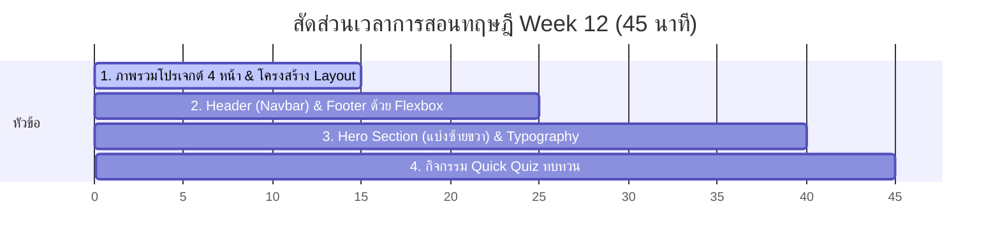

# สัปดาห์ที่ 12: โครงสร้างหลักและหน้าแรก (Layout & Index Page)

## 📚 หัวข้อทฤษฎี (45 นาที: 09:50 น. - 10:35 น.)
ก้าวสู่การสร้างเว็บไซต์จริงเต็มรูปแบบ! สัปดาห์นี้เราจะเริ่มโปรเจกต์ "แพลตฟอร์มคอร์สเรียนออนไลน์" ทบทวนการใช้ Flexbox และ Grid พื้นฐาน (Vanilla CSS) เพื่อสร้างโครงสร้างหลักที่ต้องมีในทุกหน้า (Header & Footer) รวมถึงการทำหน้าแรก (Index Page) ที่ประกอบด้วย Hero Section และ Typography ภาษาไทยที่สวยงาม

### ⏱️ แผนย่อยสำหรับการบรรยายทฤษฎี 45 นาที

```mermaid
gantt
    title สัดส่วนเวลาการสอนทฤษฎี Week 12 (45 นาที)
    dateFormat  X
    axisFormat %s
    section หัวข้อ
    1. ภาพรวมโปรเจกต์ 4 หน้า & โครงสร้าง Layout : active, 0, 15
    2. Header (Navbar) & Footer ด้วย Flexbox : 15, 25
    3. Hero Section (แบ่งซ้ายขวา) & Typography : 25, 40
    4. กิจกรรม Quick Quiz ทบทวน : 40, 45
```

---

### 1. 🏗️ ส่วนที่ 1: ภาพรวมโปรเจกต์โครงสร้าง Layout (15 นาที)
*   **แนวทางการสอนเชิงอุปมาอุปไมย (การสร้างบ้าน)**:
    *   โปรเจกต์นี้เราจะสร้างแพลตฟอร์มที่ประกอบด้วยหลายหน้าเว็บ (เช่น Index, Course, Instructors, Student Showcase, News & Events, Contact Us)
    *   ทุกหน้าต้องมี "หลังคา" (Header/Navbar) และ "ฐานราก" (Footer) ที่หน้าตาเหมือนกัน เพื่อให้รู้ว่าเป็นเว็บไซต์เดียวกัน
    *   **CSS Layout (Bootstrap 5 / Flexbox)**: หัวใจสำคัญในการจัดเรียงองค์ประกอบ ไม่ว่าจะเป็นการจัดเมนูต่างๆ ใน Navbar หรือการแบ่งหน้าจอซ้าย-ขวาสำหรับส่วน Hero Section

---

### 2. 🧩 ส่วนที่ 2: Header (Navbar) & Footer ด้วย Flexbox (10 นาที)
*   **แนวทางการบรรยายเชิงปฏิบัติ**:
    *   สอนการสร้างแท็ก `<header>` และ `<nav>` สำหรับเมนูนำทาง
    *   ใช้ `display: flex;` และ `align-items: center;` เพื่อให้โลโก้และลิงก์เมนูอยู่ในแนวระดับเดียวกัน
    *   สอนการสร้างแท็ก `<footer>` ที่เป็นส่วนล่างสุดของเว็บ ซึ่งมักมีเมนูย่อยและลิขสิทธิ์

---

### 3. 🖼️ ส่วนที่ 3: Hero Section & Typography ภาษาไทย (15 นาที)
*   **แนวทางการจัดโครงสร้าง**:
    *   Hero Section คือพื้นที่ดึงดูดสายตาแรกสุดของเว็บ (ในที่นี้เราจะวางรูปภาพไว้ทางซ้าย และข้อความพร้อมปุ่มไว้ทางขวา)
    *   แนะนำการใช้ HTML tags เพื่อจัดลำดับความสำคัญของข้อความ (`<h1>`, `<h2>`, `
`)
    *   สอนการเลือกใช้และกำหนดขนาดฟอนต์ (Typography) ภาษาไทยให้สวยงาม เช่น การใช้สีน้ำเงินโดดเด่นสลับกับข้อความสีดำ เพื่อดึงดูดความสนใจ ("เปลี่ยนไอเดียให้เป็นผลงาน...")

---

### 4. 🧠 ส่วนที่ 4: กิจกรรมทดสอบความเข้าใจด่วน (Quick Quiz) (5 นาที)
เช็กความพร้อมด้วย 3 คำถามด่วน:
1.  **คำถาม 1**: หากต้องการจัดให้โลโก้อยู่มุมซ้ายสุด และเมนูอยู่มุมขวาสุดของ Navbar โดยใช้ Flexbox ควรใช้คำสั่งใด? *(แนวตอบ: `justify-content: space-between;`)*
2.  **คำถาม 2**: แท็ก HTML ใดที่เหมาะสมที่สุดสำหรับสร้างส่วนเมนูนำทางด้านบนของเว็บไซต์? *(แนวตอบ: `<nav>` หรือ `<header>`)*
3.  **คำถาม 3**: ทำไมทุกหน้าเว็บของโปรเจกต์เดียวกันจึงควรมี Header และ Footer ที่เหมือนกัน? *(แนวตอบ: เพื่อสร้างความสอดคล้อง (Consistency) และประสบการณ์ผู้ใช้ที่ดี ไม่ให้ผู้ใช้สับสนว่ากำลังหลงไปเว็บไซต์อื่น)*

---

## ⏱️ แผนปฏิบัติการ Workshop คาบคู่ (90 นาที)

ภารกิจสำหรับคาบปฏิบัติการสัปดาห์นี้ นักเรียนจะได้สร้าง **หน้า Index (หน้าแรก)** ของแพลตฟอร์มคอร์สเรียน:

### 📅 รายละเอียดช่วงเวลาปฏิบัติการ:

#### 1. สร้างโครงสร้าง Navbar และ Footer (30 นาที | 10:40 - 11:10 น.)
*   ให้นักเรียนเขียนโครง HTML พื้นฐานสำหรับหน้า `index.html`
*   สร้าง Navbar ที่มีโลโก้ (หรือไอคอน) และลิงก์ไปยังหน้าต่างๆ (Index, Course, Instructors, Student Showcase, News & Events, Contact Us)
*   ตกแต่งด้วย CSS (`display: flex`) ให้สวยงามและมีระยะห่างที่พอดี

#### 2. ประกอบส่วน Hero Section ("We are the top...") (30 นาที | 11:10 - 11:40 น.)
*   สร้างกล่อง `
` สำหรับส่วน Hero
*   แบ่งหน้าจอเป็นสองฝั่ง (ใช้ Flexbox หรือ Bootstrap Grid) ฝั่งซ้ายใส่รูปภาพตกแต่ง ฝั่งขวาใส่ข้อความ <h1> และปุ่ม Buy now / Show more
*   ปรับสีปุ่มให้เป็นสีน้ำเงินตามแบบ (Primary Color)

#### 3. ประกอบส่วนข้อความโปรโมท "เปลี่ยนไอเดียให้เป็นผลงาน" (20 นาที | 11:40 - 12:00 น.)
*   สร้าง Section ใหม่ใต้ Hero 
*   จัดข้อความให้อยู่ตรงกลาง (`text-align: center`) 
*   ปรับขนาดและสีข้อความคำว่า "มืออาชีพ" ให้เด่นชัด

#### 4. ตรวจสอบความเรียบร้อย (10 นาที | 12:00 - 12:10 น.)
*   ทดลองดูผลลัพธ์ในเบราว์เซอร์ และปรับแก้ระยะห่าง (Margin/Padding) ให้ดูโปร่งสบายตา

## โปรเจกต์ตัวอย่างและเฉลย
*   **ไฟล์เฉลย**: ดูตัวอย่างโค้ด HTML/CSS เฉลยของคุณครูในโฟลเดอร์นี้ (`index.html`, `style.css`)
