# สัปดาห์ที่ 13: Bootstrap Grid & Components (Merged)

## 📚 หัวข้อทฤษฎี (45 นาที: 09:50 น. - 10:35 น.)
ก้าวเข้าสู่กระบวนการเขียนเว็บเชิงพาณิชย์และโปรเจกต์ระดับโปรด้วย **Bootstrap (CSS Framework)** เรียนรู้วิธีติดตั้งระบบสำเร็จรูปผ่าน CDN, กฎเหล็กโครงสร้างตารางกริด 12 ช่องเพื่อรองรับขนาดหน้าจอ Responsive Design, การเรียกประกอบชิ้นส่วนส่วนหน้าสำเร็จรูป (Navbar, Carousel, Cards) และการ Override สไตล์เพื่อความยืดหยุ่นทางอัตลักษณ์ของแบรนด์

### ⏱️ แผนย่อยสำหรับการบรรยายทฤษฎี 45 นาที

```mermaid
gantt
    title สัดส่วนเวลาการสอนทฤษฎี Week 13 (45 นาที)
    dateFormat  X
    axisFormat %s
    section หัวข้อ
    1. CSS Framework & Bootstrap CDN : active, 0, 10
    2. กฎทอง 12 คอลัมน์ของ Grid & Responsive : 10, 25
    3. ประกอบร่าง Navbar / Carousel / Cards : 25, 35
    4. ศิลปะการพ่นสีทับ: Override CSS : 35, 45
```

---

### 1. 🏗️ ส่วนที่ 1: รู้จัก CSS Framework และการติดตั้งผ่าน CDN (10 นาที)
*   **แนวทางการเปรียบเทียบ**:
    *   **เขียน CSS เอง**: เหมือนก่อกำแพงอิฐ ผสมปูน และทาสีบ้านเองทีละขั้นตอน ซึ่งใช้เวลามากและมีจุดบกพร่องสะสมได้ง่าย
    *   **Bootstrap**: เหมือนสั่งบ้านโครงเหล็กสำเร็จรูป (Prefabricated House) ที่วิศวกรออกแบบอย่างสมมาตรและทาสีไว้เสร็จสรรพ นำมาจัดวางสวมประกอบและใช้งานได้ทันที
*   **CDN (Content Delivery Network)**: ลิงก์ดึงความสวยงามจากคลาวด์มาใช้งานผ่านแท็ก `<link>` เพียงบรรทัดเดียวในหัวเว็บ `<head>`

---

### 2. 🏁 ส่วนที่ 2: ระบบตารางกริด 12 ช่อง และการตอบสนองทุกหน้าจอ (15 นาที)
*   **กฎสำคัญ 3 ประสาน**:
    1. `container`: โครงขอบรั้วแบ่งสัดส่วน
    2. `row`: แถวนอนเพื่อยึดโครงกริด
    3. `col`: คอลัมน์ที่ดินที่ต้องให้ขนาดผลรวมใน 1 แถวนอนมีค่าเท่ากับ **12 คูหา** เสมอ! (เช่น `col-lg-4` จำนวน 3 ตัวเรียงกัน หรือ `col-md-6` จำนวน 2 ตัวเรียงกัน)
*   **Responsive Breakpoints**: ตัวควบคุมขนาดคอลัมน์ตามหน้าจออิงตามรหัสลับ (`sm` จอมือถือ, `md` แท็บเล็ต, `lg` โน้ตบุ๊กคอมพิวเตอร์) เช่น:
    *   `
`
    *   ความหมาย: หากเป็นหน้าจอโน้ตบุ๊กกว้าง ให้แบ่งแสดง 3 คอลัมน์ใน 1 แถว (ใช้คลาส `col-lg-4`), หากเป็นแท็บเล็ต ให้แสดงเป็น 2 คอลัมน์ (ใช้คลาส `col-md-6`), และหากเป็นจอโทรศัพท์แคบ ให้แสดงผลแนวตั้งทอดยาวเต็มแถว 100% (ใช้คลาส `col-12`)

---

### 3. 🛋️ ส่วนที่ 3: ยกทัพชิ้นส่วนยอดนิยม (Bootstrap Components) (10 นาที)
*   **Navbar (เมนูนำทาง)**: ประกอบได้ง่าย ย่อจอแล้วเปลี่ยนสภาพเป็น Hamburger Button อัตโนมัติ
*   **Carousel (สไลด์ภาพเคลื่นไหว)**: ภาพโชว์สินค้าสลับเลื่อนซ้ายขวา
*   **Cards (กล่องสินค้า)**: กล่องแสดงรูปสินค้า ป้ายราคา และปุ่มกดให้ซื้ออย่างมีระดับ

---

### 4. 🎨 ส่วนที่ 4: ศิลปะการ Override CSS (10 นาที)
*   **Override CSS**: ปรับแต่งและพ่นสีทับชุดสำเร็จรูปเพื่อให้หน้าเว็บมีสไตล์โดดเด่นไม่ซ้ำใคร
*   **กฎสำคัญ**: ต้องลิงก์ไฟล์ `style.css` ของเราไว้ **"ใต้บรรทัดที่ดึงข้อมูล Bootstrap CDN เสมอ"** เพื่อให้คำสั่งหลังสุดของเราไปทับค่าเริ่มต้นของเฟรมเวิร์ก

---

## ⏱️ แผนปฏิบัติการ Workshop คาบคู่ (90 นาที)

ภารกิจสำหรับคาบปฏิบัติการสัปดาห์นี้ นักเรียนจะได้ประกอบสร้างหน้าเว็บสำหรับนำเสนอและขายสินค้า **[Project] Product Landing Page** แบบ Responsive เต็มสตรีม:

### 📅 รายละเอียดช่วงเวลาปฏิบัติการ:

#### 1. นำเข้า CDN และสร้างรั้วเขตนอกสุด (15 นาที | 10:40 - 10:55 น.)
*   ให้นักเรียนดึงลิงก์ CSS และ JavaScript Bundle CDN ของ Bootstrap 5 ฝังลงในไฟล์ `index.html` ของตนเอง
*   ทดลองสร้าง `
` และสั่งพิมพ์ข้อความเพื่อเช็กว่าฟอนต์และระยะห่างเปลี่ยนสภาพเข้าสู่โครงร่าง Bootstrap สำเร็จ

#### 2. ประกอบเมนูและสไลด์โชว์หัวเว็บ (30 นาที | 10:55 - 11:25 น.)
*   แนะนำการเข้าไปหยิบโค้ดต้นแบบของ **Navbar** จากเว็บไซต์คู่มือหลักของ Bootstrap มาวางที่หัวของ `<body>`
*   ประกอบสร้างสไลด์โชว์ **Carousel** พร้อมกำหนดลิงก์รูปภาพและข้อความโปรโมตโฆษณา

#### 3. แบ่งกริดวางการ์ดสินค้า 3 คอลัมน์ (35 นาที | 11:25 - 12:00 น.)
*   เขียนโครงระบบตารางกริด `
` 
*   ใส่รายละเอียดการ์ดสินค้า **Cards** จำนวน 3 รายการ โดยระบุโครงสร้างการตอบสนองหน้าจอให้สอดคล้องกัน (`col-lg-4 col-md-6 col-12`) เพื่อให้หน้าเว็บเรียงสวยงามและไม่ล้นหน้าจอเมื่อส่องจากมือถือ

#### 4. พ่นสีทับแบรนด์ Override CSS (10 นาที | 12:00 - 12:10 น.)
*   สร้างปุ่มซื้อสินค้าโดยแต่งคลาสแบรนด์เฉพาะ เช่น `btn-brand`
*   เขียนแต่งไฟล์ `style.css` ทับสีปุ่ม สไตล์ฟอนต์ และเพิ่มลูกเล่นขยับเงาการ์ดสินค้าเมื่อโฮเวอร์เมาส์ (`:hover`)
