# สัปดาห์ที่ 13: คอมโพเนนต์การ์ดและหน้าคอร์สเรียน (Components & Course Page)

## 📚 หัวข้อทฤษฎี (45 นาที: 09:50 น. - 10:35 น.)
หลังจากสร้างโครงสร้างหน้าแรกสำเร็จ สัปดาห์นี้เราจะเรียนรู้วิธีการสร้าง "การ์ดสินค้า" (Card Components) ซึ่งเป็นกล่องแสดงข้อมูลที่สามารถนำไปใช้ซ้ำได้ และเรียนรู้การใช้ระบบ Grid เพื่อจัดเรียงการ์ดเหล่านี้เป็น 3 คอลัมน์อย่างสวยงามในหน้าคอร์สเรียน (Course Page) รวมถึงส่วนแสดงรายละเอียดสินค้าที่มีปุ่มกด Add to cart

### ⏱️ แผนย่อยสำหรับการบรรยายทฤษฎี 45 นาที

```mermaid
gantt
    title สัดส่วนเวลาการสอนทฤษฎี Week 13 (45 นาที)
    dateFormat  X
    axisFormat %s
    section หัวข้อ
    1. ทำความรู้จัก Component (ส่วนประกอบที่ใช้ซ้ำได้) : active, 0, 10
    2. โครงสร้างของ Card (รูป, ข้อความ, ราคา) : 10, 25
    3. จัดคอลัมน์ 3 ช่องด้วย CSS Grid : 25, 35
    4. ส่วนรายละเอียดสินค้า (Product Details) : 35, 45
```

---

### 1. 🏗️ ส่วนที่ 1: ทำความรู้จัก Component (ส่วนประกอบที่ใช้ซ้ำได้) (10 นาที)
*   **แนวทางการสอนเชิงอุปมาอุปไมย (ตัวต่อเลโก้)**:
    *   ถ้าเรามีคอร์สเรียน 3 คอร์ส เราไม่จำเป็นต้องเขียนโค้ดที่หน้าตาต่างกัน 3 แบบ
    *   **Component**: คือเหมือนตัวต่อเลโก้สำเร็จรูปที่เราออกแบบไว้ 1 ครั้ง (เช่น บล็อกการ์ด 1 ใบ) แล้วนำไปก็อปปี้วางเปลี่ยนแค่รูปและข้อความด้านใน 
    *   ช่วยให้โค้ดสะอาด และการแก้ไขทำได้ง่าย (แก้ดีไซน์จุดเดียว สะเทือนถึงทุกการ์ด)

---

### 2. 🎴 ส่วนที่ 2: โครงสร้างของ Card (15 นาที)
*   **แนวทางการจัดโครงสร้าง HTML & CSS**:
    *   การ์ด 1 ใบมักประกอบด้วย: กล่องนอกสุด (`
`), รูปภาพ (``), กล่องใส่ข้อความ (`
`), ชื่อคอร์ส (`<h3>`), ราคา (`
`)
    *   สอนการตกแต่งให้การ์ดดูมีมิติ: การใส่ขอบ (`border`), เงา (`box-shadow`), และขอบมน (`border-radius`)

---

### 3. 🏁 ส่วนที่ 3: จัดคอลัมน์ 3 ช่องด้วย CSS Grid (10 นาที)
*   **การใช้ CSS Grid เพื่อแบ่งพื้นที่**:
    *   สร้างกล่องแม่ (`
`) ครอบการ์ดทั้งหมด
    *   สั่ง `display: grid;` 
    *   ใช้ `grid-template-columns: repeat(3, 1fr);` เพื่อบังคับให้แบ่งพื้นที่เป็น 3 คอลัมน์กว้างเท่าๆ กัน
    *   ใช้ `gap` กำหนดระยะห่างระหว่างการ์ด

---

### 4. 🛍️ ส่วนที่ 4: ส่วนรายละเอียดสินค้า (Product Details) (10 นาที)
*   **การจัด Layout ส่วนบนของหน้า Course**:
    *   เรียนรู้การจัดข้อมูลเป็น 2 คอลัมน์ (ซ้ายเป็นรูปตัวอย่างคอร์ส, ขวาเป็นราคา ปุ่ม Add to cart และรายละเอียด)
    *   สอนการสร้างปุ่มสีฟ้าเด่นชัด (Primary Button) สำหรับ Action สำคัญๆ อย่าง "Add to cart"

---

## ⏱️ แผนปฏิบัติการ Workshop คาบคู่ (90 นาที)

ภารกิจสำหรับคาบปฏิบัติการสัปดาห์นี้ นักเรียนจะได้สร้าง **หน้า Course (หน้าคอร์สเรียน)**:

### 📅 รายละเอียดช่วงเวลาปฏิบัติการ:

#### 1. สร้างไฟล์และคัดลอก Navbar/Footer (10 นาที | 10:40 - 10:50 น.)
*   ให้นักเรียนสร้างไฟล์ `course.html`
*   คัดลอกโค้ดส่วน Header (Navbar) และ Footer จากหน้า `index.html` มาวาง เพื่อรักษาความสม่ำเสมอของโครงสร้างเว็บ

#### 2. สร้างหน้าต่างรายละเอียดคอร์ส (Hero ของคอร์ส) (30 นาที | 10:50 - 11:20 น.)
*   สร้างกล่องแบ่งซ้าย-ขวา
*   ด้านซ้าย: ใส่ภาพตัวอย่างของคอร์ส
*   ด้านขวา: ใส่ข้อความชื่อคอร์ส (Web Design Course), ป้าย Tag, ราคาตัวใหญ่, ปุ่ม "Add to cart" สีฟ้า, และข้อมูลแบบย่อ (หรือทำโครง Accordion)

#### 3. สร้างและตกแต่ง Card 1 ใบ (25 นาที | 11:20 - 11:45 น.)
*   สร้างส่วนหัวข้อ Section ว่า "Course" (ตัวอักษรสีน้ำเงินใหญ่)
*   เขียนโครงสร้าง HTML และ CSS สำหรับการ์ด 1 ใบ (ใส่รูป VR Crusoe, ราคา $35)
*   ตกแต่งเงา (box-shadow) ให้ดูน่าคลิก

#### 4. ปรับเปลี่ยนเป็น Grid 3 คอลัมน์ (25 นาที | 11:45 - 12:10 น.)
*   ก็อปปี้โค้ดการ์ดเพิ่มอีก 2 ใบ และเปลี่ยนข้อมูล (3D Crusoe, Programming Crusoe)
*   นำการ์ดทั้ง 3 ใส่ในกล่อง `.course-grid` และเขียน CSS จัดให้เรียงเป็น 3 คอลัมน์

## โปรเจกต์ตัวอย่างและเฉลย
*   **ไฟล์เฉลย**: ดูตัวอย่างโค้ด HTML/CSS เฉลยของคุณครูในโฟลเดอร์นี้ (`course.html` สำหรับดูโครงสร้าง ส่วน `style.css` ให้อัปเดตโค้ดต่อจากสัปดาห์ที่แล้ว)
