# สัปดาห์ที่ 14: Final Project (Start) & Web Hosting

## 📚 หัวข้อทฤษฎี/ออกแบบ (45 นาที: 09:50 น. - 10:35 น.)
เริ่มต้นก้าวแรกของการสร้างพอร์ตโฟลิโอส่วนตัวสำหรับยื่นมหาวิทยาลัย เรียนรู้ทักษะการร่างพิมพ์เขียว (Wireframe) และเข้าใจกลไกการนำผลงานของตนเองจากหน้าจอดับออฟไลน์ ขึ้นโลดแล่นสู่โลกออนไลน์จริงให้ทุกคนเข้าชมได้ฟรีผ่านระบบ GitHub Pages

### ⏱️ แผนย่อยสำหรับการบรรยายทฤษฎีและออกแบบ 45 นาที

```mermaid
gantt
    title สัดส่วนเวลาการสอนทฤษฎี Week 14 (45 นาที)
    dateFormat  X
    axisFormat %s
    section หัวข้อ
    1. วาดพิมพ์เขียวก่อนสร้างบ้าน (Wireframing) : active, 0, 15
    2. คอนเซปต์ Git, GitHub & GitHub Pages : 15, 30
    3. สาธิตสดและเตรียมทักษะการดีบักลิงก์เสีย : 30, 40
    4. กิจกรรม Quick Quiz ทบทวน : 40, 45
```

---

### 1. 📝 ส่วนที่ 1: วาดพิมพ์เขียวก่อนสร้างบ้าน (Wireframing) (15 นาที)
*   **แนวทางการเปรียบเทียบเชิงอุปมาอุปไมย (พิมพ์เขียวสถาปนิก)**:
    *   การเปิดคอมพิวเตอร์เขียนโค้ดเลยโดยไม่มีการวางแผน เปรียบเสมือน **"การขุดหลุมลงเสาเข็มก่อกำแพงบ้านทันทีโดยไม่มีพิมพ์เขียว (Blueprints)"** ผลลัพธ์คือบ้านจะเบี้ยว ทางเดินแคบ และต้องทุบแก้ภายหลังบ่อยครั้ง
    *   **Wireframe (แบบร่างโครงสร้าง)**: การใช้อุปกรณ์กระดาษปากการ่างกล่อง สี่เหลี่ยม วงกลมระบุตำแหน่งขอบเขตเนื้อหา
        *   กล่องบนสุด: พื้นที่ของเมนูนำทาง (Navbar)
        *   กล่องวงกลม: รูปภาพโปรไฟล์เด่นแนะนำตัว
        *   กล่องสี่เหลี่ยมหลายๆ ช่องเรียงกัน: ส่วนแสดงประวัติการศึกษาและการ์ดรวบรวมผลงาน (Projects Grid)
    *   *ประโยชน์หลัก*: ช่วยให้นักเรียนเห็นภาพรวม จัดการสัดส่วนเลย์เอาต์ได้ลงตัว และเขียนโค้ดเสร็จไวขึ้นกว่าเดิม 3 เท่า!

---

### 2. 🌐 ส่วนที่ 2: คอนเซปต์ Git, GitHub และ GitHub Pages (15 นาที)
*   **แนวทางการเปรียบเทียบเชิงพื้นที่ระบบคลาวด์**:
    *   **Local Computer (เครื่องเรา)**: เปรียบเหมือน **"โต๊ะทำงานส่วนตัวภายในห้องนอนอับมืด"** ทำของเล่นหรือเขียนโค้ดอะไรไว้ ก็เห็นอยู่คนเดียวภายในบ้าน ย้ายไปเปิดเครื่องอื่นก็มองไม่เห็น
    *   **GitHub (remote Cloud)**: เปรียบเหมือน **"หอจดหมายเหตุและคลังจัดเก็บไฟล์สาธารณะที่ตั้งอยู่ใจกลางเมืองดิจิทัล"** (Cloud Storage สำหรับโปรแกรมเมอร์)
    *   **Git**: ระบบจดบันทึกเวอร์ชันประวัติศาสตร์การแก้ไขโค้ด ป้องกันโค้ดหายหรือพังย้อนหลัง
    *   **GitHub Pages (ตู้โชว์หน้าร้านริมถนน)**: บริการเซิร์ฟเวอร์ย่อยฟรีของ GitHub ที่จะนำไฟล์โค้ดดิบๆ ของเราในหอจดหมายเหตุ มาแปลความแปลงร่างเป็นหน้าเว็บไซต์จริง เปิดบริการชี้ทางด่วน URL (เช่น `username.github.io/my-portfolio/`) ให้คนทั้งโลกสามารถกดเข้าชมได้ฟรีตลอด 24 ชั่วโมง!

---

### 3. 🔍 ส่วนที่ 3: เกมสลับกันล่าลิงก์พัง (Broken Link Hunting) (10 นาที)
*   **แนวทางการดีบั๊ก (Debugging)**:
    *   การนำระบบขึ้นระบบอินเทอร์เน็ตจริงมักพบบั๊กลิงก์เสียบ่อยครั้ง (Error 404: Page Not Found)
    *   ชี้แนะให้นักเรียนเตรียมความพร้อมตรวจเช็กจุดพังยอดฮิต เช่น:
        *   การสะกดชื่อหน้าไฟล์ตัวอักษรใหญ่-เล็กไม่ตรงกัน (เช่น โค้ดชี้หา `About.html` แต่ชื่อไฟล์จริงคือ `about.html` บนเซิร์ฟเวอร์จริงจะเกิด Error ทันที แม้รันออฟไลน์ในเครื่องเครื่องจะเปิดผ่านก็ตาม!)
        *   การพิมพ์สะกด Path หรือลืมสัญลักษณ์เชื่อมต่อหน้าไฟล์

---

### 4. 🧠 ส่วนที่ 4: กิจกรรมทดสอบความเข้าใจด่วน (Quick Quiz) (5 นาที)
เช็กความพร้อมด้วย 3 คำถามด่วน:
1.  **คำถาม 1**: เหตุใดหน้าแรกสุดของพอร์ตโฟลิโอหรือเว็บไซต์ที่จะอัปโหลดขึ้น GitHub Pages จึงจำเป็นต้องตั้งชื่อไฟล์ว่า `index.html` เท่านั้น? *(แนวตอบ: เพราะระบบเว็บเซิร์ฟเวอร์จะถูกโปรแกรมให้วิ่งมาเปิดหาไฟล์ชื่อ `index.html` เป็นจุดแรกสุดของโฟลเดอร์โดยอัตโนมัติ หากตั้งชื่ออื่นหน้าเว็บจะขึ้นแจ้งข้อความ Error)*
2.  **คำถาม 2**: ประโยชน์ที่สำคัญที่สุดของการทำแบบร่าง Wireframe ลงบนกระดาษก่อนเริ่มลงมือเขียนโค้ดคืออะไร? *(แนวตอบ: ช่วยให้วางแผนสัดส่วนและเลย์เอาต์หน้าเว็บได้ชัดเจน ป้องกันการเขียนโค้ดสะเปะสะปะ และลดเวลาการทุบแก้โค้ดใหม่ภายหลัง)*
3.  **คำถาม 3**: ปัญหาบั๊กลิงก์เสีย (Broken Link) ขึ้นหน้าจอ Error 404 เมื่อรันออนไลน์ แต่มักผ่านฉลุยในเครื่องตัวเอง มักเกิดจากข้อผิดพลาดทั่วไปเรื่องใด? *(แนวตอบ: การสะกดตัวอักษรพิมพ์ใหญ่-พิมพ์เล็กในโค้ดและชื่อไฟล์จริงไม่ตรงกัน หรือการใช้ Absolute Path ชี้พิกัดหาเฉพาะไฟล์ในไดรฟ์เครื่องส่วนตัว)*

## โปรเจกต์ตัวอย่างและคู่มือครู
*   **[Project] Portfolio Design & Setup**: ดูตัวอย่างพอร์ตโฟลิโอต้นแบบในไฟล์ `index.html`
*   **คู่มือขั้นตอนการสอนขึ้น GitHub Pages**: เปิดไฟล์ `Guide_GitHub_Pages.md` เพื่อนำไปสอนนักเรียนอัปโหลดเว็บจริงทีละสเต็ป

### สิ่งที่ได้เรียนรู้:
1. การออกแบบเว็บไซต์จากแบบร่าง (Wireframe) ไปสู่โครงสร้างโค้ด
2. การอัปโหลดผลงานเดิมขึ้นออนไลน์ผ่านลิงก์ฟรี (username.github.io/repository)
3. การตรวจเช็คลิงก์เสีย (Broken Link Debugging) ในระบบอินเทอร์เน็ตจริง
