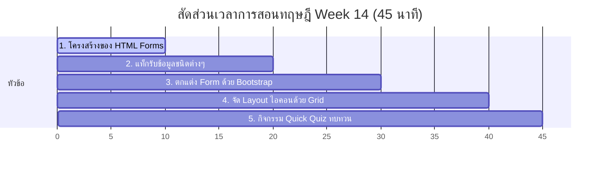

# สัปดาห์ที่ 14: ฟอร์มรับข้อมูลและหน้าติดต่อ (Forms & Contact Us Page with Bootstrap 5)

## 📚 หัวข้อทฤษฎี (45 นาที: 09:50 น. - 10:35 น.)
สัปดาห์นี้เราจะประกอบห้องที่ 3 ของบ้าน นั่นคือ "หน้าติดต่อเรา" (Contact Us) เรียนรู้การสร้างหน้าจอสำหรับรับข้อมูลจากผู้ใช้ผ่าน HTML Forms และนำเครื่องมือทุ่นแรงอย่าง **Bootstrap 5** มาช่วยตกแต่งฟอร์มให้สวยงาม เป็นระเบียบ และรองรับหน้าจอมือถือ (Responsive) ได้อย่างรวดเร็ว

### ⏱️ แผนย่อยสำหรับการบรรยายทฤษฎี 45 นาที

```mermaid
gantt
    title สัดส่วนเวลาการสอนทฤษฎี Week 14 (45 นาที)
    dateFormat  X
    axisFormat %s
    section หัวข้อ
    1. โครงสร้างของ HTML Forms : active, 0, 10
    2. แท็กรับข้อมูลชนิดต่างๆ : 10, 20
    3. ตกแต่ง Form ด้วย Bootstrap : 20, 30
    4. จัด Layout ไอคอนด้วย Grid : 30, 40
    5. กิจกรรม Quick Quiz ทบทวน : 40, 45
```

---

### 1. 📝 ส่วนที่ 1: โครงสร้างของ HTML Forms (10 นาที)
*   **แนวทางการสอน (เปรียบเทียบกับแบบสอบถามกระดาษ)**:
    *   **Form** เปรียบเสมือน "กระดาษแบบสอบถาม" หรือ "ซองจดหมาย" ที่เรายื่นให้ผู้ใช้กรอกข้อมูลส่งกลับมาหาเรา
    *   โครงสร้างต้องครอบด้วยแท็ก `<form> ... </form>` เพื่อให้เบราว์เซอร์รู้ว่าอาณาเขตนี้คือส่วนรับข้อมูล
    *   แนะนำให้รู้จัก Attribute พื้นฐานอย่าง `action` (ระบุปลายทางที่จะส่งข้อมูลไป) และ `method` (วิธีส่ง เช่น GET/POST - อธิบายง่ายๆ ว่าเหมือนการจ่าหน้าซองแบบเปิดเผยหรือแบบลับ)

---

### 2. 🔤 ส่วนที่ 2: แท็กรับข้อมูลชนิดต่างๆ (Input, Textarea, Button) (10 นาที)
*   **ชิ้นส่วนต่างๆ ของ Form (เปรียบเหมือนช่องกรอกข้อมูลแต่ละประเภท)**:
    *   `<label>`: ป้ายกำกับช่องกรอกข้อมูล (บอกผู้ใช้ว่าช่องนี้คืออะไร)
    *   `<input type="text">` และ `<input type="email">`: ช่องสำหรับกรอกข้อความสั้นๆ เช่น ชื่อ และอีเมล (สอนการใช้ `placeholder` เพื่อแสดงข้อความไกด์ไลน์สีจางๆ)
    *   `<textarea>`: ช่องสำหรับกรอกข้อความยาวๆ เปรียบเหมือนหน้ากระดาษเปล่า เช่น รายละเอียดข้อความ (Message)
    *   `<button type="submit">`: ปุ่มกดสำหรับส่งฟอร์ม (เหมือนปุ่ม "ส่งจดหมาย")

---

### 3. 🎨 ส่วนที่ 3: ตกแต่งฟอร์มให้สวยงามและรวดเร็วด้วย Bootstrap 5 (10 นาที)
*   **การใช้ Class ของ Bootstrap เพื่อประหยัดเวลาเขียน CSS**:
    *   คลาส `.form-label`: ใช้กับ `<label>` เพื่อจัดระยะห่างข้อความให้พอดีกับช่องกรอก
    *   คลาส `.form-control`: หัวใจสำคัญของการทำฟอร์ม! ใส่ใน `<input>` และ `<textarea>` จะช่วยปรับให้กล่องกว้าง 100%, มีขอบมนสวยงาม, และมีแสงเงาตอนคลิกพิมพ์โดยอัตโนมัติ (User Friendly)
    *   คลาส `.mb-3` (Margin Bottom 3): ใช้ครอบกล่องแต่ละกล่องเพื่อเว้นระยะห่างบรรทัดไม่ให้ฟอร์มติดกันเกินไป
    *   คลาส `.btn` และ `.btn-primary`: ใช้แต่งปุ่ม `<button>` ให้เป็นปุ่มสีน้ำเงินมาตรฐานที่ดูน่ากด

---

### 4. 📞 ส่วนที่ 4: การจัดเรียงช่องทางติดต่อด้วย Bootstrap Grid (10 นาที)
*   **การจัดเรียง 3 คอลัมน์ (ที่อยู่, เบอร์โทร, อีเมล)**:
    *   ทบทวนการใช้ระบบ Grid ของ Bootstrap: `.container` > `.row` > `.col-md-4`
    *   อธิบายว่าการใช้ `.col-md-4` จำนวน 3 กล่อง จะรวมกันได้ 12 ส่วนพอดี (4+4+4=12) ทำให้ไอคอนทั้ง 3 อันเรียงกันสวยงามในหน้าจอคอมพิวเตอร์ และจะพับซ้อนกันเป็นแนวตั้งบนหน้าจอมือถืออัตโนมัติ
    *   จัดข้อความให้อยู่กึ่งกลางด้วยคลาส `.text-center`

---

### 5. 🧠 ส่วนที่ 5: กิจกรรมทดสอบความเข้าใจด่วน (Quick Quiz) (5 นาที)
เช็กความพร้อมก่อนลงมือปฏิบัติจริงด้วย 3 คำถาม:
1.  **คำถาม 1**: หากต้องการให้ช่อง `<input>` มีความกว้างเต็มพื้นที่และขอบมนสวยงามสไตล์ Bootstrap ต้องเติมคลาส (Class) ใดลงไป? *(แนวตอบ: `class="form-control"`)*
2.  **คำถาม 2**: แท็กใดที่ทำหน้าที่เป็น "ป้ายกำกับ" เพื่อบอกให้ผู้ใช้รู้ว่าช่องนี้ต้องกรอกอะไร? *(แนวตอบ: `<label>`)*
3.  **คำถาม 3**: หากต้องการแบ่งไอคอนติดต่อเป็น 3 คอลัมน์เท่าๆ กันใน Bootstrap Grid ต้องใช้คลาสใด? *(แนวตอบ: `col-md-4`)*

---

## ⏱️ แผนปฏิบัติการ Workshop คาบคู่ (90 นาที)

ภารกิจสำหรับคาบปฏิบัติการสัปดาห์นี้ นักเรียนจะได้ลงมือสร้าง **หน้า Contact Us (หน้าติดต่อเรา)** โดยใช้พลังของ Bootstrap 5:

### 📅 รายละเอียดช่วงเวลาปฏิบัติการ:

#### 1. สร้างไฟล์และเตรียมความพร้อม (10 นาที | 10:40 - 10:50 น.)
*   ให้นักเรียนสร้างไฟล์ `contact.html`
*   คัดลอกโครงสร้างพื้นฐาน (รวมถึงลิงก์เชื่อม Bootstrap CSS/JS) Navbar และ Footer จาก `index.html` มาประกอบ

#### 2. สร้างโครงร่าง Form ด้วย Bootstrap Classes (30 นาที | 10:50 - 11:20 น.)
*   สร้าง `.container` และหัวข้อ "Contact Us" ให้อยู่กึ่งกลาง (`.text-center`)
*   สร้างแท็ก `<form>` 
*   สร้างช่อง Name และ Email โดยใช้ `.row` ครอบ แล้วแบ่งเป็น `.col-md-6` สองช่อง เพื่อให้อยู่คู่กันในหน้าจอใหญ่
*   ในแต่ละช่อง ให้ใส่ `<label class="form-label">` คู่กับ `<input class="form-control">` และครอบด้วย `.mb-3`
*   เพิ่ม `<textarea class="form-control">` สำหรับส่วน Message ไว้ด้านล่าง
*   ใส่ `<button type="submit" class="btn btn-primary">Submit</button>`

#### 3. ประกอบส่วนข้อมูลช่องทางติดต่อ (Address, Phone, Email) (35 นาที | 11:20 - 11:55 น.)
*   สร้าง Section ใหม่ ใส่พื้นหลังสีน้ำเงินเข้ม (อาจจะใช้ Custom CSS นิดหน่อย หรือใช้คลาส `.bg-dark` ของ Bootstrap)
*   สร้างระบบ Grid: `.container` > `.row`
*   สร้าง `.col-md-4` จำนวน 3 กล่อง และใส่ `.text-center` เพื่อจัดให้อยู่กึ่งกลาง
*   ใส่รูปภาพ/ไอคอน และข้อความ (ที่อยู่, เบอร์โทร, อีเมล) ลงในแต่ละคอลัมน์

#### 4. ตรวจสอบความสวยงามและ Responsive (15 นาที | 11:55 - 12:10 น.)
*   ทดลองย่อ-ขยายหน้าต่างเบราว์เซอร์ เพื่อให้นักเรียนเห็นความมหัศจรรย์ของ Bootstrap Grid (`.col-md-6` และ `.col-md-4`) ที่เรียงเป็นแถวในจอคอมพิวเตอร์ และพับซ้อนกันในจอมือถือ

## โปรเจกต์ตัวอย่างและเฉลย
*   **ไฟล์เฉลย**: ดูตัวอย่างโค้ด HTML/CSS เฉลยของคุณครูในโฟลเดอร์นี้ (`contact.html`)
