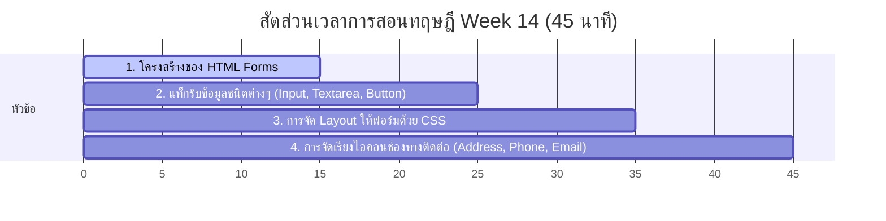

# สัปดาห์ที่ 14: ฟอร์มรับข้อมูลและหน้าติดต่อ (Forms & Contact Us Page)

## 📚 หัวข้อทฤษฎี (45 นาที: 09:50 น. - 10:35 น.)
สัปดาห์นี้เราจะประกอบห้องที่ 3 ของบ้าน นั่นคือ "หน้าติดต่อเรา" (Contact Us) เรียนรู้การสร้างหน้าจอสำหรับรับข้อมูลจากผู้ใช้ผ่าน HTML Forms และการใช้ CSS เพื่อจัดเรียงองค์ประกอบการติดต่อต่างๆ เช่น ไอคอนที่อยู่ เบอร์โทรศัพท์ และอีเมล ให้อยู่ในแนวเดียวกัน

### ⏱️ แผนย่อยสำหรับการบรรยายทฤษฎี 45 นาที

```mermaid
gantt
    title สัดส่วนเวลาการสอนทฤษฎี Week 14 (45 นาที)
    dateFormat  X
    axisFormat %s
    section หัวข้อ
    1. โครงสร้างของ HTML Forms : active, 0, 15
    2. แท็กรับข้อมูลชนิดต่างๆ (Input, Textarea, Button) : 15, 25
    3. การจัด Layout ให้ฟอร์มด้วย CSS : 25, 35
    4. การจัดเรียงไอคอนช่องทางติดต่อ (Address, Phone, Email) : 35, 45
```

---

### 1. 📝 ส่วนที่ 1: โครงสร้างของ HTML Forms (15 นาที)
*   **แนวทางการสอน (เปรียบเทียบกับแบบสอบถามกระดาษ)**:
    *   **Form** คือกระดาษแบบสอบถามที่เรายื่นให้ผู้ใช้กรอก
    *   โครงสร้างต้องครอบด้วยแท็ก `<form>` เพื่อระบุว่านี่คือส่วนรับข้อมูล
    *   แนะนำให้รู้จัก Attribute พื้นฐานอย่าง `action` (ส่งข้อมูลไปที่ไหน) และ `method` (ส่งด้วยวิธีไหน - แนะนำแบบให้เห็นภาพคร่าวๆ ว่าต้องส่งให้ฝั่ง Server จัดการต่อ)

---

### 2. 🔤 ส่วนที่ 2: แท็กรับข้อมูลชนิดต่างๆ (Input, Textarea, Button) (10 นาที)
*   **ชิ้นส่วนต่างๆ ของ Form**:
    *   `<input type="text">` และ `<input type="email">`: ช่องสำหรับกรอกชื่อ และอีเมล (สอนการใช้ `placeholder` เพื่อแสดงข้อความไกด์ไลน์ข้างในช่อง)
    *   `<textarea>`: ช่องสำหรับกรอกข้อความยาวๆ เช่น รายละเอียดข้อความ (Message)
    *   `<button type="submit">` หรือปุ่มกดอื่นๆ
    *   สอนเรื่องการประยุกต์ใช้เพื่อทำฟอร์มตามตัวอย่าง (ช่อง Name, Email เล็กๆ และช่อง Message ใหญ่ๆ)

---

### 3. 🎨 ส่วนที่ 3: การจัด Layout ให้ฟอร์มด้วย CSS (10 นาที)
*   **การทำให้ฟอร์มสวยงาม**:
    *   ตามค่าเริ่มต้น (Default) อินพุตของเบราว์เซอร์จะดูแข็งกระด้าง
    *   สอนการปรับ CSS: เปลี่ยนพื้นหลังให้เป็นสีเทาอ่อน, ลบเส้นขอบ (`border: none;`), ปรับขอบให้มน (`border-radius`), และเพิ่มระยะขอบด้านใน (`padding`) เพื่อให้กล่องดูป่องและคลิกง่าย

---

### 4. 📞 ส่วนที่ 4: การจัดเรียงไอคอนช่องทางติดต่อ (10 นาที)
*   **การจัดเรียง 3 คอลัมน์ (เหมือนหน้าคอร์ส)**:
    *   สอนการสร้างกลุ่มไอคอน (ที่อยู่, เบอร์โทร, อีเมล) และวงกลมพื้นหลัง
    *   ใช้ Flexbox หรือ Grid เพื่อจัดเรียงกล่อง 3 กล่องนี้ให้อยู่กึ่งกลางหน้าจอในแนวนอน
    *   แบ่งพื้นหลังเป็นสีน้ำเงินครึ่งล่างเพื่อสร้างมิติให้เว็บไซต์

---

## ⏱️ แผนปฏิบัติการ Workshop คาบคู่ (90 นาที)

ภารกิจสำหรับคาบปฏิบัติการสัปดาห์นี้ นักเรียนจะได้สร้าง **หน้า Contact Us (หน้าติดต่อเรา)**:

### 📅 รายละเอียดช่วงเวลาปฏิบัติการ:

#### 1. สร้างไฟล์และประกอบ Navbar/Footer (10 นาที | 10:40 - 10:50 น.)
*   ให้นักเรียนสร้างไฟล์ `contact.html`
*   คัดลอกโค้ด Navbar และ Footer มาประกอบ

#### 2. สร้างโครงร่าง Form รับข้อมูล (25 นาที | 10:50 - 11:15 น.)
*   สร้างข้อความหัวข้อ "Contact Us" สีน้ำเงินใหญ่อยู่กึ่งกลาง
*   สร้าง `<form>` ที่มี `<input>` 2 ช่อง (Name, Email) วางขนานกัน (ใช้ Flexbox จัดคู่)
*   และสร้าง `<textarea>` สำหรับ Message วางด้านล่าง

#### 3. ตกแต่งฟอร์มให้สวยงาม (20 นาที | 11:15 - 11:35 น.)
*   เขียน CSS เพื่อปรับแต่ง `<input>` และ `<textarea>`: ใส่พื้นหลังสีเทาอ่อน ลบเส้นขอบ ทำให้ขอบมนสวยงามเหมือนตัวอย่าง

#### 4. ประกอบส่วนข้อมูลช่องทางติดต่อ (Address, Phone, Email) (35 นาที | 11:35 - 12:10 น.)
*   สร้างกล่องแบ่งเป็น 3 คอลัมน์ (ใช้ `display: flex` หรือ `display: grid`)
*   สร้างวงกลมสีเทาใส่รูปไอคอนที่อยู่ตรงกลาง
*   จัดข้อความ ที่อยู่ เบอร์โทร อีเมล ให้อยู่กึ่งกลาง และวางไว้ในส่วนที่มีพื้นหลังสีน้ำเงินเข้ม

## โปรเจกต์ตัวอย่างและเฉลย
*   **ไฟล์เฉลย**: ดูตัวอย่างโค้ด HTML/CSS เฉลยของคุณครูในโฟลเดอร์นี้ (`contact.html`)
