# สัปดาห์ที่ 15: Final Project (Dev)

## 📚 หัวข้อทฤษฎี (45 นาที: 09:50 น. - 10:35 น.)
ปลดล็อกการสร้างสรรค์อย่างไร้ขีดจำกัด ผสานรวมขุมพลังระหว่างเสาเข็มสำเร็จรูป (Bootstrap) และความประณีตประดิดประดอยสไตล์ส่วนตัว (Custom CSS) เรียนรู้วิธีการจัดหมวดหมู่และจัดการสินทรัพย์ไฟล์รูปภาพและไอคอน (Asset Management) เพื่อเตรียมความพร้อมของโปรเจกต์สุดท้ายอย่างมั่นคงและเป็นระเบียบ

### ⏱️ แผนย่อยสำหรับการบรรยายทฤษฎี 45 นาที

```mermaid
gantt
    title สัดส่วนเวลาการสอนทฤษฎี Week 15 (45 นาที)
    dateFormat  X
    axisFormat %s
    section หัวข้อ
    1. การผสานสไตล์กึ่งสำเร็จรูปอย่างประณีต (Hybrid Styling) : active, 0, 15
    2. ศิลปะการจัดระเบียบคลังวัตถุดิบ (Asset Management) : 15, 30
    3. การจัดโครงสร้างไฟล์เว็บไซต์หลายหน้า (Site Architecture) : 30, 40
    4. กิจกรรม Quick Quiz ทบทวน : 40, 45
```

---

### 1. 🏗️ ส่วนที่ 1: การผสานสไตล์กึ่งสำเร็จรูปอย่างประณีต (Hybrid Styling) (15 นาที)
*   **แนวทางการสอนเชิงอุปมาอุปไมย (สร้างตึกเสาสำเร็จรูปและแต่งห้องประณีต)**:
    *   ถ้าเขียนเว็บด้วย Bootstrap อย่างเดียว เว็บจะขึ้นรูปเสร็จไวแต่อาจจะหน้าตาซ้ำกับคนอื่น ทว่าถ้าเขียนเองทั้งหมดก็นานเกินไปจนทำชิ้นงานไม่ทันกำหนดส่งงาน
    *   **แนวคิด Hybrid Styling**: 
        *   ใช้คลาสเสาและตารางสำเร็จรูปของ Bootstrap ในการจัด Layout โครงสร้างใหญ่ (เช่น จัดเรียงแกลเลอรีรูปภาพ จัด Layout แถวและคอลัมน์) เพื่อความรวดเร็วและรองรับ Responsive
        *   ใช้คุณสมบัติ Custom CSS ของเราเองเขียนทับเพื่อลงลึกรายละเอียดความวิจิตรของห้อง (เช่น เปลี่ยนฟอนต์ ไล่โทนเฉดสีแบบ Gradient ปรับแต่งขอบมุมการ์ดโค้งมนเฉพาะทาง หรือใส่ Hover เอฟเฟกต์การเคลื่อนไหววิบวับเมื่อเอาเมาส์ชี้)

---

### 2. 📂 ส่วนที่ 2: ศิลปะการจัดระเบียบคลังวัตถุดิบ (Asset Management) (15 นาที)
*   **แนวทางการเปรียบเทียบเชิงองค์กร (กล่องเครื่องมือช่างทำครัว)**:
    *   การทำโปรเจกต์ขนาดใหญ่อาจมีรูปภาพไอคอนมากมาย หากจับวางสลัดกองทิ้งไว้ในโฟลเดอร์นอกสุด จะเกิดปัญหาความรกรุงรังและหาไฟล์แก้ไขยากมาก
    *   **Asset Management**: การตั้งระเบียบสร้างโฟลเดอร์ย่อยเฉพาะทาง เช่น
        *   `images/` หรือ `assets/`: รวบรวมไฟล์ภาพภาพโปรไฟล์ ภาพภูมิหลัง และโปสเตอร์ผลงานทั้งหมด
        *   `css/`: เก็บไฟล์ตกแต่งสไตล์แยกย่อย
    *   สอนทบทวนวิธีระบุที่อยู่ Path ลึกซึ้งลงไปในโฟลเดอร์ย่อย เช่น ``

---

### 3. 🗺️ ส่วนที่ 3: สถาปัตยกรรมเว็บไซต์หลายหน้าและลิงก์เชื่อมโยง (10 นาที)
*   **แนวทางการบรรยายเชิงสถาปนิก**:
    *   พอร์ตโฟลิโอที่ดีควรแบ่งเป็นสัดส่วนชัดเจน เช่น หน้าแรก (`index.html`), หน้าประวัติผลงาน (`projects.html`), และหน้าติดต่อ (`contact.html`)
    *   สอนเทคนิคการทำชุดเมนูนำทาง (Navbar) ที่มีลิงก์และหน้าตาเหมือนกันในทุกๆ ไฟล์ย่อย เพื่อให้ผู้ใช้งานไม่สับสนเวลาสลับข้ามไปมาระหว่างหน้าเพจ

---

### 4. 🧠 ส่วนที่ 4: กิจกรรมทดสอบความเข้าใจด่วน (Quick Quiz) (5 นาที)
เช็กความพร้อมด้วย 3 คำถามด่วน:
1.  **คำถาม 1**: หากย้ายไฟล์รูปภาพชื่อ `hero.png` ไปจัดระเบียบใส่ไว้ในโฟลเดอร์ชื่อ `images` ข้อใดคือการชี้คุณสมบัติ `src` ของรูปภาพนี้ในแท็ก `` ได้อย่างถูกต้องและเว็บไม่พัง?
    *   A) ``
    *   B) `` *(แนวตอบ: B)*
2.  **คำถาม 2**: การนำ Custom CSS มาใช้ควบคู่กับ Bootstrap Framework มีประโยชน์หลักอย่างไรในการพัฒนาโปรเจกต์พอร์ตโฟลิโอส่วนตัว? *(แนวตอบ: ช่วยให้ได้โครงสร้างเว็บที่เสร็จไวและรองรับมือถือ (จาก Bootstrap) ควบคู่กับความสวยงามโดดเด่นเป็นเอกลักษณ์สไตล์ของตนเองที่ไม่เหมือนใคร (จาก Custom CSS))*
3.  **คำถาม 3**: หากต้องการให้ทุกหน้าย่อยของพอร์ตโฟลิโอ (`index.html`, `projects.html`) มีแถบเมนูด้านบนนำทางเหมือนกัน เราจำเป็นต้องทำอย่างไรในแง่ของโค้ด HTML? *(แนวตอบ: ต้องคัดลอกส่วนประกอบโครงสร้างแท็ก `<nav>` ของ Bootstrap ไปแปะไว้ที่ส่วนบนสุดของแท็ก `<body>` ในทุกๆ หน้าไฟล์ย่อยให้เหมือนกันทุกประการ)*

## โปรเจกต์
[Final Project] Development
- • สร้างหน้าย่อยอื่นๆ ค้นหาและจัดการ Asset รูปภาพ/ไอคอน
