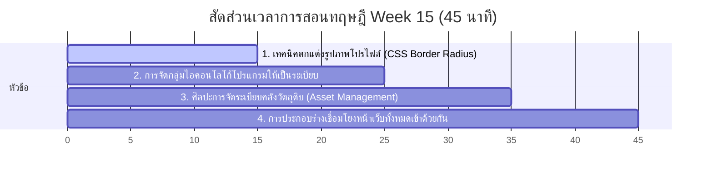

# สัปดาห์ที่ 15: หน้าโปรไฟล์ผู้สอนและการประกอบร่างเว็บ (Instructors Page & Site Assembly)

## 📚 หัวข้อทฤษฎี (45 นาที: 09:50 น. - 10:35 น.)
สัปดาห์นี้เราจะประกอบหน้าเว็บห้องสุดท้าย คือ "หน้าผู้สอน" (Instructors Page) ซึ่งมีความน่าสนใจตรงการจัดรูปภาพโปรไฟล์ให้เป็นวงกลม และการจัดเรียงไอคอนโปรแกรม/ผลงานให้เป็นระเบียบ นอกจากนี้ เราจะเรียนรู้วิธีการจัดระเบียบไฟล์รูปภาพต่างๆ (Asset Management) เพื่อไม่ให้โฟลเดอร์รก และทบทวนการเชื่อมโยงทุกลิงก์ในเมนูเข้าด้วยกันเพื่อเป็นเว็บไซต์ที่สมบูรณ์

### ⏱️ แผนย่อยสำหรับการบรรยายทฤษฎี 45 นาที

```mermaid
gantt
    title สัดส่วนเวลาการสอนทฤษฎี Week 15 (45 นาที)
    dateFormat  X
    axisFormat %s
    section หัวข้อ
    1. เทคนิคตกแต่งรูปภาพโปรไฟล์ (CSS Border Radius) : active, 0, 15
    2. การจัดกลุ่มไอคอนโลโก้โปรแกรมให้เป็นระเบียบ : 15, 25
    3. ศิลปะการจัดระเบียบคลังวัตถุดิบ (Asset Management) : 25, 35
    4. การประกอบร่างเชื่อมโยงหน้าเว็บทั้งหมดเข้าด้วยกัน : 35, 45
```

---

### 1. 🖼️ ส่วนที่ 1: เทคนิคตกแต่งรูปภาพโปรไฟล์ (15 นาที)
*   **การทำให้รูปสี่เหลี่ยมกลายเป็นวงกลม**:
    *   ใช้คำสั่ง CSS `border-radius: 50%;` เพื่อทำให้รูปภาพโค้งมนจนเป็นวงกลม
    *   *เคล็ดลับ*: รูปต้นฉบับควรมีสัดส่วนกว้างยาวเท่ากัน (จัตุรัส) ไม่งั้นวงกลมจะกลายเป็นรูปไข่ (วงรี) แนะนำให้ใช้ `object-fit: cover;` ร่วมกับกำหนดความกว้าง-สูงคงที่ เพื่อแก้ปัญหาภาพบิดเบี้ยว

---

### 2. 🧩 ส่วนที่ 2: การจัดกลุ่มไอคอนโลโก้โปรแกรมให้เป็นระเบียบ (10 นาที)
*   **การจัดเรียงไอคอนหลายๆ รูป**:
    *   หน้าผู้สอนจะมีโลโก้โปรแกรมต่างๆ (เช่น PS, Ai, Pr, HTML5) เรียงกัน
    *   ใช้ Flexbox (`display: flex`, `flex-wrap: wrap`, `gap`) เพื่อให้ไอคอนต่อกันและปัดบรรทัดลงมาอัตโนมัติเมื่อจอแคบ
    *   กำหนดขนาด `width` ของแต่ละไอคอนให้เท่ากัน เพื่อความสวยงาม

---

### 3. 📂 ส่วนที่ 3: ศิลปะการจัดระเบียบคลังวัตถุดิบ (Asset Management) (10 นาที)
*   **แนวทางการสอนเปรียบเทียบเชิงองค์กร**:
    *   เวลาทำงานจริง รูปภาพจะมีเยอะมาก (รูปหน้าแรก, รูปคอร์ส, รูปรถเข็น, รูปผู้สอน, รูปไอคอนติดต่อ ฯลฯ)
    *   ถ้ากองรวมกันหน้าบ้าน (โฟลเดอร์นอกสุด) เวลาจะหาแก้ไขจะตาลาย
    *   แนะนำการสร้างโฟลเดอร์ `images` ย่อย และวิธีเปลี่ยน Path ใน HTML เป็น `` 

---

### 4. 🔗 ส่วนที่ 4: การประกอบร่างเชื่อมโยงหน้าเว็บทั้งหมด (10 นาที)
*   **การทำเมนูนำทาง (Navigation)**:
    *   ย้อนกลับไปแก้ไข Navbar ในทุกหน้า (`index.html`, `course.html`, `contact.html`, `instructors.html`) 
    *   ใส่ลิงก์ที่แท็ก `<a>` ให้ถูกต้อง เช่น `<a href="course.html">Course</a>` 
    *   สอนให้นักเรียนลองกดสลับไปมาระหว่าง 4 หน้า (ตอนนี้เราได้เว็บไซต์ที่สมบูรณ์แล้ว!)

---

## ⏱️ แผนปฏิบัติการ Workshop คาบคู่ (90 นาที)

ภารกิจสำหรับคาบปฏิบัติการสัปดาห์นี้ นักเรียนจะได้สร้าง **หน้า Instructors (หน้าประวัติผู้สอน)** และประกอบหน้าเว็บทั้งหมด:

### 📅 รายละเอียดช่วงเวลาปฏิบัติการ:

#### 1. สร้างไฟล์และนำเข้า Navbar/Footer (10 นาที | 10:40 - 10:50 น.)
*   ให้นักเรียนสร้างไฟล์ `instructors.html` และคัดลอกส่วน Navbar/Footer มาเช่นเดิม
*   ตั้งค่าลิงก์ใน Navbar ของทุกไฟล์ให้เชื่อมเข้าหากันอย่างถูกต้อง

#### 2. จัดระเบียบไฟล์รูปภาพ (10 นาที | 10:50 - 11:00 น.)
*   สร้างโฟลเดอร์ `images` และย้ายรูปภาพทั้งหมดที่เคยมีเข้าไปไว้
*   แก้ไขโค้ด `` ในทุกหน้าให้ชี้ไปยังที่อยู่ใหม่ให้ถูกต้อง (ทดสอบเปิดเว็บว่ารูปไม่หาย)

#### 3. ประกอบโครงหน้า Instructors (35 นาที | 11:00 - 11:35 น.)
*   แบ่ง Layout เป็นซ้าย (รูปผู้สอน) และขวา (ข้อความประวัติ)
*   ด้านซ้าย: ใส่รูปภาพ ใช้ CSS `border-radius: 50%` และจัดขนาดรูปให้เป็นวงกลมสวยงาม 
*   ด้านขวา: ใส่ข้อความชื่อผู้สอนตัวใหญ่สีฟ้า, คำคมย่อหน้า

#### 4. ส่วนแสดงความชำนาญ (Programs / Product) (35 นาที | 11:35 - 12:10 น.)
*   ใต้คำคม ให้สร้างหัวข้อ "program" และนำไอคอนโปรแกรมต่างๆ มาวางเรียงกันโดยใช้ Flexbox
*   สร้างหัวข้อ "product" และใส่ข้อความอธิบายย่อๆ ตามตัวอย่าง

## โปรเจกต์ตัวอย่างและเฉลย
*   **ไฟล์เฉลย**: ดูตัวอย่างโค้ด HTML/CSS เฉลยของคุณครูในโฟลเดอร์นี้ (`instructors.html`)
