# สัปดาห์ที่ 16: Final Project (QA)

## 📚 หัวข้อทฤษฎี (45 นาที: 09:50 น. - 10:35 น.)
สวมบทบาทเป็นผู้ตรวจสอบคุณภาพซอฟต์แวร์ระดับมืออาชีพ เรียนรู้กระบวนการทดสอบความเรียบร้อยรอบด้าน (QA) การทดสอบบนมือถือจริง และหัวใจสำคัญของ **UX/UI (การออกแบบเพื่อประสบการณ์และการใช้งานของผู้ใช้)** ก่อนส่งงานจริง

### ⏱️ แผนย่อยสำหรับการบรรยายทฤษฎี 45 นาที

```mermaid
gantt
    title สัดส่วนเวลาการสอนทฤษฎี Week 16 (45 นาที)
    dateFormat  X
    axisFormat %s
    section หัวข้อ
    1. ด่านตรวจคนเข้าเมือง: Responsive QA : active, 0, 15
    2. หัวใจของการออกแบบ UX vs UI : 15, 30
    3. รายการเช็คความพร้อมก่อนเปิดร้าน (QA Checklist) : 30, 40
    4. กิจกรรม Quick Quiz ทบทวน : 40, 45
```

---

### 1. 📱 ส่วนที่ 1: ด่านตรวจคนเข้าเมือง: Responsive QA (15 นาที)
*   **แนวทางการสอนเชิงกระบวนการ**:
    *   เว็บที่ดูสวยในจอคอมพิวเตอร์ของคุณครูหรือนักเรียน อาจเบี้ยวเบียดหรืออ่านไม่รู้เรื่องบนหน้าจอมือถือจริง
    *   **กระบวนการทดสอบอุปกรณ์**:
        *   สอนใช้ฟังก์ชัน **Device Toggle Toolbar** ใน Google Chrome Developer Tools (กด F12 -> คลิกรูปมือถือซ้อนแท็บเล็ตมุมซ้ายบน) เพื่อลองกดขยับย่อขยายขนาดขอบจอทดสอบเลียนแบบหน้าจอสมาร์ตโฟนแต่ละรุ่นในตลาดจริง
        *   แนะนำการส่งลิงก์ URL จริงของ GitHub Pages ไปเข้ากลุ่มไลน์เพื่อดึงเปิดขึ้นทดลองสไลด์หน้าจอบน **สมาร์ตโฟนส่วนตัวของตัวเองจริงๆ** เพื่อสัมผัสการเปิดใช้งานในฐานะผู้ใช้งานจากข้างนอกระบบ

---

### 2. 🎨 ส่วนที่ 2: หัวใจของการออกแบบ UX vs UI (15 นาที)
*   **แนวทางการเปรียบเทียบเชิงอุปมาอุปไมย (การซื้อรถสปอร์ตหรูหรา)**:
    *   **UI (User Interface - หน้ากากภายนอก)**: เปรียบเหมือน **"สีเคลือบเงารถ หน้าปัดสวยงามเบาะหนังนุ่มละมุน และรูปทรงลู่ลมอันน่าหลงใหล"** (หน้าตาเว็บ สีสัน ความงาม ฟอนต์และการจัดวางกราฟิก)
    *   **UX (User Experience - การขับขี่จริง)**: เปรียบเหมือน **"ความนุ่มนวลของการเร่งความเร็ว ตำแหน่งพวงมาลัยและเกียร์ที่จับถนัดมือ และทัศนวิสัยโปร่งโล่งที่ทำให้ผู้ขับรู้สึกสบายไม่เหนื่อยล้า"** (ความง่ายในการใช้งาน โครงสร้างลิงก์ไม่ซับซ้อน หาข้อมูลเจอใน 3 วินาที ลิงก์ไม่เสียปุ่มกดง่ายเหมาะกับนิ้วมือคน)
    *   *ข้อสรุป*: "เว็บที่ UI สวยงามแต่ UX ห่วย จะทำให้ผู้ใช้งานกดปิดเพจทิ้งทันทีเพราะหาข้อมูลติดต่อไม่เจอ!"

---

### 📝 ส่วนที่ 3: รายการเช็คความพร้อมก่อนเปิดร้าน (QA Checklist) (10 นาที)
*   **แนวทางการอธิบายเรื่องการตรวจงาน**:
    *   **ตาราง Checklist สำหรับนักเรียน**:
        1.  **Broken Links Check**: คลิกเช็กปุ่มและลิงก์ทุกปุ่มในทุกๆ หน้า ว่าวิ่งไปปลายทางถูกต้องและมีปุ่มกดลิงก์ย้อนกลับมาหน้าแรกได้เสมอ
        2.  **Responsiveness**: เปิดเช็กรูปภาพว่าหดสเกลตามหน้าจอขนาดเล็กหรือไม่ (รูปต้องไม่ทะลุเลยขอบจอขวา)
        3.  **Readability**: ตัวอักษรสีเข้มตัดกับพื้นหลังชัดเจน อ่านง่าย ไม่จมหายไปกับพื้นหลังสีมืด

---

### 4. 🧠 ส่วนที่ 4: กิจกรรมทดสอบความเข้าใจด่วน (Quick Quiz) (5 นาที)
เช็กความพร้อมด้วย 3 คำถามด่วน:
1.  **คำถาม 1**: ข้อใดต่อไปนี้เปรียบได้กับ "ประสบการณ์ใช้งานของผู้ใช้" (UX - User Experience) ของเว็บไซต์?
    *   A) ปุ่มกดติดต่อเรามีขนาดใหญ่ กดง่ายด้วยนิ้วโป้งมือข้างเดียวบนโทรศัพท์มือถือ *(แนวตอบ: A)*
    *   B) การเลือกคู่สีโทนพาสเทล สีฟ้าตัดชมพูอ่อนดูหวานแหวว
2.  **คำถาม 2**: เครื่องมือ "Device Toggle Toolbar" ใน Google Chrome Developer Tools มีประโยชน์หลักอย่างไรในการทำ QA เว็บไซต์? *(แนวตอบ: ช่วยจำลองและทดสอบการแสดงผลสัดส่วนของเว็บไซต์บนหน้าจออุปกรณ์พกพาขนาดต่างๆ เช่น สมาร์ตโฟนและแท็บเล็ต โดยไม่ต้องไปส่องดูผ่านเครื่องจริงจริงทุกเครื่อง)*
3.  **คำถาม 3**: ปัญหาความสวยงามที่พบบ่อยในการทดสอบ Responsive Web Design คืออะไร และมักเกิดจากข้อผิดพลาดใดในแท็ก ``? *(แนวตอบ: รูปภาพล้นทะลุออกไปนอกขอบจอขวา แก้ไขได้โดยกำหนดความกว้างรูปภาพใน CSS เป็นเปอร์เซ็นต์ (เช่น `max-width: 100%; height: auto;`))*

## โปรเจกต์
[Final Project] Testing & Deploy
- • จับคู่เทสต์เว็บหาจุดบกพร่อง และ Deploy ขึ้น GitHub
