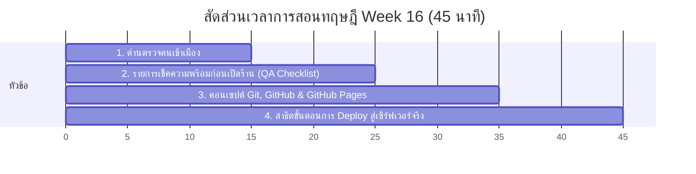

# สัปดาห์ที่ 16: การทดสอบคุณภาพและนำเว็บขึ้นระบบจริง (QA & Web Hosting)

## 📚 หัวข้อทฤษฎี (45 นาที: 09:50 น. - 10:35 น.)
เมื่อเราสร้างแพลตฟอร์มคอร์สเรียนทั้ง 4 หน้าเสร็จสมบูรณ์แล้ว ขั้นตอนสุดท้ายก่อนปล่อยผลงานสู่สาธารณะคือการสวมบทบาทเป็นผู้ตรวจสอบคุณภาพ (QA) เรียนรู้กระบวนการทดสอบความเรียบร้อยรอบด้าน การทดสอบบนมือถือจริง (Responsive Testing) และทำความรู้จักเครื่องมือระดับโลกอย่าง GitHub Pages ในการนำเว็บไซต์ขึ้นออนไลน์ฟรี!

### ⏱️ แผนย่อยสำหรับการบรรยายทฤษฎี 45 นาที

```mermaid
gantt
    title สัดส่วนเวลาการสอนทฤษฎี Week 16 (45 นาที)
    dateFormat  X
    axisFormat %s
    section หัวข้อ
    1. ด่านตรวจคนเข้าเมือง: Responsive QA : active, 0, 15
    2. รายการเช็คความพร้อมก่อนเปิดร้าน (QA Checklist) : 15, 25
    3. คอนเซปต์ Git, GitHub & GitHub Pages : 25, 35
    4. สาธิตขั้นตอนการ Deploy สู่เซิร์ฟเวอร์จริง : 35, 45
```

---

### 1. 📱 ส่วนที่ 1: ด่านตรวจคนเข้าเมือง: Responsive QA (15 นาที)
*   **ทำไมต้องตรวจสอบมือถือ?**:
    *   เว็บที่ดูสวยในหน้าจอคอมพิวเตอร์กว้างๆ อาจจะแสดงผลเบี้ยว หรือตกขอบเมื่อเปิดในมือถือ (สมาร์ตโฟน)
    *   **กระบวนการทดสอบอุปกรณ์ (Device Testing)**:
        *   สอนใช้ฟังก์ชัน **Device Toggle Toolbar** ใน Google Chrome Developer Tools (กด F12 -> คลิกรูปมือถือ/แท็บเล็ต มุมซ้ายบน) 
        *   ลองกดขยับย่อขยายขอบจอ เพื่อเช็คดูว่าข้อความ รูปภาพ หรือการ์ดคอร์สเรียนของเราล้นออกนอกจอหรือไม่ 
        *   (ถ้านักเรียนใช้ Flexbox/Grid ได้ดี การจัดหน้าส่วนใหญ่จะยืดหยุ่นตามจออัตโนมัติ)

---

### 2. 📝 ส่วนที่ 2: รายการเช็คความพร้อมก่อนเปิดร้าน (QA Checklist) (10 นาที)
*   **รายการตรวจสอบ (Checklist) สำหรับนักเรียน**:
    1.  **Broken Links Check**: คลิกลิงก์เมนูข้างบน (Navbar) ทุกปุ่มในทุกหน้า ว่าคลิกแล้วไปถูกหน้าหรือไม่ และสามารถคลิกกลับมาได้ไหม (ไม่มีหน้า Error 404)
    2.  **Image Check**: รูปภาพแสดงขึ้นมาครบถ้วน ไม่เป็นไอคอนภาพแตก (ตรวจสอบการสะกดชื่อไฟล์ตัวพิมพ์เล็กพิมพ์ใหญ่ให้ตรงกัน)
    3.  **Readability**: ลองอ่านข้อความต่างๆ ดูว่าสีกลืนกับพื้นหลังจนอ่านยากไปหรือไม่ 

---

### 3. 🌐 ส่วนที่ 3: คอนเซปต์ Git, GitHub & GitHub Pages (10 นาที)
*   **แนวทางการเปรียบเทียบเชิงพื้นที่**:
    *   **Local Computer (เครื่องเรา)**: ทำเว็บเสร็จในเครื่องตัวเอง เปิดดูเองได้ แต่ถ้าส่งไฟล์ให้เพื่อนก็ยุ่งยาก
    *   **GitHub (Cloud Storage สำหรับโค้ด)**: เหมือนคลังเก็บไฟล์สาธารณะที่โปรแกรมเมอร์ใช้เก็บโค้ดกัน
    *   **GitHub Pages**: บริการใจดีที่เปลี่ยนโค้ด HTML/CSS ดิบๆ ของเราให้กลายเป็นเว็บไซต์จริง พร้อม URL ส่วนตัว (เช่น `username.github.io/my-course-website/`) ให้ส่งไปอวดเพื่อนหรืออาจารย์ได้ฟรีตลอด 24 ชั่วโมง!

---

### 4. 🚀 ส่วนที่ 4: สาธิตขั้นตอนการ Deploy สู่เซิร์ฟเวอร์จริง (10 นาที)
*   **Demonstration**:
    *   อาจารย์เปิดหน้าจอทำทีละสเต็ป (สร้าง Account GitHub -> New Repository -> Upload files -> ตั้งค่า GitHub Pages) เพื่อให้นักเรียนเห็นภาพรวมก่อนลงมือทำจริง

---

## ⏱️ แผนปฏิบัติการ Workshop คาบคู่ (90 นาที)

ภารกิจสำหรับคาบปฏิบัติการสัปดาห์นี้ นักเรียนจะได้นำแพลตฟอร์ม **4 หน้าจอขึ้นสู่ระบบออนไลน์**:

### 📅 รายละเอียดช่วงเวลาปฏิบัติการ:

#### 1. จัดคู่ทดสอบเว็บไซต์ (QA Pair Testing) (20 นาที | 10:40 - 11:00 น.)
*   ให้นักเรียนสลับกันตรวจเว็บไซต์ของเพื่อนที่นั่งข้างๆ 
*   กดเช็คทุกลิงก์ (เมนู Index, Course, Instructors, Contact Us) ว่าพังหรือไม่
*   ใช้ Chrome Inspect ส่องดูหน้าจอมือถือว่ามีจุดไหนล้นขอบจอ

#### 2. แก้ไขจุดบกพร่อง (Debugging) (20 นาที | 11:00 - 11:20 น.)
*   ให้นักเรียนกลับมาแก้โค้ดที่เพื่อนเจอจุดบกพร่อง เช่น เพิ่ม CSS `max-width: 100%; height: auto;` ในรููปภาพกันตกขอบ หรือแก้ชื่อลิงก์ `href` ให้ถูกต้อง

#### 3. เริ่มขั้นตอนอัปโหลดสู่ GitHub (30 นาที | 11:20 - 11:50 น.)
*   ให้นักเรียนสมัครบัญชี GitHub (หากยังไม่มี)
*   สร้าง Repository ใหม่ชื่อ (เช่น `learning-platform`)
*   ลากไฟล์โฟลเดอร์งานทั้งหมด (รวมไฟล์ html ทุกหน้า, ไฟล์ css และโฟลเดอร์ภาพ) อัปโหลดขึ้นสู่ GitHub (ผ่านหน้าเว็บเบราว์เซอร์หรือ GitHub Desktop)

#### 4. เปิดใช้งาน GitHub Pages และแชร์ลิงก์ (20 นาที | 11:50 - 12:10 น.)
*   ไปที่แท็บ Settings ของ Repository ย่อยนั้น เลือกเมนู Pages ฝั่งซ้าย
*   เลือก Source จาก `None` เป็น `main` branch แล้วกด Save
*   รอสักพัก (1-3 นาที) จะปรากฏลิงก์ URL จริง ให้นักเรียนคัดลอกลิงก์นั้นส่งงานในระบบ หรือส่งลงแชทกลุ่ม

## โปรเจกต์ตัวอย่างและเฉลย
*   **ไฟล์เฉลย**: โปรเจกต์สมบูรณ์คือโค้ดทั้งหมดตั้งแต่ Week 12 ถึง 15 (สามารถดูภาพรวมได้จากไฟล์ตัวอย่างของคุณครู)
