# 📖 คู่มือลำดับการสอนแบบละเอียด สัปดาห์ที่ 16 (Teacher's Step-by-Step Guide)
**วิชาการเขียนโปรแกรมเว็บ ม.5 | สัปดาห์ที่ 16: การเชื่อมโยงคอมโพเนนต์ ตรวจสอบคุณภาพ และนำเว็บขึ้นระบบจริง**

---

## 🎯 ภาพรวมและเป้าหมายประจำคาบ (Lesson Objectives)
1. นักเรียนเข้าใจการทำงานของ **Custom Web Components** (`<site-header>` และ `<site-footer>`) เพื่อดูแลเว็บหลายหน้าจากจุดเดียว (Single Source of Truth)
2. นักเรียนเข้าใจจุดเชื่อมโยงของ **CSS Variables (`:root`)** กับคลาสของ **Bootstrap 5**
3. นักเรียนเข้าใจวงจรการทำงานร่วมกันของ **JavaScript ➡️ HTML ➡️ CSS** ในการแสดงสถานะเมนูหน้าปัจจุบัน (Active Link)
4. นักเรียนสามารถตรวจสอบคุณภาพเว็บไซต์ (QA Testing) บนอุปกรณ์หน้าจอต่างๆ ได้
5. นักเรียนสามารถ Deploy ผลงานเว็บไซต์ 4 หน้าขึ้นออนไลน์จริงผ่าน **GitHub Pages** ได้สำเร็จ 100%

---

## ⏱️ ไทม์ไลน์การจัดกิจกรรมการเรียนรู้ (รวม 135 นาที)

```mermaid
gantt
    title ลำดับการจัดกิจกรรม Week 16 (135 นาที)
    dateFormat X
    axisFormat %s นาที
    section บรรยายทฤษฎี (45 นาที)
    1. Shared Components & CSS Variables : active, 0, 20
    2. Lifecycle เมนู Active & QA Checklist : 20, 35
    3. คอนเซปต์ Git, GitHub & GitHub Pages : 35, 45
    section ปฏิบัติการ Workshop (90 นาที)
    Step 1-2: เรียกใช้ Components & แก้ลิงก์ : 45, 65
    Step 3-4: ตั้งค่าถังสี & สไตล์ Active ใน CSS : 65, 85
    Step 5: QA Pair Review (ตรวจคู่เพื่อน) : 85, 105
    Step 6: นำขึ้น GitHub Pages & สรุปผล : 105, 135
```



---

## ภาคที่ 1: บรรยายทฤษฎี & ปูพื้นฐานความเข้าใจ (45 นาที)

### 📌 1.1 ทำไมต้องใช้ Shared Components? (15 นาที)
* **ปัญหาที่ต้องเปิดประเด็น:** 
  > *"ถ้านักเรียนทำเว็บ 4 หน้า (Index, Course, Instructors, Contact) แล้ววันหนึ่งผู้อำนวยการสั่งเปลี่ยนเบอร์โทรศัพท์ใน Footer หรือเพิ่มเมนูใหม่ นักเรียนต้องเปิดแก้กี่ไฟล์?"*
  * นักเรียนจะตอบว่า: 4 ไฟล์ (และถ้าเว็บมี 100 หน้า ก็ต้องแก้ 100 ครั้ง เสี่ยงต่อการลืมหรือแก้ไม่ครบ)
* **วิธีแก้ด้วย Vanilla JavaScript (Web Components):**
  * เราสร้างแม่แบบ Navbar และ Footer ไว้ที่ `components.js` แค่ที่เดียว
  * เวลาใช้งาน เราแค่เรียกใช้แท็กที่เราสร้างขึ้นเอง (Custom Elements) คือ `<site-header></site-header>` และ `<site-footer></site-footer>`
  * **มุกเปรียบเทียบ:** เหมือน **"พิมพ์เขียวเสาไฟส่องสว่างของหมู่บ้าน"** ที่สร้างต้นแบบไว้จุดเดียว ทุกบ้านแค่สั่งติดตั้ง ถ้าจะเปลี่ยนหลอดไฟ เราแก้ที่ต้นแบบ ทุกบ้านสว่างเหมือนกันหมดทันที
  * **หัวใจสำคัญ - การจดทะเบียนแท็กด้วย `customElements.define()`:**
    ```javascript
    customElements.define('site-header', SiteHeader);
    customElements.define('site-footer', SiteFooter);
    ```
    * **เปรียบเหมือน "การนำสูติบัตรไปแจ้งเกิดที่อำเภอ":**
      1. เราเขียนคลาส `class SiteHeader extends HTMLElement` คือ **การเขียนพิมพ์เขียว**
      2. เบราว์เซอร์จะไม่รู้จักแท็ก `<site-header>` เลย จนกว่าเราจะใช้คำสั่ง `customElements.define('site-header', SiteHeader)` สั่งให้เบราว์เซอร์ "จดทะเบียน" แท็กนี้เข้าระบบ
      3. **กฎเหล็กของ Web Components:** ชื่อแท็ก Custom Element **ต้องมีเครื่องหมายขีดกลาง (Hyphen `-`) เสมอ** เช่น `site-header` เพื่อไม่ให้ชนกับแท็กมาตรฐานของ HTML (เช่น `header`, `footer`)


---

### 📌 1.2 จุดเชื่อมโยงถังสีกลางใน CSS Variables (`:root`) (15 นาที)
* **ทำความรู้จัก `:root`:**
  * เปรียบเหมือน **"ถังสีกลางประจำไซต์งานก่อสร้าง"**
* **การเชื่อมต่อกับ Bootstrap 5:**
  * ในไฟล์ `style.css` เราประกาศ:
    ```css
    :root {
      --bs-primary: #0066ff;
      --bs-primary-rgb: 0, 102, 255;
      --brand-blue: #0066ff;
    }
    ```
  * **จุดเชื่อมโยง:** Bootstrap 5 เขียนระบบคลาส `.btn-primary` และ `.text-primary` ให้ดึงค่ามาจากตัวแปร `--bs-primary` อัตโนมัติ
  * เมื่อเราเปลี่ยนค่าใน `:root` ปุ่มและหัวข้อทุกหน้าจะเปลี่ยนสีตามทั้งเว็บไซต์ใน 1 วินาที!
  * **อธิบายเหตุผลของ `--bs-primary-rgb`:** ทำไมต้องใส่ตัวเลขแม่สี `0, 102, 255` คู่กัน? ➡️ เพราะ Bootstrap ใช้ฟังก์ชัน `rgba()` ในการทำสีพื้นหลังโปร่งแสงและเงา ซึ่งต้องการตัวเลขคั่นด้วยจุลภาค ไม่สามารถใช้รหัส `#` ได้

---

### 📌 1.3 วงจรการทำงานของเมนู Active (JS ➡️ HTML ➡️ CSS) (10 นาที)
* **เปรียบเหมือน "ป้าย 'คุณอยู่ที่นี่' บนแผนที่ห้าง":**
  1. **JavaScript:** ตรวจสอบ URL แล้วแปะสติกเกอร์คลาส `active` ให้กับหน้านั้น
  2. **HTML:** กลายเป็น `<a class="nav-link active" href="...">`
  3. **CSS:** ดักจับ `.navbar .nav-link.active` แล้วสาดสี `--brand-blue` พร้อมทำตัวหนา `font-weight: 600;`
  4. **ทำไมต้องมี `!important`?** ➡️ เพื่อบอกเบราว์เซอร์ให้ใช้สีแบรนด์ของเรา ชนะสีเริ่มต้นของ Bootstrap

---

### 📌 1.4 แนะนำ Git & GitHub Pages (5 นาที)
* **Local (ในเครื่อง):** เหมือนทำอาหารกินเองที่บ้าน คนอื่นเข้ามาดูไม่ได้
* **GitHub Pages:** เหมือนเปิดหน้าร้านออนไลน์ มี URL สาธารณะฟรี ให้เพื่อนและอาจารย์เปิดดูได้จากทุกที่ทั่วโลกตลอด 24 ชั่วโมง

---

## ภาคที่ 2: ปฏิบัติการ Workshop ทีละสเต็ป (90 นาที)
*(ครูพานักเรียนเปิดโฟลเดอร์ `Student` แล้วทำตามลำดับต่อไปนี้)*

```
📁 Week 16/Student
├── 📄 index.html         <-- สเต็ป 1 & 2
├── 📄 course.html        <-- สเต็ป 1
├── 📄 instructors.html   <-- สเต็ป 1
├── 📄 contact.html       <-- สเต็ป 1
├── 📄 components.js      <-- สเต็ป 3
└── 📄 style.css          <-- สเต็ป 4 & 5
```

---

### 🛠️ สเต็ปที่ 1: เรียกใช้ Shared Header และ Footer ใน HTML ทั้ง 4 หน้า (20 นาที)
ให้นักเรียนเปิดไฟล์ HTML ครบทั้ง 4 หน้า (`index.html`, `course.html`, `instructors.html`, `contact.html`) แล้วเติมแท็กต่อไปนี้:

#### 1.1 ด้านบน (ใต้แท็ก `<body>` ทันที):
```html
<!-- TODO: เรียกใช้ Shared Header (<site-header></site-header>) -->
<site-header></site-header>
```

#### 1.2 ด้านล่าง (ก่อนปิด `</body>` เหนือแท็ก `<script>`):
```html
<!-- TODO: เรียกใช้ Shared Footer (<site-footer></site-footer>) -->
<site-footer></site-footer>
```

> 🎯 **จุดกระตุกต่อมคิด (Teachable Moment):** เมื่อนักเรียนพิมพ์เสร็จและกดบันทึก ให้ลองเปิดดูบนเบราว์เซอร์ จะสังเกตเห็นว่า **"เอ๊ะ! ทำไมหน้าจอยังว่างเปล่า Navbar กับ Footer ยังไม่ขึ้นมา?"** 
> * ครูเฉลยและเปิดประเด็น: *"เพราะแท็ก `<site-header>` ไม่ใช่แท็กมาตรฐานอย่าง `<div>` หรือ `<p>` เบราว์เซอร์จึงยังไม่รู้จัก! เราจะต้องไปสั่ง 'จดทะเบียนแจ้งเกิด' ให้เบราว์เซอร์รู้จักในไฟล์ `components.js` ในสเต็ปที่ 3 เสียก่อน!"*

---

### 🛠️ สเต็ปที่ 2: เชื่อมลิงก์ปุ่มในหน้าแรก `index.html` (10 นาที)
ให้นักเรียนเปิดไฟล์ `index.html` แล้วค้นหาจุด TODO เพื่อเปลี่ยน `href="#"` เป็นลิงก์จริง:

1. **จุดที่ 1 (ปุ่ม Buy now):**
   ```html
   <!-- เดิม: <a href="#" class="btn btn-primary px-4 py-2 fw-semibold">Buy now</a> -->
   <a href="course.html" class="btn btn-primary px-4 py-2 fw-semibold">Buy now</a>
   ```
2. **จุดที่ 2 (ปุ่ม more ตรงหัวข้อ Course):**
   ```html
   <!-- เดิม: <a href="#" class="btn btn-dark rounded-pill px-3 py-1 small">more</a> -->
   <a href="course.html" class="btn btn-dark rounded-pill px-3 py-1 small">more</a>
   ```

---

### 🛠️ สเต็ปที่ 3: เติมลิงก์เชื่อมต่อและจดทะเบียน Custom Elements ใน `components.js` (15 นาที)
ให้นักเรียนเปิดไฟล์ `components.js`:

#### 3.1 เติมลิงก์เชื่อมต่อเมนู Navbar (บรรทัดที่ 26 - 54):
```javascript
// ค้นหา TODO สเต็ปที่ 3.1 - 3.4:
<li class="nav-item">
  <a class="nav-link" href="index.html">Index</a>          <!-- สเต็ปที่ 3.1 -->
</li>
<li class="nav-item">
  <a class="nav-link" href="course.html">Course</a>        <!-- สเต็ปที่ 3.2 -->
</li>
<li class="nav-item">
  <a class="nav-link" href="instructors.html">Instructors</a> <!-- สเต็ปที่ 3.3 -->
</li>
...
<li class="nav-item">
  <a class="nav-link" href="contact.html">Contact Us</a>   <!-- สเต็ปที่ 3.4 -->
</li>
```

#### 3.2 ลงทะเบียน Custom Elements ที่ท้ายไฟล์ (บรรทัดล่างสุด):
ให้นักเรียนเลื่อนไปล่างสุดของไฟล์ `components.js` แล้วพิมพ์คำสั่งจดทะเบียนแท็ก:

```javascript
// ลงทะเบียน Custom Web Components
customElements.define('site-header', SiteHeader);
customElements.define('site-footer', SiteFooter);
```

> 💡 **ครูเน้นย้ำและอธิบายโค้ด:**
> 1. **`customElements.define(ชื่อแท็ก, ชื่อคลาส)`**:
>    - พารามิเตอร์ที่ 1 (`'site-header'` / `'site-footer'`): ชื่อแท็ก HTML ที่เราสร้างขึ้น (ต้องอยู่ในเครื่องหมายคำพูด และมีขีดกลาง `-`)
>    - พารามิเตอร์ที่ 2 (`SiteHeader` / `SiteFooter`): ชื่อคลาสที่เป็นพิมพ์เขียว (ระวังตัวพิมพ์ใหญ่-เล็ก ต้องตรงกับชื่อ `class` ข้างบน)
> 2. **ทันทีที่บันทึกไฟล์และรีเฟรชเบราว์เซอร์:**
>    - *“Aha Moment!”* Navbar สีขาวและ Footer สีน้ำเงินจะปรากฏขึ้นมาบนหน้าเว็บทันทีครบทั้ง 4 หน้า!
>    - และเมื่อคลิกเมนู จะสลับไปมาทั้ง 4 หน้าได้ทันทีจากการแก้ที่ `components.js` เพียงจุดเดียว!


---

### 🛠️ สเต็ปที่ 4: ประกาศถังสีกลางใน `style.css` (10 นาที)
ให้นักเรียนเปิดไฟล์ `style.css` แล้วเติมตัวแปรสีในบล็อก `:root`:

```css
:root {
  /* กำหนดตัวแปรธีมสีประจำเว็บไซต์ (CSS Variables) */
  --bs-primary: #0066ff;
  --bs-primary-rgb: 0, 102, 255;
  --brand-blue: #0066ff;
  --brand-dark: #1e293b;
  --brand-muted: #64748b;
  --brand-light: #f8fafc;
}
```

* **กิจกรรมเสริม:** ให้นักเรียนลองเปลี่ยนสี `#0066ff` เป็นสีที่ตัวเองชอบ เช่น สีเขียวมรกต `#10b981` หรือสีส้ม `#f97316` แล้วบันทึกไฟล์ เพื่อดูปุ่ม `Buy now` และส่วนหัวเปลี่ยนสีตาม

---

### 🛠️ สเต็ปที่ 5: กำหนดสไตล์ Hover และ Active ใน `style.css` (10 นาที)
ในไฟล์ `style.css` บรรทัดประมาณ 38 ให้เติมโค้ดสไตล์ของเมนูนำทาง:

```css
/* กำหนดสไตล์เมื่อ hover และสถานะหน้าปัจจุบัน (active) ของเมนู Navbar */
.navbar .nav-link:hover,
.navbar .nav-link.active {
  color: var(--brand-blue) !important;
  font-weight: 600;
}
```

---

## ภาคที่ 3: ด่านตรวจคุณภาพเว็บ (QA Pair Testing - 15 นาที)
ให้นักเรียนจับคู่สลับเครื่องตรวจกับเพื่อนที่นั่งข้างๆ ตามเกณฑ์ 3 ข้อ:

* [ ] **1. Broken Links Check:** กดคลิกเมนู Navbar ทุกปุ่มในทุกหน้า และปุ่ม Buy now ต้องสลับหน้าได้อย่างถูกต้อง ไม่มีหน้าจอ Error 404
* [ ] **2. Image Check:** รูปภาพนักเรียน รูปห้องเรียน และไอคอนทั้งหมดแสดงผลสมบูรณ์ ไม่มีรูปแตก
* [ ] **3. Mobile Responsive Check:** กดปุ่ม `F12` ใน Chrome ➡️ กดรูปไอคอนมือถือ/แท็บเล็ต:
  * ทดสอบดูบนขนาดจอ iPhone / iPad
  * แถบเมนูด้านบนยุบเป็นปุ่ม 3 ขีด (Hamburger Menu) และกดคลี่เปิด-ปิดได้
  * รูปภาพและข้อความไม่ล้นขอบจอแนวนอน

---

## ภาคที่ 4: นำเว็บขึ้นระบบจริง (GitHub Pages - 20 นาที)
ครูฉายหน้าจอโปรเจกเตอร์และพานักเรียนทำทีละคลิก:

1. เข้าเว็บ [github.com](https://github.com) ➡️ ล็อกอิน ➡️ กดปุ่มเครื่องหมายบวก `+` มุมขวาบน ➡️ เลือก **New repository**
2. **ตั้งชื่อ Repository:** เช่น `learning-platform`
3. **การเข้าถึง:** เลือกเป็น **Public** (ห้ามเลือก Private เพราะ Pages จะใช้งานไม่ได้บนบัญชีฟรี) ➡️ กด **Create repository**
4. ในหน้าถัดไป ให้คลิกลิงก์สีฟ้า **uploading an existing file**
5. ลากไฟล์ทั้งหมดในโฟลเดอร์ `Student` ขึ้นไป:
   * ไฟล์ `.html` ทั้ง 4 หน้า
   * ไฟล์ `components.js` และ `style.css`
   * โฟลเดอร์ `image` และ `icon`
6. เลื่อนลงมาด้านล่าง กดปุ่มสีเขียว **Commit changes**
7. ไปที่แท็บ **Settings** ด้านบน ➡️ เลือกเมนู **Pages** (แถบเมนูด้านซ้าย)
8. ในหัวข้อ **Branch:**
   * เปลี่ยนจาก `None` เป็น **`main`** (หรือ `master`)
   * โฟลเดอร์คงไว้ที่ `/(root)` ➡️ กดปุ่ม **Save**
9. รอประมาณ 1–3 นาที แล้วกดรีเฟรชหน้าจอ จะปรากฏแถบสีฟ้าพร้อม URL จริง เช่น:
   ```text
   https://<your-username>.github.io/learning-platform/
   ```
10. ให้นักเรียนคัดลอก URL ไปเปิดบนสมาร์ตโฟนจริง หรือสร้างเป็น QR Code อวดเพื่อนในห้อง!

---

## ❓ ปัญหาที่พบบ่อย & วิธีแก้ไข (Troubleshooting FAQ)

| ปัญหาที่พบ | สาเหตุ | วิธีแก้ไข |
| :--- | :--- | :--- |
| **1. เปิดหน้าเว็บแล้วไม่เห็น Navbar หรือ Footer** | 1. ลืมพิมพ์ `customElements.define(...)` ท้ายไฟล์ `components.js`<br>2. สะกดชื่อคลาสผิด (เช่น `siteheader` แทน `SiteHeader`)<br>3. ลืมใส่แท็ก `<site-header>` หรือลืม `<script src="components.js">` | ตรวจสอบท้ายไฟล์ `components.js` ว่ามี 2 บรรทัด:<br>`customElements.define('site-header', SiteHeader);`<br>`customElements.define('site-footer', SiteFooter);`<br>และตัวสะกดตรงกับชื่อ class ข้างบน |
| **2. คลิกเมนูแล้วขึ้นหน้า 404 Not Found** | สะกดชื่อไฟล์ใน `href` ไม่ตรง (เช่น `Course.html` พิมพ์ C ใหญ่) | ตรวจสอบชื่อไฟล์ใน `components.js` ต้องเป็นตัวพิมพ์เล็กทั้งหมดให้ตรงกับชื่อไฟล์จริง |
| **3. รูปภาพแตกเมื่อขึ้น GitHub Pages** | พิมพ์ Path รูปผิด หรือตัวพิมพ์เล็ก-ใหญ่ไม่ตรง | GitHub เป็นระบบ Linux ที่แยก Case-sensitive ให้ตรวจชื่อโฟลเดอร์ เช่น `image/` หรือ `icon/` ให้ตรงกัน 100% |
| **4. เข้า GitHub Pages แล้วขึ้น 404** | ไฟล์หน้าแรกไม่ได้ชื่อ `index.html` หรืออัปโหลดซ้อนโฟลเดอร์ | ตรวจสอบว่าไฟล์หน้าแรกต้องชื่อ `index.html` ตัวพิมพ์เล็ก และอยู่ชั้นนอกสุด (Root) ของ Repository |

