# สัปดาห์ที่ 17: Final Showcase

## 📚 หัวข้อทฤษฎี (45 นาที: 09:50 น. - 10:35 น.)
สวมบทบาทเป็นผู้ดำเนินรายการและผู้นำเสนอผลงานนวัตกรรมดิจิทัลระดับมืออาชีพ เรียนรู้เทคนิคการนำเสนอเชิงเทคนิคเพื่อสร้างความประทับใจ (Technical Pitching) ศิลปะการเล่าเรื่องการแก้ปัญหาระหว่างทำโปรเจกต์ และเตรียมพร้อมเข้าสู่งานแสดงผลงานอย่างสง่างาม

### ⏱️ แผนย่อยสำหรับการบรรยายทฤษฎี 45 นาที

```mermaid
gantt
    title สัดส่วนเวลาการสอนทฤษฎี Week 17 (45 นาที)
    dateFormat  X
    axisFormat %s
    section หัวข้อ
    1. ศิลปะการนำเสนอสไตล์ Apple Event (Technical Pitching) : active, 0, 15
    2. วิธีการเล่าเรื่องบั๊กเชิงสร้างสรรค์ (Technical Storytelling) : 15, 30
    3. ระเบียบขั้นตอนการคอมเมนต์ชื่นชมผลงานของเพื่อน : 30, 40
    4. กิจกรรม Quick Quiz ทบทวน : 40, 45
```

---

### 1. 📢 ส่วนที่ 1: ศิลปะการนำเสนอสไตล์ Apple Event (15 นาที)
*   **แนวทางการสอนเชิงการสื่อสาร (Technical Pitching)**:
    *   การทำเว็บไซต์ได้สวยงามมีประโยชน์มาก ทว่าทักษะการบอกเล่าเพื่อขายความคิดและแสดงมูลค่าของงานก็สำคัญไม่แพ้กัน
    *   **แนวคิดการนำเสนอระดับโลก (Apple Event Style)**:
        *   **Hook (การเปิดตัว)**: ดึงสายตาผู้ฟังภายใน 30 วินาทีแรกด้วยการโชว์ภาพพอร์ตโฟลิโอออนไลน์เต็มจอ หรือเปิดประเด็นสโลแกนเจ๋งๆ ที่เป็นเอกลักษณ์เฉพาะตัว
        *   **Showcase (การเปิดหน้าร้านสด)**: เลื่อนหน้าจอจริง (Live Demo) โชว์การกดปุ่มเมนูนำทาง การ์ดผลงาน และแสดงการตอบสนอง Responsive บนหน้าจอมือถือให้ผู้ฟังเห็นผลสัมฤทธิ์จริงของงานเขียนโค้ดของเรา
        *   **Call to Action (ช่องทางติดต่อ)**: ปิดท้ายสไลด์ด้วย QR Code ชี้ไปที่ URL เว็บไซต์จริง เพื่อให้ผู้เข้าชมหยิบมือถือขึ้นมาสแกนเปิดเล่นในเครื่องของพวกเขาได้ทันที

---

### 2. 🐛 ส่วนที่ 2: วิธีการเล่าเรื่องบั๊กและฟันฝ่าเชิงสร้างสรรค์ (15 นาที)
*   **แนวทางการเล่าเรื่องเชิงวิศวกรรม (Technical Storytelling)**:
    *   โปรแกรมเมอร์และสถาปนิกเก่งๆ ไม่ได้อวดเพียงความสวยงามของเว็บ แต่ต้องอธิบายว่า **"เจอบั๊กอะไรที่น่าทึ่ง และเราใช้ความรู้ดีบักไขปัญหาตรงนั้นมาได้อย่างไร"**
    *   **สูตรลับการเล่าเรื่องปัญหา (STAR Method)**:
        *   **Situation**: ในการทำพอร์ตโฟลิโอช่วงสัปดาห์ก่อนหน้า มีจุดที่รูปภาพหรือลิงก์มีปัญหาพังยับเยิน
        *   **Task**: เราตั้งเป้าว่าต้องแก้ไขให้ออกมาแสดงผลบนโทรศัพท์มือถือทุกรุ่นให้ได้
        *   **Action**: เรานั่งกด F12 เข้า Developer Tools ตรวจสอบพบปัญหาการสะกดตัวอักษรผิดพลาด และการลืมประกาศค่า Relative Path
        *   **Result**: แก้ไขสำเร็จ ลิงก์ทุกปุ่มรันผ่านฉลุยออนไลน์ทั่วโลกอย่างสวยงาม

---

### 3. 🤝 ส่วนที่ 3: ระเบียบและมารยาทการวิจารณ์เชิงบวก (Feedback Culture) (10 นาที)
*   **แนวทางการสร้างสรรค์วัฒนธรรมโปรแกรมเมอร์**:
    *   ชี้แนะให้นักเรียนเตรียมกระดาษและปากกาสำหรับบันทึกคำชื่นชมและคำแนะนำเชิงสร้างสรรค์ (Constructive Feedback) ให้เพื่อนข้างๆ
    *   สอนวิธีการติเพื่อก่อตามกฎทอง: "ชื่นชมจุดเด่นการออกแบบ 2 จุด และเสนอแนะจุดขยายเพิ่มเติมนวัตกรรมเพื่อความก้าวหน้า 1 จุด" เพื่อสร้างบรรยากาศการเรียนรู้ร่วมกันอย่างอบอุ่นและมีคุณค่า

---

### 4. 🧠 ส่วนที่ 4: กิจกรรมทดสอบความเข้าใจด่วน (Quick Quiz) (5 นาที)
เช็กความพร้อมด้วย 3 คำถามด่วน:
1.  **คำถาม 1**: ในการนำเสนอเว็บไซต์พอร์ตโฟลิโอของตนเอง ข้อมูลส่วนใดสำคัญที่สุดที่จะทำให้ผู้ฟังสามารถเข้าตรวจสอบชิ้นงานโค้ดของเราได้หลังจากการพรีเซนต์เสร็จสิ้น?
    *   A) ภาพถ่ายสถานที่ตั้งของเครื่องคอมพิวเตอร์ที่ใช้เขียนโค้ด
    *   B) ลิงก์ URL ของเว็บไซต์จริงบน GitHub Pages หรือ QR Code ชี้พิกัดเว็บ *(แนวตอบ: B)*
2.  **คำถาม 2**: การนำเสนอเชิงเทคนิค (Technical Pitching) ที่ดี ควรแบ่งปันเรื่องราวประเภทใดเพิ่มเติมเพื่อให้ผู้ฟังเห็นถึงพัฒนาการทางวิชาการและทักษะการแก้ปัญหาของเรา? *(แนวตอบ: เรื่องราวกระบวนการแก้บั๊ก (Debugging) และอุปสรรคทางโค้ดดิ้งที่ก้าวข้ามผ่านมาได้สำเร็จ)*
3.  **คำถาม 3**: มารยาทการให้ข้อเสนอแนะเชิงบวก (Feedback Culture) ที่มีประโยชน์ต่อการพัฒนาผลงานของเพื่อนในห้องเรียนควรเน้นที่สิ่งใดบ้าง? *(แนวตอบ: การระบุจุดแข็งที่โดดเด่นเพื่อชื่นชมให้กำลังใจ ควบคู่กับการเสนอแนะจุดปรับปรุงเฉพาะด้านอย่างสุภาพสร้างสรรค์)*

## โปรเจกต์
🏆 [Showcase] นำเสนอผลงาน
- • พรีเซนต์เว็บไซต์ที่ใช้งานได้จริงบน URL ของตัวเอง
